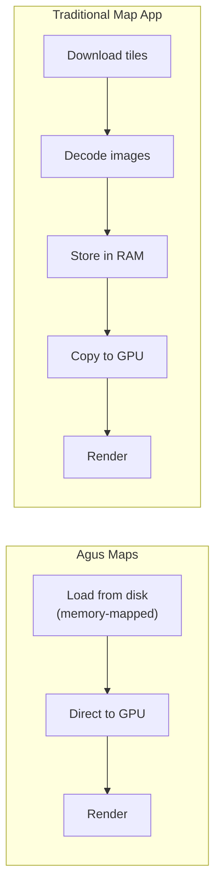
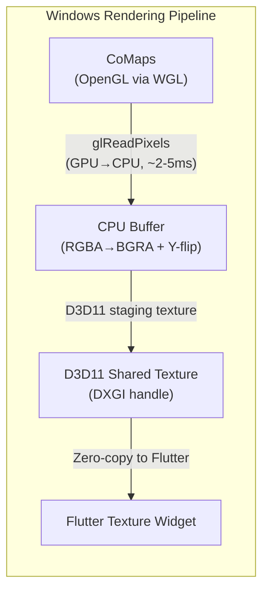

<p align="center">
  
</p>

<h1 align="center">Agus Maps Flutter</h1>

<p align="center">
  <strong>High-performance offline maps for Flutter, powered by the CoMaps/Organic Maps rendering engine.</strong>
</p>

<p align="center">
  <a href="#features">Features</a> •
  <a href="#demos">Demos</a> •
  <a href="#quick-start">Quick Start</a> •
  <a href="#comparison">Comparison</a> •
  <a href="#documentation">Docs</a> •
  <a href="#roadmap">Roadmap</a>
</p>

---

## What is Agus Maps?

Agus Maps Flutter is a **native Flutter plugin** that embeds the powerful [CoMaps](https://codeberg.org/comaps/comaps) rendering engine directly into your Flutter app. Unlike tile-based solutions, it renders **vector maps** with zero-copy GPU acceleration, delivering smooth 60fps performance even on low-end devices.

> **Note:** Agus Maps follows the **CoMaps** implementation specifically. While CoMaps shares historical heritage with [Organic Maps](https://organicmaps.app/) and the original MAPS.ME, we track CoMaps as our upstream reference. CoMaps is actively developed with a focus on community-driven improvements and modern tooling.

---

### 🗺️ New to CoMaps? Try it First!

If you're not familiar with CoMaps, we highly recommend installing it on your phone first to experience the magic firsthand — available on [iOS (App Store)](https://apps.apple.com/us/app/comaps/id6747180809) and [Android (Google Play)](https://play.google.com/store/apps/details?id=app.comaps.google&pcampaignid=web_share).

**Here's how CoMaps works:**

1. **Start with a world overview** — When you first open CoMaps, you get a low-resolution map of the entire world. This lets you navigate and explore at a global scale without downloading gigabytes of data.

2. **Zoom in to discover regions** — As you zoom into a specific area (say, your city or a travel destination), CoMaps notices you might want more detail and invites you to download that region's map.

3. **Download once, use forever offline** — After downloading a region (which typically takes just seconds to a few minutes depending on size), you now have a fully detailed, high-resolution offline copy of that entire area. No internet needed!

4. **Explore with incredible detail** — Street names, hiking trails, building outlines, cafes, transit stops—all available offline with smooth panning and zooming.

**So what's the point of this plugin?**

CoMaps is a fantastic standalone app, but what if you want to embed this same powerful offline mapping experience *inside your own Flutter app*? That's exactly what Agus Maps Flutter does! 🎉

With this plugin, you can:
- **Bundle specific region maps** with your app (pre-downloaded, ready to go on first launch)
- **Let users download additional regions** as needed through an in-app UI
- **Display fully interactive, offline-capable maps** as a Flutter widget

**Example use case:** Imagine building a **bus route app** for a specific city. Pre-bundle that city's map file with your app, and your users get instant offline maps—no API keys, no usage fees, no internet required. The map widget integrates seamlessly with your custom UI and business logic.

> **💡 Tip:** Keep maps fresh by pushing updates through App Store/Play Store releases, or [host your own map server](#host-your-own-map-server-recommended-for-production) for full control over regions and update cycles.

Other ideas: hiking apps, travel guides, field data collection, emergency services, tourism kiosks—the possibilities are endless!

> **📜 Licensing:** Agus Maps Flutter is released under the [Apache 2.0 License](LICENSE). Please review our [NOTICE](NOTICE) file for attribution requirements and third-party dependencies. **We recommend consulting with a legal professional** to understand how these licenses apply to your specific use case.

---

### 🚧 Current Status: Proof of Concept

This project is currently in the **proof of concept stage**, demonstrating zero-copy (or optimized) rendering integration between the CoMaps engine and Flutter's texture system. The [example app](example/) successfully runs on:

| Platform | Status | Notes |
|----------|--------|-------|
| **iOS** | ✅ Working | arm64, x86_64 simulator |
| **macOS** | ✅ Working | arm64/x86_64, window resize supported |
| **Android** | ✅ Working | arm64-v8a, armeabi-v7a, x86_64 |
| **Windows** | ✅ Working | x86_64 only |
| **Linux** | ✅ Working | x86_64 with EGL/GLES3, tested on WSL2 |
| **Windows ARM64** | 🚧 Planned | Blocked on dedicated hardware |

Contributions for Windows ARM64 are welcome from developers with access to the required hardware!

### Why Another Map Plugin?

Most Flutter map solutions either:
- Render tiles in Dart (slow, GC pressure, jank on older devices)
- Use PlatformView embedding (performance overhead, gesture conflicts, "airspace" issues)

**Agus Maps takes a different approach:** The C++ rendering engine draws directly to a GPU texture that Flutter composites natively—no copies, no bridges, no compromises.

---

## Demos

The following videos demonstrate the **example app** ([source code](example/)) running on each platform. This example app showcases the `AgusMap` widget and serves as a reference implementation for developers integrating the plugin into their own apps.

<table>
  <tr>
    <td align="center" width="50%">
      <a href="https://youtu.be/YVaBJ8uW5Ag">
        
        <br><strong>📱 Android</strong>
      </a>
    </td>
    <td align="center" width="50%">
      <a href="https://youtu.be/Jt0QE9Umsng">
        
        <br><strong>📱 iOS</strong>
      </a>
    </td>
  </tr>
  <tr>
    <td align="center" width="50%">
      <a href="https://youtu.be/Gd53HFrAGts">
        
        <br><strong>🖥️ macOS</strong>
      </a>
    </td>
    <td align="center" width="50%">
      <a href="https://youtu.be/SWoLl-700LM">
        
        <br><strong>🪟 Windows</strong>
      </a>
    </td>
  </tr>
</table>

---

## Features

- 🚀 **Zero-Copy Rendering** — Map data flows directly from disk to GPU via memory-mapping (iOS, macOS, Android)
- 🖥️ **Windows Support** — Full Windows x86_64 support with optimized CPU-mediated rendering
- 📴 **Fully Offline** — No internet required; uses compact MWM map files from OpenStreetMap
- 🎯 **Native Performance** — The battle-tested Drape engine from Organic Maps
- 🖐️ **Gesture Support** — Pan, pinch-to-zoom, rotation (multitouch)
- 🖱️ **macOS Trackpad Zoom** — Pinch or two-finger parallel swipe (Google Maps-style) with cursor-centered zoom
- 📐 **Responsive** — Automatically handles resize and device pixel ratio
- 🔌 **Simple API** — Drop-in `AgusMap` widget with `AgusMapController`
- 📥 **Map Download Manager** — Browse and download maps from mirror servers with progress tracking
- 🔍 **Fuzzy Search** — Search for regions with intelligent fuzzy matching
- 💾 **Caching** — Downloaded region data cached locally for instant subsequent loads
- 📊 **Disk Space Management** — Real-time disk space monitoring with safety checks

---

## Quick Start

> **Note:** Agus Maps Flutter is a **plugin/package** that you integrate into your own Flutter app—we are not building a standalone map application. The [example app](example/) demonstrates how to use the plugin and serves as a reference implementation.

### Installation

```yaml
dependencies:
  agus_maps_flutter: ^0.1.0
```

### Basic Usage

```dart
import 'package:agus_maps_flutter/agus_maps_flutter.dart';

// Initialize the engine (call once at app startup)
await agus_maps_flutter.initWithPaths(dataPath, dataPath);
agus_maps_flutter.loadMap(mapFilePath);

// Add the map widget
AgusMap(
  initialLat: 36.1408,
  initialLon: -5.3536,
  initialZoom: 14,
  onMapReady: () => print('Map is ready!'),
)
```

### Programmatic Control

```dart
final controller = AgusMapController();

AgusMap(
  controller: controller,
  // ...
)

// Move the map
controller.moveToLocation(40.4168, -3.7038, 12);
```

See the [example app](example/) for a complete working demo showing all plugin features.

> **For Plugin Users:** The example app source code in `./example/` is your best reference for integrating Agus Maps into your own Flutter application.

---

<h2 id="comparison">Comparison with Other Solutions</h2>

| Feature | Agus Maps | flutter_map | google_maps_flutter | mapbox_gl |
|---------|-----------|-------------|---------------------|-----------|
| **Rendering** | Native GPU (zero-copy*) | Dart/Skia | PlatformView | PlatformView |
| **Offline Support** | ✅ Full | ✅ With tiles | ❌ Limited | ✅ With SDK |
| **Performance** | ⭐⭐⭐⭐⭐ | ⭐⭐⭐ | ⭐⭐⭐⭐ | ⭐⭐⭐⭐ |
| **Memory Usage** | Very Low | High (GC) | Medium | Medium |
| **License** | Apache 2.0 | BSD | Proprietary | Proprietary |
| **Pricing** | Free | Free | Usage-based | Usage-based |
| **Data Source** | OpenStreetMap | Any tiles | Google | Mapbox |
| **Widget Integration** | ✅ Native | ✅ Native | ⚠️ PlatformView | ⚠️ PlatformView |
| **Platforms** | Android, iOS, macOS, Windows, Linux | All | Android, iOS | Android, iOS |

*\*Zero-copy on iOS, macOS, Android. Windows and Linux use optimized CPU-mediated transfer.*

### Platform Support

| Platform | Architecture | Rendering | Zero-Copy |
|----------|--------------|-----------|-----------|
| **iOS** | arm64, x86_64 (sim) | Metal | ✅ Yes (IOSurface) |
| **macOS** | arm64, x86_64 | Metal | ✅ Yes (IOSurface) |
| **Android** | arm64-v8a, armeabi-v7a, x86_64 | OpenGL ES | ✅ Yes (SurfaceTexture) |
| **Windows** | x86_64 only | OpenGL + D3D11 | ❌ No (CPU-mediated) |
| **Linux** | x86_64 | EGL + OpenGL ES 3.0 | ❌ No (CPU-mediated) |

> **Windows/Linux Note:** ARM64 Windows (Snapdragon X, etc.) is not currently supported due to lack of testing hardware. Both Windows and Linux use CPU-mediated pixel copy via `glReadPixels()` (~2-5ms per frame latency). Linux uses `FlPixelBufferTexture` - zero-copy texture sharing isn't available because Flutter's Linux embedder doesn't support direct GL texture sharing. See [Linux Implementation](docs/IMPLEMENTATION-LINUX.md) for details. Contributions welcome!

### Pros ✅

- **Truly offline** — No API keys, no usage limits, no internet dependency
- **Best-in-class performance** — The battle-tested Drape engine, refined through MAPS.ME → Organic Maps → CoMaps
- **Privacy-first** — No telemetry, no tracking, data stays on device
- **Compact map files** — Entire countries in tens of MB (Germany ~800MB, Gibraltar ~1MB)
- **Free forever** — Open source, Apache 2.0 license
- **Flutter-native composition** — No PlatformView overhead, works perfectly with overlays

### Cons ⚠️

- **Limited styling** — Uses Organic Maps' cartographic style (not customizable yet)
- **No real-time traffic** — Offline-first design means no live data
- **Windows not zero-copy** — Windows uses CPU-mediated frame transfer (still performant, ~60fps)
- **Windows x86_64 only** — ARM64 Windows not yet supported
- **MWM format required** — Must use pre-generated map files (not arbitrary tile servers)
- **Early stage** — Search and routing APIs not yet exposed

---

## Why It's Efficient

Agus Maps achieves excellent performance on older devices (tested on Samsung Galaxy S10) through architectural choices that minimize resource usage:

| Aspect | How We Achieve It | Learn More |
|--------|-------------------|------------|
| **Memory** | Memory-mapped files (mmap) — only viewed tiles loaded into RAM | [Details](docs/ARCHITECTURE-ANDROID.md#memory-efficiency) |
| **Battery** | Event-driven rendering — CPU/GPU sleep when map is idle | [Details](docs/ARCHITECTURE-ANDROID.md#battery-efficiency) |
| **CPU** | Multi-threaded — heavy work on background threads, UI never blocked | [Details](docs/ARCHITECTURE-ANDROID.md#processor-efficiency) |
| **Startup** | One-time asset extraction, cached on subsequent launches | [Details](docs/IMPLEMENTATION-ANDROID.md) |

### Zero-Copy Architecture (iOS, macOS, Android)



| | Traditional Map App | Agus Maps |
|--|---------------------|------------|
| **RAM Usage** | ~100MB | ~20MB |
| **Behavior** | Always polling | Sleep when idle |

### Windows Architecture (x86_64)

Windows uses a different architecture due to OpenGL/D3D11 interop limitations:



> **Performance:** Still achieves 60fps on modern hardware with ~30-40MB RAM for the rendering pipeline.

> **Note:** While Windows is not true zero-copy, the map data itself (MWM files) still uses memory-mapping. The CPU-mediated transfer only affects the frame display, not the map data loading.

---

## Documentation

| Document | Description |
|----------|-------------|
| [GUIDE.md](GUIDE.md) | Architectural blueprint and design philosophy |
| [docs/ARCHITECTURE-ANDROID.md](docs/ARCHITECTURE-ANDROID.md) | Deep dive: memory efficiency, battery savings, how it works |
| [docs/COMAPS-ASSETS.md](docs/COMAPS-ASSETS.md) | **CoMaps asset management:** data files, localization, MWM maps |
| [docs/IMPLEMENTATION-ANDROID.md](docs/IMPLEMENTATION-ANDROID.md) | Android build instructions, debug/release modes |
| [docs/IMPLEMENTATION-IOS.md](docs/IMPLEMENTATION-IOS.md) | iOS build instructions and Metal integration |
| [docs/IMPLEMENTATION-MACOS.md](docs/IMPLEMENTATION-MACOS.md) | macOS build instructions, window resize handling |
| [docs/IMPLEMENTATION-WIN.md](docs/IMPLEMENTATION-WIN.md) | Windows build instructions, x86_64 only |
| [docs/RENDER-LOOP.md](docs/RENDER-LOOP.md) | Render loop comparison across all platforms |
| [docs/CONTRIBUTING.md](docs/CONTRIBUTING.md) | Developer setup, commit guidelines, known issues |
| [example/](example/) | Working demo application with downloads manager |

### Technical Deep Dives

For those who want to understand *why* Agus Maps is efficient:

- **[How Memory Mapping Works](docs/ARCHITECTURE-ANDROID.md#memory-efficiency)** — Why we use 10x less RAM than tile-based solutions
- **[Battery Efficiency](docs/ARCHITECTURE-ANDROID.md#battery-efficiency)** — Event-driven rendering that sleeps when idle
- **[Multi-threaded Architecture](docs/ARCHITECTURE-ANDROID.md#processor-efficiency)** — How we keep the UI thread responsive
- **[Old Phone Compatibility](docs/ARCHITECTURE-ANDROID.md#why-this-works-on-older-phones)** — Tested on Samsung Galaxy S10 and similar devices

### Known Issues & Optimization Opportunities

We track efficiency-related issues in dedicated files. See [CONTRIBUTING.md](docs/CONTRIBUTING.md#known-issues) for the full list, including:

- Debug logging overhead in release builds
- EGL context recreation on app resume
- Touch event throttling considerations

---

## Roadmap

### ✅ Proof of Concept Complete
- Zero-copy rendering to Flutter Texture (iOS, macOS, Android)
- Optimized CPU-mediated rendering (Windows x86_64)
- Touch/mouse gesture forwarding (pan, zoom, rotation)
- Viewport resize with DPI scaling
- Basic Dart API (`AgusMap`, `AgusMapController`)
- Map Download Manager with mirror selection
- Example app demonstrating all features

### 🚧 Platform Expansion (Needs Hardware)
- Linux x86_64 / arm64 implementation
- Windows ARM64 support

### 📋 Future Development
- Search API integration
- Routing API integration
- POI tap callbacks
- Animated camera transitions
- UI widgets (compass, scale bar)
- Map deletion/management

---

## Map Data

Agus Maps uses MWM files from OpenStreetMap. You can download maps from:
- [Organic Maps Downloads](https://organicmaps.app/downloads/)
- [CoMaps Mirror](https://omaps.webfreak.org/)
- **In-app**: Use the built-in Downloads tab to browse and download regions

The example app bundles a small Gibraltar map for testing.

### Host Your Own Map Server (Recommended for Production)

For production apps, we **strongly recommend** hosting your own MWM file server rather than relying on third-party mirrors. This gives you:
- **Reliability** — No dependency on external services
- **Control** — Update maps on your own schedule  
- **Customization** — Generate maps for specific regions or with custom data
- **Compliance** — Meet data residency requirements

#### Overview

The map generation pipeline consists of:
1. **Input Data**: OpenStreetMap `.osm.pbf` planet dumps (or regional extracts)
2. **Generator Tools**: C++ binaries (`generator_tool`, `world_roads_builder_tool`) built from CoMaps
3. **Python Driver**: `maps_generator` CLI that orchestrates the generation process
4. **Output**: `.mwm` binary map files ready for serving

#### Quick Start: Generate Maps for a Single Region

```bash
# 1. Clone CoMaps and build the generator tools
git clone https://codeberg.org/comaps/comaps.git
cd comaps
./tools/unix/build_omim.sh -r generator_tool
./tools/unix/build_omim.sh -r world_roads_builder_tool

# 2. Set up the Python environment
cd tools/python
pip install -r maps_generator/requirements_dev.txt
cp maps_generator/var/etc/map_generator.ini.default maps_generator/var/etc/map_generator.ini

# 3. Edit map_generator.ini:
#    - Set OMIM_PATH to your CoMaps repo root
#    - Set PLANET_URL to your regional .osm.pbf (e.g., from Geofabrik)
#    Example: PLANET_URL=https://download.geofabrik.de/europe/germany-latest.osm.pbf

# 4. Generate maps (example: Germany without coastlines)
python3 -m maps_generator --countries="Germany_*" --skip="Coastline"
```

Output files will be in `maps_build/YYYY_MM_DD__HH_MM_SS/YYMMDD/*.mwm`

#### Full Planet Generation (CI/CD Pipeline)

For automated full-planet generation, CoMaps uses a multi-stage Forgejo Actions workflow:

| Stage | Purpose | Resources |
|-------|---------|-----------|
| **update-planet-pbf** | Download/update OSM planet dump (~70GB) | `pyosmium-up-to-date` |
| **update-planet-o5m** | Convert PBF to O5M format for faster processing | `osmconvert`, `osmupdate` |
| **update-wiki** | Fetch Wikipedia descriptions for POIs | [wikiparser](https://codeberg.org/comaps/wikiparser) |
| **update-subways** | Generate metro/subway layer | [subways](https://codeberg.org/comaps/subways) |
| **update-tiger** | US address data from Nominatim | `address_parser_tool` |
| **update-isolines** | Altitude contour lines from SRTM | `topography_generator_tool` |
| **generate-maps** | Run the full map generation | `maps_generator` Python CLI |
| **upload-maps** | Upload to CDN servers via rclone | `rclone copy` |

**Hardware requirements for full planet:**
- ~4TB storage (planet files, intermediate data, output)
- 96+ CPU cores recommended (generation is parallelized)
- 128GB+ RAM
- ~28 days for full generation with all features

#### Hosting Your MWM Server

The server structure expected by apps is:
```
https://your-server.com/maps/
├── YYMMDD/                    # Version date folder (e.g., 250101)
│   ├── World.mwm
│   ├── WorldCoasts.mwm
│   ├── Germany_Baden-Wurttemberg.mwm
│   ├── Germany_Bavaria.mwm
│   └── ... (other .mwm files)
└── countries.txt              # Index of available maps
```

**Simple setup with nginx:**
```bash
apt install nginx
mkdir -p /var/www/html/maps/YYMMDD
cp *.mwm /var/www/html/maps/YYMMDD/
# Configure your app to use https://your-server.com/maps/
```

#### Resources

- [maps_generator README](https://codeberg.org/comaps/comaps/src/branch/main/tools/python/maps_generator/README.md) — Detailed usage and examples
- [map-generator.yml workflow](https://codeberg.org/comaps/comaps/src/branch/main/.forgejo/workflows/map-generator.yml) — Full CI/CD pipeline reference
- [Docker image](https://codeberg.org/comaps/maps_generator) — Pre-built container with all dependencies
- [Geofabrik Downloads](https://download.geofabrik.de/) — Regional OSM extracts for faster testing
- [geojson.io](https://geojson.io/) — Create custom region boundaries

> **Tip:** Configure your app to use your custom server by modifying the mirror URLs in the download manager or `MirrorService`.

---

## License

```
Apache License 2.0

Copyright 2024 Agus App

Licensed under the Apache License, Version 2.0
```

### Understanding Your Rights & Obligations

This plugin and its dependencies use various open-source licenses including Apache 2.0, MIT, BSD, and others. Before using this plugin in your project—especially for commercial applications—please:

1. **Read the [LICENSE](LICENSE) file** — The full Apache 2.0 license text
2. **Read the [NOTICE](NOTICE) file** — Attribution requirements and third-party dependency licenses
3. **Consult a legal professional** — To understand how these licenses apply to your specific use case

The [NOTICE](NOTICE) file includes:
- Detailed breakdown of all third-party libraries and their licenses
- Attribution requirements for OpenStreetMap data (ODbL)
- Sample attribution text you may reference
- License compatibility summary

> **⚠️ Disclaimer:** The information in our NOTICE file is provided for informational purposes only and does not constitute legal advice. We encourage all developers to perform their own due diligence and seek qualified legal counsel for licensing questions.

### Heritage

This project incorporates code from [CoMaps](https://codeberg.org/comaps/comaps) (Apache 2.0), which is our primary upstream reference. CoMaps itself descends from [Organic Maps](https://github.com/organicmaps/organicmaps) and the original [MAPS.ME](https://github.com/mapsme/omim), all under Apache 2.0.

---

<p align="center">
  <sub>Built with ❤️ for the Flutter community</sub>
</p>

