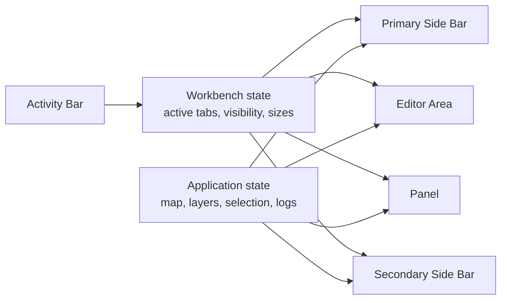
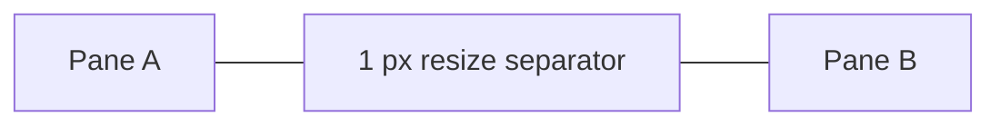
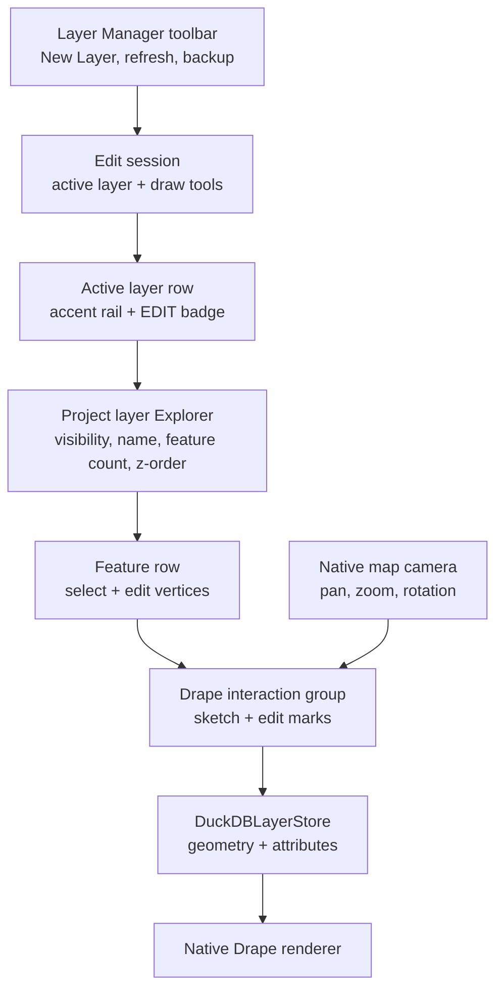
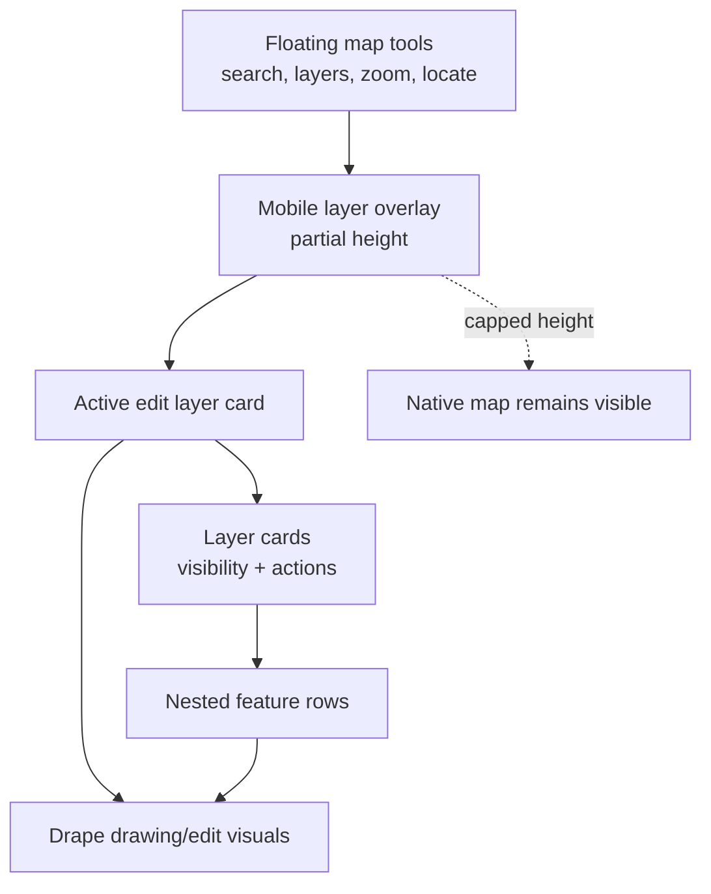
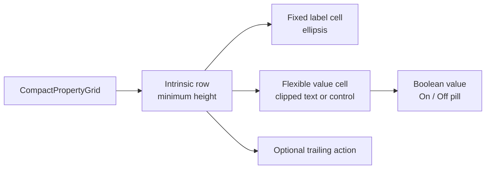
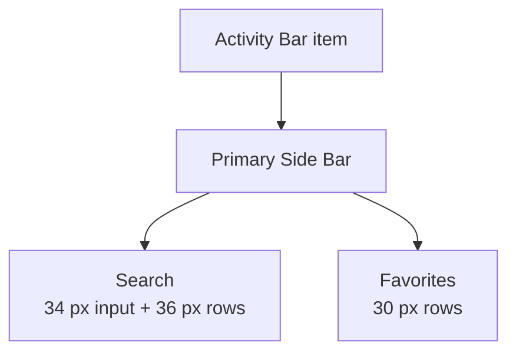
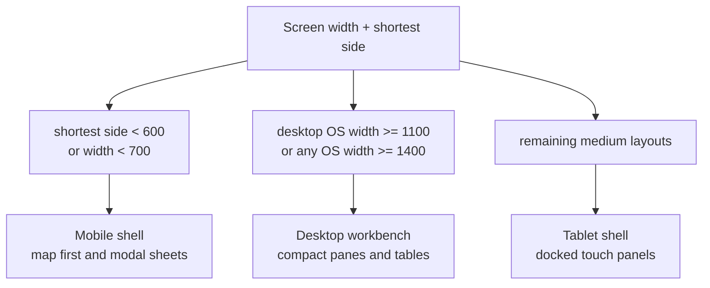
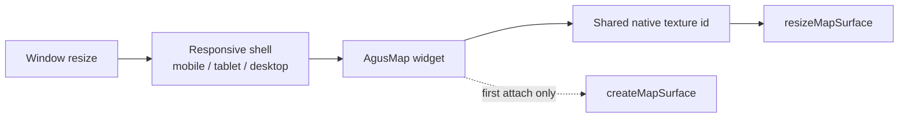
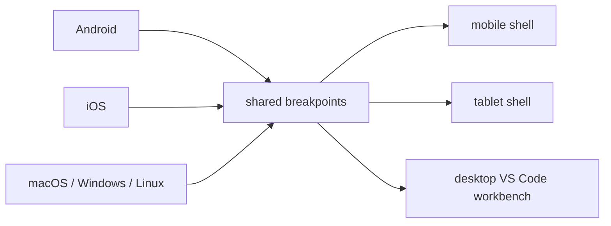

# UI Layout Architecture

This document defines the example application's responsive layout direction.
The desktop experience for macOS, Linux, and Windows follows a compact
VS Code-style workbench, while tablet and mobile keep touch-optimized variants
of the same GIS workflows.

## Layout targets

| Target | Primary input | Layout pattern | Density |
| --- | --- | --- | --- |
| Desktop | Mouse, keyboard, touchpad | VS Code-style workbench with docked panes | Compact, one-line rows, thin separators |
| Tablet | Touch with optional pointer/keyboard | Docked panels and larger controls | Medium density, larger targets |
| Mobile | Touch | Map-first screens with compact floating tools and partial-height overlays | Comfortable density, large targets |

Desktop is a resolved form factor, not only an operating-system label. macOS,
Linux, and Windows use the VS Code-style workbench at desktop widths, but narrow
desktop windows still move through the tablet and mobile layouts so the app can
be tested and used responsively.

## Platform menus

On macOS, the native platform menu is owned above the responsive shell. This is
intentional: Flutter's `PlatformMenuBar` replaces the whole native app menu and
clears it when disposed, so it must not live inside only the desktop workbench
branch.

The compact/tablet/mobile macOS menu always contains `Agus Suite`, `Edit`,
`View`, `Window`, and `Help`. Desktop layout adds a `Tools` menu for
workbench-only panel tools such as Point of Interest and Debug Console. The menu
tree is cached by resolved layout bucket so resizing within the same bucket does
not send redundant platform-menu updates.

Windows and Linux currently keep their runner/platform default behavior; the
Flutter stock platform menu delegate used here is macOS-only.

## Desktop workbench terminology

The desktop shell intentionally uses VS Code component terminology:

- **Activity Bar**: fixed left-most icon strip.
- **Primary Side Bar**: left resizable pane controlled by the Activity Bar.
- **Editor Area**: central tabbed viewport. Initial tabs are `Map` and `Blank`.
- **Panel**: bottom resizable pane. Initial tabs are `POINT OF INTEREST` and
  `DEBUG CONSOLE`.
- **Secondary Side Bar**: right resizable pane for stacked inspectors such as
  `PROPERTIES`.
- **Layout Controls**: upper-right controls that toggle Primary Side Bar,
  Panel, and Secondary Side Bar visibility.

Tabs and panes are viewports over shared application state. The tab widget does
not own map data, selections, logs, drawing layers, or persisted project data.

## Pane resizing and separators

Desktop pane splitters use a single visible separator that is also the resize
target. Avoid stacking borders, outlines, reserved transparent hit-target width,
or splitter padding on the same edge. A pane boundary should visually read as one
line with no gap between adjacent pane headers and bodies.

Tablet and mobile can use thicker dividers where touch precision requires it,
but desktop panes should stay visually thin and compact.

Resize handles must not reserve extra transparent layout space. If a larger hit
target is introduced later, it should be implemented as an overlay that does not
change pane geometry; otherwise vertical and horizontal seams will fail to meet
cleanly at intersections.

## Layer Manager

Desktop Layer Manager is a compact GIS layer dock, not a nested card tree.
It should expose:

- Project layers as a full-width compact Explorer tree.
- An obvious **New Layer** action.
- Active edit layer selection by row click, with a clear selected-for-editing
  treatment similar to Figma/Penpot layer rows: highlighted row, left accent rail,
  and compact `EDIT` badge.
- Individual feature rows below expanded layers, with geometry icons and compact
  per-feature actions.
- Drawing session tools using GIS terms: map interaction, point, segment, line,
  and polygon.

Map presentation is not part of the Explorer activity. It has its own Activity
Bar destination and compact property grid for basemap/runtime overlays such as
3D buildings, outdoors, contour lines, and subway.

The **New Layer** command depends on the DuckDB project layer store, not on the
native renderer. If native Drape rendering is unavailable on a platform, layer
persistence and editing should remain available and the renderer issue should be
logged separately.

Layer Manager startup is therefore split into two phases: project persistence
first, native map rendering second. The UI enables **New Layer** as soon as
`DuckDBLayerStore` is open, even if the map surface has not finished attaching.
If the store is unavailable, the Explorer pane must show the failure status and
the DEBUG CONSOLE must contain the underlying DuckDB error.

The New Layer dialog must not dispose a `TextEditingController` owned by a local
method scope while the dialog route is closing. Prefer controller-free form
fields or a dedicated stateful dialog widget that owns and disposes its
controller. Layer creation failures should be reported inside the Layer Manager
pane instead of surfacing as Flutter red screens.

Layer editing commands must keep the desktop workbench stable even when
persistence or renderer operations fail. Visibility toggles, z-order changes,
new-layer creation, and feature commits should report failures in the Layer
Manager or active scaffold message area. They must not rely on unhandled async
exceptions, because those become red screens on desktop debug runs.

Feature commits and native rendering are separate steps. A commit writes WGS84
geometry and bbox metadata to DuckDB; the renderer then queries visible features
using the current map viewport. Desktop diagnostics should keep logging both
events so a successful commit followed by `0 visible features` can be traced as a
viewport/query problem rather than a drawing-tool failure.

If DuckDB startup fails because an unreplayable WAL is quarantined and retried,
the Layer Manager should continue to present the same store status model:
`Starting`, `Ready`, or `Unavailable`. Detailed recovery paths belong in the
DEBUG CONSOLE and schema docs, not in dense desktop pane chrome.

For drawing UX, transient sketches and committed map rendering must both be
native Drape visuals. Flutter must not paint map geometry, vertex handles, or
rubber-band sketch lines above the map texture. Pressing the check mark should
clear the transient Drape interaction group only after the feature has been
persisted and handed to the committed native Drape user-mark group.

The project-layer Explorer follows the same viewport-over-state model as the
workbench. Layer rows and feature rows read from `DuckDBLayerStore`; they do not
own geometry. Selecting a draw tool enters drawing mode and submits transient
sketch WKT to a native Drape interaction group. Taps add vertices; mouse/touchpad
drag continues to pan the native map because drawing taps are observed by
`AgusMap` instead of an opaque Flutter overlay. Selecting a feature enters
committed-feature edit mode and submits its stored WKT to the same native
interaction group in edit state. The visible vertex handles are map-native user
marks, so panning, zooming, and rotation move them with the map instead of
leaving Flutter-painted widgets floating above the workbench. Flutter currently
remains the pointer-input bridge only for dragging an existing handle; on pointer
release, the app rewrites the same feature id with updated WKT and bbox values in
DuckDB, refreshes the committed Drape layer group, and keeps selected
layer/feature state global rather than pane-local.

Tablet can keep the grouped layer tree with larger rows. Mobile uses a
map-first layer overlay instead of a full modal route. The map remains visible
behind the layer UI, the overlay is capped to roughly the lower half of the
screen, and selecting a draw tool or feature returns focus to the map so native
Drape sketch/edit handles have enough usable space.

Mobile Layer Manager feature parity is expressed through a different shape, not
through a reduced model:

- **New layer** is a prominent full-width action at the top of the overlay.
- **Active edit layer** is shown in a touch card with an Add menu for point,
  segment, line, and polygon creation.
- **Project layers** appear as large touch cards with visibility, active/edit
  selection, feature count, z-order actions, delete, and nested feature rows.
- **Feature rows** remain children of their layer and select/edit the same
  persisted DuckDB feature ids used on desktop.
- Drawing tools stay hidden until an Add action enters drawing mode; then the
  map banner and native Drape interaction group make the mode explicit.

Mobile search starts as a labeled floating tool in the map tool stack. Tapping
it opens the compact search bar and puts the UI in search context; tapping the
same control or the search close button clears search state and returns to
normal map context. The mobile layer entry point is also labeled instead of
being icon-only, because touch users cannot rely on desktop hover tooltips.
Opening search closes the mobile layer overlay, and opening the layer overlay
closes search, so narrow screens do not stack competing panels over the map.

Mobile overlays must follow a strict hit-test contract: only visible controls
and panels may sit above `AgusMap`. Closed search/layer panels must not leave
zero-width or transparent desktop/tablet panes in the mobile stack, and the map
texture listener must remain hit-testable across the whole visible map so pan,
pinch zoom, rotation, and drawing taps continue to reach native CoMaps/Drape.

The mobile map tab uses the CoMaps iPhone pattern: the native map consumes the
full available map viewport, including top, bottom, left, and right safe-area
regions. Flutter overlays remain offset inside safe readable positions. This
edge-to-edge rule is scoped to the map tab; Downloads, Settings, About, and
other content tabs keep normal safe-area padding.

Floating map actions on mobile are independent circular icon buttons, not a
shared group backplate. Each control uses theme-aware fill, border, icon color,
semantic labels, tooltips for pointer users, and button shadow that works in
light and dark modes. When a lower sheet such as Layers or a place page is open,
secondary camera buttons may collapse away so the remaining Search, Layers, and
Locate controls stay above the sheet instead of spanning into the unsafe top
area. On small landscape phones, the right-side floating action stack is
vertically scrollable and clipped to its safe map column so all actions remain
reachable without covering the whole map.

Mobile drawing sessions lock geometry type once a feature is started. The layer
sheet is only the entry point for choosing point, segment, line, or polygon.
After that choice, the sheet closes and the map shows only floating action
buttons for undo, commit, and cancel; changing from polygon to another geometry
requires cancelling or committing and starting a separate feature.

Mobile tabs are icon-only. Portrait phones use an icon-only bottom navigation
bar. Landscape phones move those tabs into a vertically scrollable left strip
inside the safe area so camera islands and rounded corners do not hide the
navigation affordances.

Tablet navigation uses the same side-rail placement as desktop/tablet adaptive
apps, but it must be flush and square-edged. Avoid rounded floating rail chrome
on macOS tablet-width windows because it conflicts with the pane-based workbench
visual language.

## Property grids and data grids

Inspector-like surfaces should use shared compact grid widgets instead of
custom per-pane rows. Desktop property grids should:

- Consume the available pane width.
- Use fixed label columns and flexible value columns.
- Keep row heights tight, with a default desktop row height near 22 logical
  pixels.
- Use one-pixel grid lines.
- Render text through compact clipped cells, not independent selectable text
  controls per row, so dense inspector panes never paint labels or values on top
  of adjacent rows.
- Render boolean values as small `On`/`Off` pill controls instead of full
  checkboxes or switches in dense desktop grids.

Use these grids for feature properties, point-of-interest details, map
presentation settings, and future layer/style inspectors.

## Downloads

Desktop Downloads should feel like a file explorer or VS Code tree:

- Compact toolbar with search, status counts, and refresh.
- One-line tree rows.
- Folder/leaf icons with disclosure controls.
- Status text in a secondary column.
- Right-aligned compact actions for download, update, and delete.
- Active downloads expose a cancel action that aborts the stream and removes the
  temporary `.download` file before it can be registered as a map.
- Static icons and determinate progress bars instead of indeterminate animated
  spinners on desktop release builds.

Tablet and mobile should retain larger list rows and clearer explanatory text.

## Desktop Search and Favorites

Search and Favorites in the Primary Side Bar follow VS Code explorer density,
not mobile `ListTile` density:

- Search input height near 34 logical pixels.
- Result rows near 36 logical pixels with one-line title and one-line subtitle.
- Favorites rows near 30 logical pixels.
- No rounded cards inside the Primary Side Bar.
- One-pixel row separators aligned to the full pane width.

## Responsive behavior

The same business state and persistence layer should feed every form factor.
Only layout, density, and command placement should change.

The native map surface is also shared across form-factor transitions. Responsive
shell changes may reparent the Flutter `AgusMap` widget, but they must attach to
the existing native texture and issue a resize rather than creating a second
CoMaps/Drape/Metal surface while rendering is active.

## Platform responsive expectations

The same responsive breakpoints apply to Android, iOS, macOS, Windows, and
Linux. Desktop operating systems are mouse/keyboard/touchpad optimized at
desktop widths, but still use tablet/mobile shells at smaller window widths.
Mobile operating systems can still reach tablet/desktop layouts on sufficiently
large screens, foldables, or external displays.

