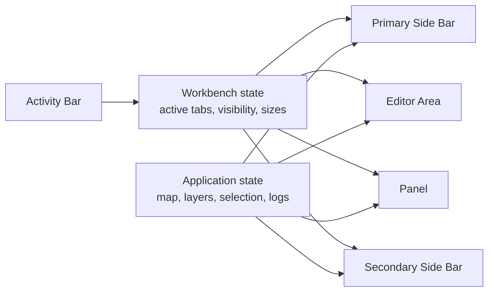
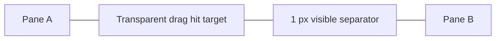
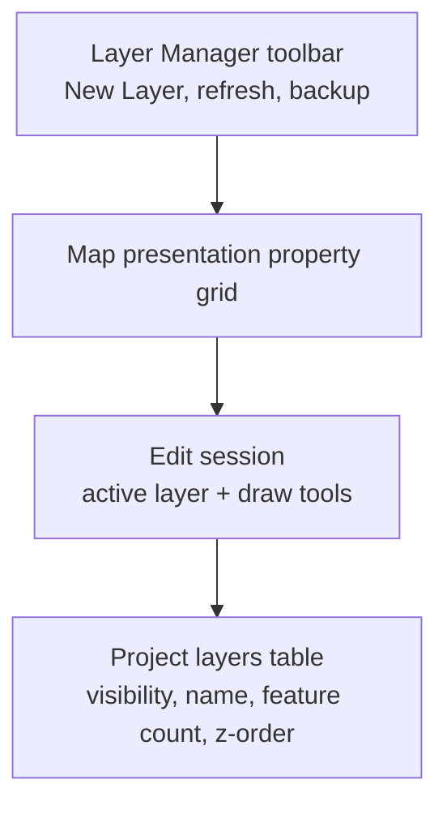
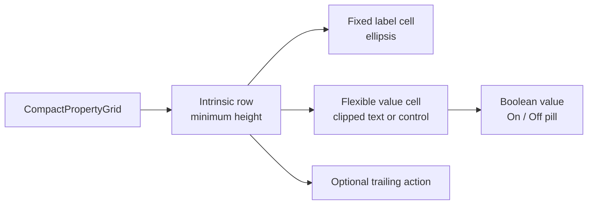
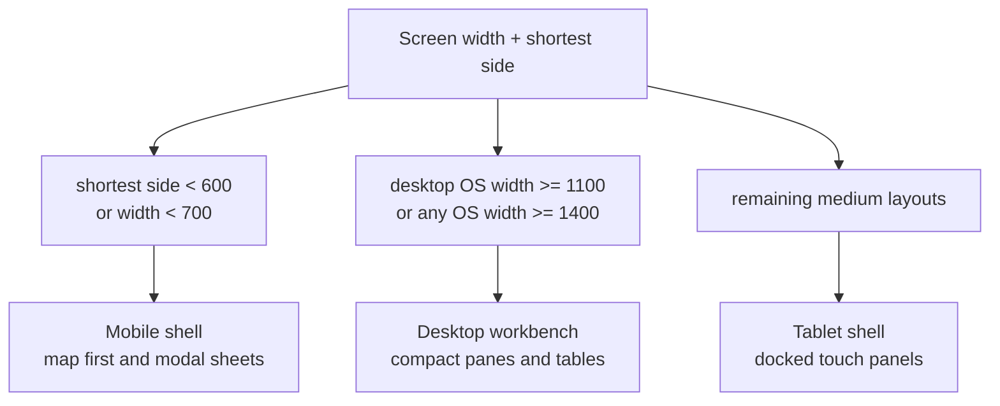
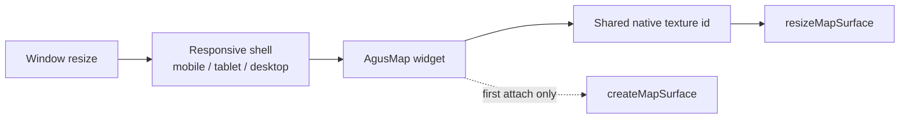
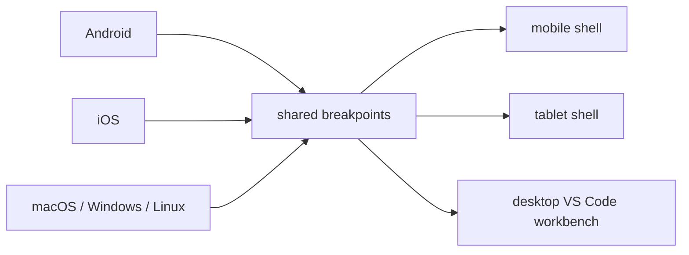

# UI Layout Architecture

This document defines the example application's responsive layout direction.
The desktop experience for macOS, Linux, and Windows follows a compact
VS Code-style workbench, while tablet and mobile keep touch-optimized variants
of the same GIS workflows.

## Layout targets

| Target | Primary input | Layout pattern | Density |
| --- | --- | --- | --- |
| Desktop | Mouse, keyboard, touchpad | VS Code-style workbench with docked panes | Compact, one-line rows, thin separators |
| Tablet | Touch with optional pointer/keyboard | Docked panels and larger controls | Medium density, larger targets |
| Mobile | Touch | Map-first screens, modal sheets, simplified panels | Comfortable density, large targets |

Desktop is a resolved form factor, not only an operating-system label. macOS,
Linux, and Windows use the VS Code-style workbench at desktop widths, but narrow
desktop windows still move through the tablet and mobile layouts so the app can
be tested and used responsively.

## Desktop workbench terminology

The desktop shell intentionally uses VS Code component terminology:

- **Activity Bar**: fixed left-most icon strip.
- **Primary Side Bar**: left resizable pane controlled by the Activity Bar.
- **Editor Area**: central tabbed viewport. Initial tabs are `Map` and `Blank`.
- **Panel**: bottom resizable pane. Initial tabs are `POINT OF INTEREST` and
  `DEBUG CONSOLE`.
- **Secondary Side Bar**: right resizable pane for stacked inspectors such as
  `PROPERTIES`.
- **Layout Controls**: upper-right controls that toggle Primary Side Bar,
  Panel, and Secondary Side Bar visibility.

Tabs and panes are viewports over shared application state. The tab widget does
not own map data, selections, logs, drawing layers, or persisted project data.

## Pane resizing and separators

Desktop pane splitters use the VS Code pattern: a narrow visible separator and a
larger invisible hit target for pointer resizing. Avoid stacking borders,
outlines, and splitter lines on the same edge. A pane boundary should visually
read as one line.

Tablet and mobile can use thicker dividers where touch precision requires it,
but desktop panes should stay visually thin and compact.

## Layer Manager

Desktop Layer Manager is a compact GIS layer dock, not a nested card tree.
It should expose:

- Map presentation toggles as a property grid.
- Project layers as a full-width compact table.
- An obvious **New Layer** action.
- Active edit layer selection by row click.
- Drawing session tools using GIS terms: map interaction, point, segment, line,
  and polygon.

Tablet can keep the grouped layer tree with larger rows. Mobile should keep the
modal sheet pattern and avoid exposing every desktop control at once.

## Property grids and data grids

Inspector-like surfaces should use shared compact grid widgets instead of
custom per-pane rows. Desktop property grids should:

- Consume the available pane width.
- Use fixed label columns and flexible value columns.
- Keep row heights tight, with a default desktop row height near 22 logical
  pixels.
- Use one-pixel grid lines.
- Render text through compact clipped cells, not independent selectable text
  controls per row, so dense inspector panes never paint labels or values on top
  of adjacent rows.
- Render boolean values as small `On`/`Off` pill controls instead of full
  checkboxes or switches in dense desktop grids.

Use these grids for feature properties, point-of-interest details, map
presentation settings, and future layer/style inspectors.

## Downloads

Desktop Downloads should feel like a file explorer or VS Code tree:

- Compact toolbar with search, status counts, and refresh.
- One-line tree rows.
- Folder/leaf icons with disclosure controls.
- Status text in a secondary column.
- Right-aligned compact actions for download, update, and delete.
- Static icons and determinate progress bars instead of indeterminate animated
  spinners on desktop release builds.

Tablet and mobile should retain larger list rows and clearer explanatory text.

## Responsive behavior

The same business state and persistence layer should feed every form factor.
Only layout, density, and command placement should change.

The native map surface is also shared across form-factor transitions. Responsive
shell changes may reparent the Flutter `AgusMap` widget, but they must attach to
the existing native texture and issue a resize rather than creating a second
CoMaps/Drape/Metal surface while rendering is active.

## Platform responsive expectations

The same responsive breakpoints apply to Android, iOS, macOS, Windows, and
Linux. Desktop operating systems are mouse/keyboard/touchpad optimized at
desktop widths, but still use tablet/mobile shells at smaller window widths.
Mobile operating systems can still reach tablet/desktop layouts on sufficiently
large screens, foldables, or external displays.

