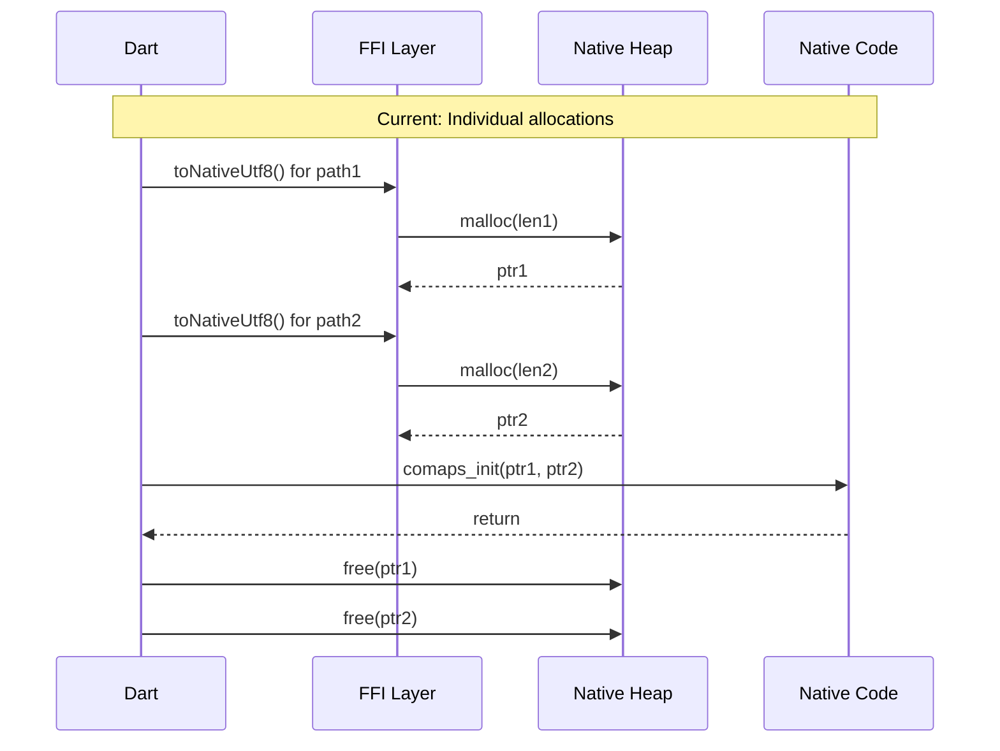
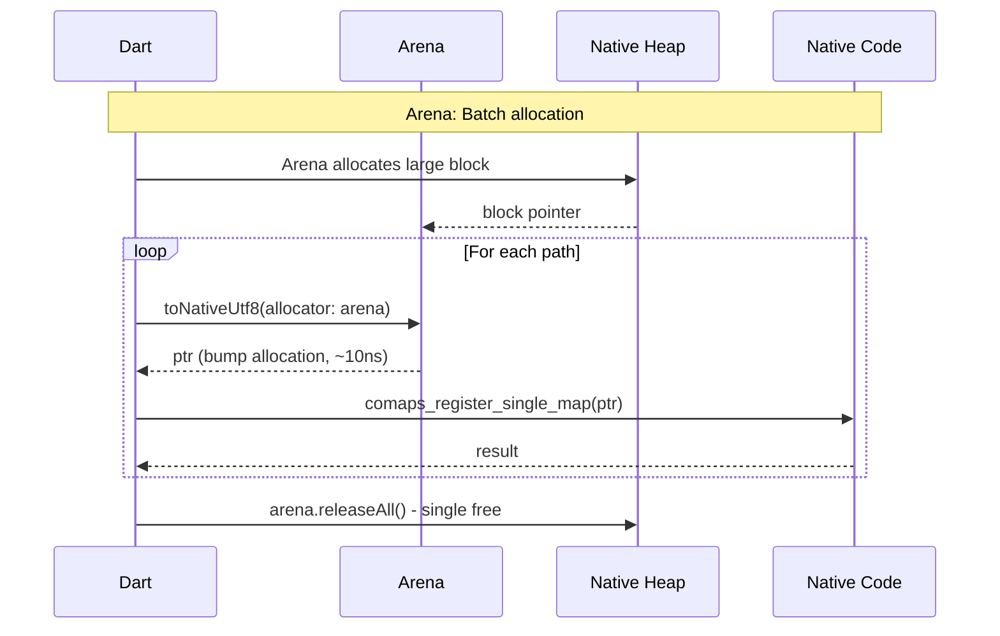
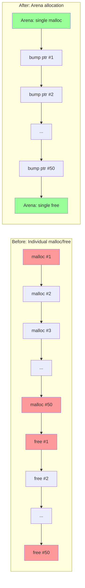
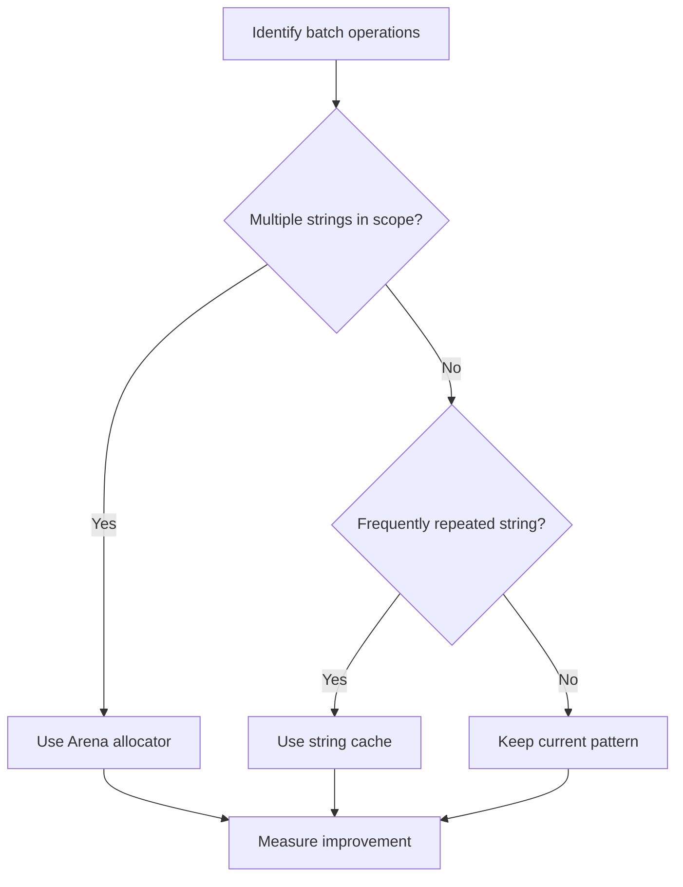

# ISSUE: FFI String Allocation Churn

## Severity: Low-Medium

## Status: Open

---

## Non-Technical Summary

### The Problem (Analogy)

Imagine you're a librarian who needs to create temporary labels for books. Every time someone asks about a book, you:
1. Get a fresh sticky note from your drawer
2. Write the book's title on it
3. Show it to the person
4. Throw the sticky note in the trash
5. Repeat for the next book

Even if someone asks about 100 books in a row, you use 100 separate sticky notes, making 100 trips to the drawer and 100 trips to the trash.

A smarter approach: Get a whole pad of sticky notes at once, use them all, then throw away the whole pad together when done.

In the code, we're constantly creating and destroying small pieces of memory (like sticky notes) for text strings when communicating between Dart and native code. This "memory churn" wastes time and energy.

### Why It Matters

- **Slower operations**: Each allocation takes time
- **Memory fragmentation**: Many small allocations scatter memory around
- **GC pressure**: More objects for the garbage collector to track
- **Battery impact**: Extra CPU cycles waste power

### The Solution (Simple)

Use "bulk packaging" for memory—allocate a big chunk once, use portions of it for multiple strings, then free the whole chunk at once.

---

## Technical Deep Dive

### Problem Statement

FFI string operations in Dart require converting `String` to native UTF-8 (`Pointer<Char>`) using `toNativeUtf8()`, which allocates memory that must be explicitly freed with `malloc.free()`. The current implementation allocates and frees memory for each string individually, even in loops.

### Current Implementation

**Location**: [lib/agus_maps_flutter.dart](../../lib/agus_maps_flutter.dart)

```dart
void init(String apkPath, String storagePath) {
  // Allocation 1
  final apkPathPtr = apkPath.toNativeUtf8().cast<Char>();
  // Allocation 2
  final storagePathPtr = storagePath.toNativeUtf8().cast<Char>();
  
  _bindings.comaps_init(apkPathPtr, storagePathPtr);
  
  // Free 1
  malloc.free(apkPathPtr);
  // Free 2
  malloc.free(storagePathPtr);
}

void initWithPaths(String resourcePath, String writablePath) {
  // Same pattern: 2 allocations, 2 frees
  final resourcePathPtr = resourcePath.toNativeUtf8().cast<Char>();
  final writablePathPtr = writablePath.toNativeUtf8().cast<Char>();
  _bindings.comaps_init_paths(resourcePathPtr, writablePathPtr);
  malloc.free(resourcePathPtr);
  malloc.free(writablePathPtr);
}

int registerSingleMap(String fullPath) {
  String normalizedPath = fullPath;
  if (Platform.isWindows) {
    normalizedPath = fullPath.replaceAll('/', '\\');
  }
  // Allocation
  final pathPtr = normalizedPath.toNativeUtf8().cast<Char>();
  try {
    return _bindings.comaps_register_single_map(pathPtr);
  } finally {
    // Free
    malloc.free(pathPtr);
  }
}
```

### Memory Operation Analysis



### Problem Amplification: Batch Operations

Consider registering multiple maps (common use case):

```dart
// Current implementation - problematic for batches
Future<void> registerMultipleMaps(List<String> mapPaths) async {
  for (final path in mapPaths) {
    // Each iteration: 1 malloc + 1 free
    final result = registerSingleMap(path);
    if (result != 0) {
      debugPrint('Failed to register: $path (error: $result)');
    }
  }
}

// For 50 map files:
// - 50 malloc calls
// - 50 free calls
// - 100 heap operations total
```

### Performance Impact

| Scenario | Allocations | Frees | Heap Operations |
|----------|------------|-------|-----------------|
| Single map registration | 1 | 1 | 2 |
| Init with paths | 2 | 2 | 4 |
| Register 50 maps | 50 | 50 | 100 |
| Set locale + init + 50 maps | 53 | 53 | 106 |

**Allocation overhead per operation:**
- `malloc()`: ~100-500ns (depends on heap state)
- `free()`: ~50-200ns
- Total per string: ~150-700ns

For 50 maps: 50 × 700ns = **35μs** wasted on allocation overhead alone.

---

## Proposed Solutions

### Solution A: Arena Allocator Pattern (Recommended)

**Approach**: Use Dart's `Arena` allocator from `package:ffi` to batch allocations.

```dart
import 'package:ffi/ffi.dart';

/// Register multiple maps efficiently using arena allocation.
/// All string memory is allocated from a single arena and freed at once.
int registerMultipleMaps(List<String> mapPaths) {
  // Create arena - no allocations yet
  final arena = Arena();
  
  try {
    int successCount = 0;
    
    for (final path in mapPaths) {
      // Normalize path
      String normalizedPath = path;
      if (Platform.isWindows) {
        normalizedPath = path.replaceAll('/', '\\');
      }
      
      // Allocate from arena - fast bump allocation
      final pathPtr = normalizedPath.toNativeUtf8(allocator: arena).cast<Char>();
      
      final result = _bindings.comaps_register_single_map(pathPtr);
      if (result == 0) {
        successCount++;
      } else {
        debugPrint('[AgusMap] Failed to register: $path (error: $result)');
      }
      
      // No free here - arena handles it
    }
    
    return successCount;
  } finally {
    // Single free operation for ALL strings
    arena.releaseAll();
  }
}
```



**Using the `using()` convenience function:**

```dart
/// Alternative syntax using Dart's using() for automatic cleanup
int registerMultipleMapsAlt(List<String> mapPaths) {
  return using((Arena arena) {
    int successCount = 0;
    
    for (final path in mapPaths) {
      final normalizedPath = Platform.isWindows 
          ? path.replaceAll('/', '\\') 
          : path;
      final pathPtr = normalizedPath.toNativeUtf8(allocator: arena).cast<Char>();
      
      if (_bindings.comaps_register_single_map(pathPtr) == 0) {
        successCount++;
      }
    }
    
    return successCount;
  });
  // Arena automatically released when using() returns
}
```

**Refactored init functions:**

```dart
/// Initialize CoMaps with arena-allocated strings.
void initWithPaths(String resourcePath, String writablePath) {
  using((Arena arena) {
    final resourcePathPtr = resourcePath.toNativeUtf8(allocator: arena).cast<Char>();
    final writablePathPtr = writablePath.toNativeUtf8(allocator: arena).cast<Char>();
    _bindings.comaps_init_paths(resourcePathPtr, writablePathPtr);
  });
}

/// Set locale with arena allocation.
void setLocale(String localeTag) {
  using((Arena arena) {
    final localeTagPtr = localeTag.toNativeUtf8(allocator: arena).cast<Char>();
    try {
      _bindings.comaps_set_locale(localeTagPtr);
    } on ArgumentError {
      debugPrint('[AgusMap] setLocale: Symbol not found');
    }
  });
}
```

#### Performance Comparison



| Metric | Before (malloc/free) | After (Arena) | Improvement |
|--------|---------------------|---------------|-------------|
| Heap operations | 100 | 2 | 50x fewer |
| Time (50 strings) | ~35μs | ~2μs | ~17x faster |
| Memory fragmentation | High | None | Eliminated |
| Code complexity | Low | Low | Same |

#### Pros
- ✅ **Significant speedup**: 10-50x fewer heap operations
- ✅ **No fragmentation**: Single contiguous allocation
- ✅ **Automatic cleanup**: Arena ensures no leaks
- ✅ **Standard pattern**: `package:ffi` provides `Arena` out of the box
- ✅ **Readable code**: `using()` makes scope clear

#### Cons
- ❌ **Memory held longer**: All strings live until arena release
- ❌ **Not suitable for long-lived strings**: Arena must be released
- ❌ **Slight API change**: Functions need refactoring

---

### Solution B: String Caching for Repeated Values

**Approach**: Cache FFI pointers for strings that are used repeatedly.

```dart
/// Cache for frequently used native strings.
class NativeStringCache {
  final Map<String, Pointer<Char>> _cache = {};
  final Finalizer<Pointer<Char>> _finalizer = Finalizer((ptr) {
    malloc.free(ptr);
  });
  
  /// Get or create a native UTF-8 string.
  /// Cached strings live for the lifetime of this cache.
  Pointer<Char> get(String value) {
    return _cache.putIfAbsent(value, () {
      final ptr = value.toNativeUtf8().cast<Char>();
      _finalizer.attach(this, ptr, detach: ptr);
      return ptr;
    });
  }
  
  /// Clear the cache and free all strings.
  void clear() {
    for (final ptr in _cache.values) {
      malloc.free(ptr);
    }
    _cache.clear();
  }
}

// Usage for repeated locale settings
final _localeCache = NativeStringCache();

void setLocale(String localeTag) {
  // If same locale set multiple times, reuses cached pointer
  final ptr = _localeCache.get(localeTag);
  _bindings.comaps_set_locale(ptr);
}
```

#### Pros
- ✅ **Zero allocations for repeated strings**: Perfect for locales, paths
- ✅ **Automatic with Finalizer**: Cleaned up when cache is GC'd

#### Cons
- ❌ **Memory usage**: Cached strings never freed until explicit clear
- ❌ **Not suitable for dynamic strings**: Only helps with repeated values
- ❌ **Complexity**: Must manage cache lifecycle

---

### Solution C: Native-Side String Handling

**Approach**: Move string normalization and caching to native code.

```cpp
// Native side caches normalized paths
static std::unordered_map<std::string, std::string> g_pathCache;

extern "C" int comaps_register_single_map_normalized(const char* path) {
    std::string pathStr(path);
    
    // Check cache
    auto it = g_pathCache.find(pathStr);
    if (it != g_pathCache.end()) {
        return comaps_register_single_map(it->second.c_str());
    }
    
    // Normalize (Windows path separators handled in native)
    #ifdef _WIN32
    std::replace(pathStr.begin(), pathStr.end(), '/', '\\');
    #endif
    
    g_pathCache[path] = pathStr;
    return comaps_register_single_map(pathStr.c_str());
}
```

```dart
// Dart side simplified - no normalization needed
int registerSingleMap(String fullPath) {
  final pathPtr = fullPath.toNativeUtf8().cast<Char>();
  try {
    return _bindings.comaps_register_single_map_normalized(pathPtr);
  } finally {
    malloc.free(pathPtr);
  }
}
```

#### Pros
- ✅ **Cleaner Dart code**: No platform checks in Dart
- ✅ **Native caching benefits**: Faster for repeated registrations

#### Cons
- ❌ **ABI change**: New native function needed
- ❌ **Memory in native**: Cache lives in native heap
- ❌ **Doesn't solve batch allocation**: Still one malloc per call

---

## Recommended Approach

**Solution A (Arena Allocator)** is recommended for most cases:

1. **Immediate benefit**: No native code changes needed
2. **Standard pattern**: Part of `package:ffi`
3. **Flexible**: Works for any batch operation

**Solution B (String Caching)** can be added for specific hot paths like locale setting.

### Implementation Priority



### Code Migration Guide

| Current Pattern | New Pattern | When to Use |
|----------------|-------------|-------------|
| `toNativeUtf8()` + `malloc.free()` | Keep as-is | Single string, rare calls |
| Loop with `toNativeUtf8()` | `using((arena) { ... })` | Multiple strings in batch |
| Repeated same string | `NativeStringCache.get()` | Hot paths, same value |

---

## Verification

### Benchmark Code

```dart
void benchmarkStringAllocation() {
  final paths = List.generate(50, (i) => '/path/to/map_$i.mwm');
  
  // Benchmark individual allocations
  final individualStart = DateTime.now();
  for (int run = 0; run < 100; run++) {
    for (final path in paths) {
      final ptr = path.toNativeUtf8().cast<Char>();
      malloc.free(ptr);
    }
  }
  final individualDuration = DateTime.now().difference(individualStart);
  
  // Benchmark arena allocation
  final arenaStart = DateTime.now();
  for (int run = 0; run < 100; run++) {
    using((arena) {
      for (final path in paths) {
        path.toNativeUtf8(allocator: arena);
      }
    });
  }
  final arenaDuration = DateTime.now().difference(arenaStart);
  
  print('Individual: ${individualDuration.inMicroseconds / 100}μs per batch');
  print('Arena: ${arenaDuration.inMicroseconds / 100}μs per batch');
  print('Speedup: ${individualDuration.inMicroseconds / arenaDuration.inMicroseconds}x');
  
  // Expected output:
  // Individual: ~150μs per batch
  // Arena: ~15μs per batch
  // Speedup: ~10x
}
```

### Memory Profiling

```dart
// Use Dart DevTools to observe allocation patterns
import 'dart:developer';

void profileBatchRegistration(List<String> paths) {
  Timeline.startSync('batch_registration');
  
  Timeline.startSync('arena_allocation');
  using((arena) {
    for (final path in paths) {
      path.toNativeUtf8(allocator: arena);
    }
  });
  Timeline.finishSync(); // arena_allocation
  
  Timeline.finishSync(); // batch_registration
}
```

---

## References

- [Dart FFI Memory Management](https://dart.dev/guides/libraries/c-interop#memory-management)
- [package:ffi Arena](https://pub.dev/documentation/ffi/latest/ffi/Arena-class.html)
- [Arena Allocator Pattern](https://en.wikipedia.org/wiki/Region-based_memory_management)
- [Dart Finalizer](https://api.dart.dev/stable/dart-core/Finalizer-class.html)
