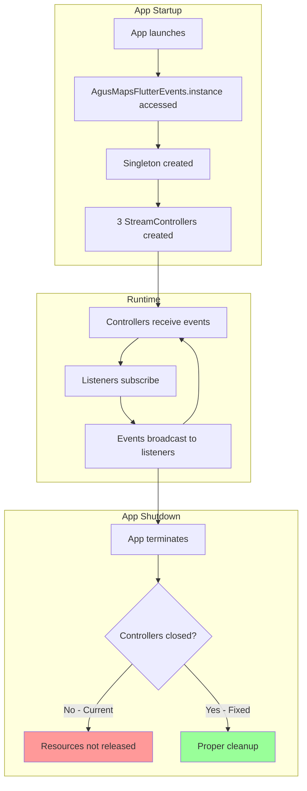
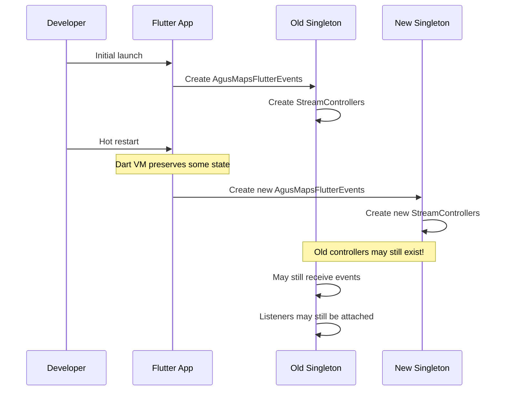
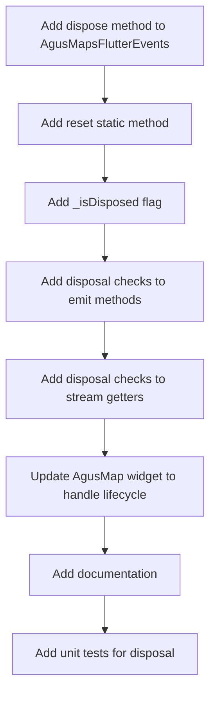

# ISSUE: Event Stream Controllers Never Disposed

## Severity: Low

## Status: Open

---

## Non-Technical Summary

### The Problem (Analogy)

Imagine you have a radio that's always on, broadcasting to anyone who wants to listen. When your app starts, you turn on three radios:
1. "Map Ready" radio
2. "Render State" radio  
3. "Place Page" radio

The problem? **You never turn these radios off.** Even when no one is listening, they're still running in the background, using electricity.

In software terms, these "radios" are called Stream Controllers. They manage the flow of events (messages) from the map engine to the Flutter app. When they're never properly shut down, they can cause memory leaks and unexpected behavior.

### Why It Matters

- **Memory leaks**: Controllers hold references that prevent garbage collection
- **Unexpected behavior**: Old controllers might fire events after the app thinks they're gone
- **Resource waste**: System resources tied up unnecessarily
- **Debug difficulty**: Hard to track down issues caused by zombie streams

### The Solution (Simple)

Add an "off switch" for each radio, and make sure to use it when the app closes or restarts.

---

## Technical Deep Dive

### Problem Statement

The `AgusMapsFlutterEvents` class creates broadcast `StreamController` instances that are never closed during the application lifecycle. While this is often acceptable for singleton event buses, it violates Dart best practices and can cause issues in certain scenarios.

### Current Implementation

**Location**: [lib/agus_maps_flutter.dart#L50-L82](../../lib/agus_maps_flutter.dart)

```dart
/// Broadcast streams for low-frequency native notifications.
class AgusMapsFlutterEvents {
  AgusMapsFlutterEvents._() {
    AgusMapsFlutterApi.setUp(_AgusMapsFlutterApiHandler(this));
  }

  static final AgusMapsFlutterEvents instance = AgusMapsFlutterEvents._();

  // These controllers are NEVER closed
  final StreamController<MapReadyEvent> _mapReadyController =
      StreamController<MapReadyEvent>.broadcast();
  final StreamController<RenderStateChangedEvent>
      _renderStateChangedController =
      StreamController<RenderStateChangedEvent>.broadcast();
  final StreamController<PlacePageChangedEvent> _placePageChangedController =
      StreamController<PlacePageChangedEvent>.broadcast();

  Stream<MapReadyEvent> get onMapReady => _mapReadyController.stream;
  Stream<RenderStateChangedEvent> get onRenderStateChanged =>
      _renderStateChangedController.stream;
  Stream<PlacePageChangedEvent> get onPlacePageChanged =>
      _placePageChangedController.stream;

  void _emitMapReady(int surfaceId) {
    _mapReadyController.add(MapReadyEvent(surfaceId));
  }

  void _emitRenderStateChanged(RenderState state, int? surfaceId) {
    _renderStateChangedController.add(
      RenderStateChangedEvent(state, surfaceId),
    );
  }

  void _emitPlacePageChanged(PlacePageData? placePage) {
    _placePageChangedController.add(PlacePageChangedEvent(placePage));
  }

  // NO dispose() method exists!
}
```

### Object Lifecycle Analysis



### Why This Can Be Problematic

#### Scenario 1: Hot Restart in Development



#### Scenario 2: Plugin Reinitialization

In scenarios where the Flutter engine is restarted (e.g., add-to-app scenarios), the old event instance may linger:

```dart
// In add-to-app scenario
class MyFlutterActivity : FlutterActivity() {
    override fun onDestroy() {
        // Flutter engine destroyed
        // But Dart singletons aren't notified
        super.onDestroy()
    }
}

// Later, new engine created
// Old AgusMapsFlutterEvents.instance still exists
// with stale Pigeon handler reference
```

#### Scenario 3: Subscription Leaks

```dart
class MapScreen extends StatefulWidget { ... }

class _MapScreenState extends State<MapScreen> {
  StreamSubscription? _subscription;
  
  @override
  void initState() {
    super.initState();
    // Subscribe to events
    _subscription = mapsFlutterEvents.onPlacePageChanged.listen((event) {
      // Handle event
    });
  }
  
  @override
  void dispose() {
    // Developer forgets to cancel subscription
    // _subscription?.cancel();  // MISSING!
    super.dispose();
  }
}
```

Without proper stream lifecycle, it's harder to catch these bugs because:
- The stream stays open forever
- The subscription holds references
- Widgets may receive events after disposal

---

## Proposed Solutions

### Solution A: Add Dispose Method (Recommended)

**Approach**: Add explicit lifecycle management to the events class.

```dart
/// Broadcast streams for low-frequency native notifications.
class AgusMapsFlutterEvents {
  AgusMapsFlutterEvents._() {
    AgusMapsFlutterApi.setUp(_AgusMapsFlutterApiHandler(this));
  }

  static AgusMapsFlutterEvents? _instance;
  
  /// Get the singleton instance. Creates if not exists.
  static AgusMapsFlutterEvents get instance {
    _instance ??= AgusMapsFlutterEvents._();
    return _instance!;
  }

  final StreamController<MapReadyEvent> _mapReadyController =
      StreamController<MapReadyEvent>.broadcast();
  final StreamController<RenderStateChangedEvent>
      _renderStateChangedController =
      StreamController<RenderStateChangedEvent>.broadcast();
  final StreamController<PlacePageChangedEvent> _placePageChangedController =
      StreamController<PlacePageChangedEvent>.broadcast();

  bool _isDisposed = false;

  Stream<MapReadyEvent> get onMapReady {
    _checkNotDisposed();
    return _mapReadyController.stream;
  }

  Stream<RenderStateChangedEvent> get onRenderStateChanged {
    _checkNotDisposed();
    return _renderStateChangedController.stream;
  }

  Stream<PlacePageChangedEvent> get onPlacePageChanged {
    _checkNotDisposed();
    return _placePageChangedController.stream;
  }

  void _emitMapReady(int surfaceId) {
    if (_isDisposed) return;
    _mapReadyController.add(MapReadyEvent(surfaceId));
  }

  void _emitRenderStateChanged(RenderState state, int? surfaceId) {
    if (_isDisposed) return;
    _renderStateChangedController.add(
      RenderStateChangedEvent(state, surfaceId),
    );
  }

  void _emitPlacePageChanged(PlacePageData? placePage) {
    if (_isDisposed) return;
    _placePageChangedController.add(PlacePageChangedEvent(placePage));
  }

  void _checkNotDisposed() {
    if (_isDisposed) {
      throw StateError(
        'AgusMapsFlutterEvents has been disposed. '
        'Create a new instance or call reset() before accessing streams.',
      );
    }
  }

  /// Dispose all stream controllers.
  /// Call this when the plugin is being torn down.
  void dispose() {
    if (_isDisposed) return;
    _isDisposed = true;
    
    _mapReadyController.close();
    _renderStateChangedController.close();
    _placePageChangedController.close();
    
    // Clear Pigeon handler
    AgusMapsFlutterApi.setUp(null);
  }

  /// Reset the singleton instance.
  /// Useful for testing or reinitializing after dispose.
  static void reset() {
    _instance?.dispose();
    _instance = null;
  }
}
```

**Usage in app:**

```dart
class MyApp extends StatefulWidget {
  @override
  State<MyApp> createState() => _MyAppState();
}

class _MyAppState extends State<MyApp> with WidgetsBindingObserver {
  @override
  void initState() {
    super.initState();
    WidgetsBinding.instance.addObserver(this);
  }

  @override
  void dispose() {
    WidgetsBinding.instance.removeObserver(this);
    // Clean up map events when app is disposed
    AgusMapsFlutterEvents.reset();
    super.dispose();
  }

  @override
  void didChangeAppLifecycleState(AppLifecycleState state) {
    if (state == AppLifecycleState.detached) {
      // App is being terminated
      AgusMapsFlutterEvents.reset();
    }
  }

  @override
  Widget build(BuildContext context) => MaterialApp(...);
}
```

#### Pros
- ✅ **Proper resource cleanup**: Controllers closed when no longer needed
- ✅ **Fail-fast on misuse**: Accessing disposed streams throws clear error
- ✅ **Testable**: Can reset between tests
- ✅ **Standard pattern**: Follows Dart stream conventions

#### Cons
- ❌ **Breaking change**: Existing code may need updates
- ❌ **Complexity**: Callers must handle lifecycle
- ❌ **Risk of premature disposal**: If disposed too early, events are lost

---

### Solution B: Use async* Generator Functions

**Approach**: Replace StreamController with generator-based streams.

```dart
class AgusMapsFlutterEvents {
  static final _mapReadyEvents = <MapReadyEvent>[];
  static final _renderStateEvents = <RenderStateChangedEvent>[];
  static final _placePageEvents = <PlacePageChangedEvent>[];
  
  /// Map ready events stream using async generator.
  /// Each listener gets their own stream instance.
  Stream<MapReadyEvent> get onMapReady async* {
    int lastIndex = _mapReadyEvents.length;
    while (true) {
      await Future.delayed(const Duration(milliseconds: 16));
      while (lastIndex < _mapReadyEvents.length) {
        yield _mapReadyEvents[lastIndex++];
      }
    }
  }
  
  // Similar for other events...
}
```

#### Pros
- ✅ **No explicit disposal needed**: Streams clean up when cancelled
- ✅ **Memory efficient**: No persistent controller objects

#### Cons
- ❌ **Polling overhead**: Continuous checking even when idle
- ❌ **Event buffering complexity**: Managing event history
- ❌ **Not truly broadcast**: Each listener gets separate stream

---

### Solution C: Weak References for Listeners

**Approach**: Use weak references so listeners don't prevent garbage collection.

```dart
class WeakBroadcastStreamController<T> {
  final _listeners = <WeakReference<void Function(T)>>[];
  
  void add(T event) {
    // Clean up dead references
    _listeners.removeWhere((ref) => ref.target == null);
    
    // Notify remaining listeners
    for (final ref in _listeners) {
      ref.target?.call(event);
    }
  }
  
  StreamSubscription<T> listen(void Function(T) onData) {
    _listeners.add(WeakReference(onData));
    return _WeakSubscription(() {
      _listeners.removeWhere((ref) => ref.target == onData);
    });
  }
}
```

#### Pros
- ✅ **Automatic cleanup**: Dead listeners collected automatically
- ✅ **No dispose needed**: Self-cleaning

#### Cons
- ❌ **Non-standard API**: Not a real Stream
- ❌ **Unpredictable timing**: GC is non-deterministic
- ❌ **Closure complications**: Closures can keep objects alive unexpectedly

---

## Recommended Approach

**Solution A (Add Dispose Method)** is recommended because:

1. **Standard Dart pattern**: Follows established conventions
2. **Explicit lifecycle**: Clear when resources are released
3. **Debugging friendly**: Errors show exactly what went wrong
4. **Backward compatible**: Can be added without breaking existing listeners

### Implementation Checklist



---

## Verification

### Unit Test

```dart
void main() {
  group('AgusMapsFlutterEvents lifecycle', () {
    tearDown(() {
      AgusMapsFlutterEvents.reset();
    });

    test('streams are accessible before dispose', () {
      final events = AgusMapsFlutterEvents.instance;
      expect(() => events.onMapReady, returnsNormally);
      expect(() => events.onPlacePageChanged, returnsNormally);
    });

    test('dispose closes all controllers', () async {
      final events = AgusMapsFlutterEvents.instance;
      final mapReadyStream = events.onMapReady;
      
      events.dispose();
      
      // Stream should be closed
      expect(
        mapReadyStream.isEmpty,
        completion(isTrue),
      );
    });

    test('accessing streams after dispose throws', () {
      final events = AgusMapsFlutterEvents.instance;
      events.dispose();
      
      expect(
        () => events.onMapReady,
        throwsStateError,
      );
    });

    test('reset allows recreation', () {
      final events1 = AgusMapsFlutterEvents.instance;
      events1.dispose();
      
      AgusMapsFlutterEvents.reset();
      
      final events2 = AgusMapsFlutterEvents.instance;
      expect(events2, isNot(same(events1)));
      expect(() => events2.onMapReady, returnsNormally);
    });

    test('emit methods are no-op after dispose', () {
      final events = AgusMapsFlutterEvents.instance;
      final received = <MapReadyEvent>[];
      
      events.onMapReady.listen(received.add);
      events._emitMapReady(1);
      expect(received, hasLength(1));
      
      events.dispose();
      events._emitMapReady(2);  // Should not throw, just no-op
      expect(received, hasLength(1));  // Still 1, not 2
    });
  });
}
```

### Memory Leak Detection

```dart
// In debug builds, track stream subscriptions
class DebugStreamTracker {
  static final _activeSubscriptions = <String, int>{};
  
  static void trackSubscription(String name) {
    _activeSubscriptions[name] = (_activeSubscriptions[name] ?? 0) + 1;
    debugPrint('[StreamTracker] +$name (total: ${_activeSubscriptions[name]})');
  }
  
  static void untrackSubscription(String name) {
    _activeSubscriptions[name] = (_activeSubscriptions[name] ?? 1) - 1;
    debugPrint('[StreamTracker] -$name (total: ${_activeSubscriptions[name]})');
  }
  
  static void reportLeaks() {
    final leaks = _activeSubscriptions.entries
        .where((e) => e.value > 0)
        .map((e) => '${e.key}: ${e.value}')
        .join(', ');
    if (leaks.isNotEmpty) {
      debugPrint('[StreamTracker] LEAKS: $leaks');
    }
  }
}
```

---

## References

- [Dart StreamController Documentation](https://api.dart.dev/stable/dart-async/StreamController-class.html)
- [Effective Dart: Usage - Streams](https://dart.dev/effective-dart/usage#do-close-streams-when-youre-done)
- [Flutter Memory Leak Debugging](https://docs.flutter.dev/testing/debugging#memory)
