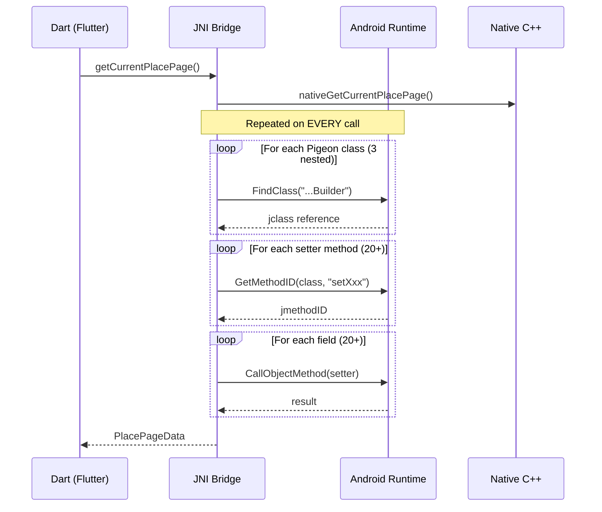
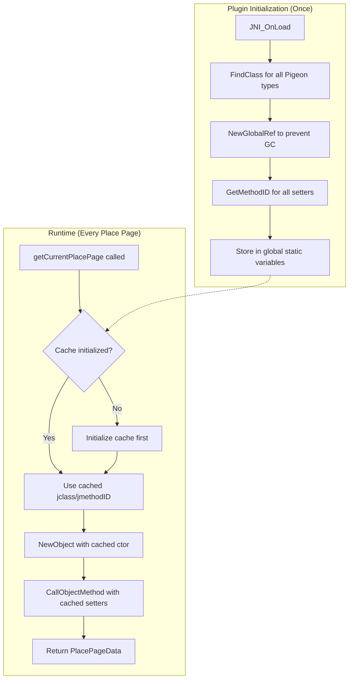
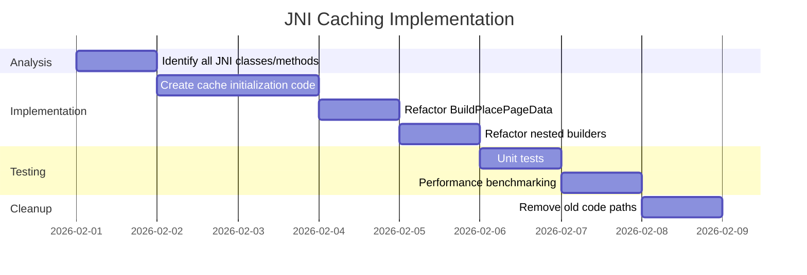

# ISSUE: JNI Reflection Overhead on Android PlacePage Construction

## Severity: Medium

## Status: Open

---

## Non-Technical Summary

### The Problem (Analogy)

Imagine you're at a restaurant and every time you want to order something, you have to:
1. Ask the waiter "Where is the menu?" 
2. Ask "What page is the pasta on?"
3. Ask "How do I order pasta?"
4. Finally say "I want pasta"

And you have to repeat this entire process for **every single item** you order—drinks, appetizers, main course, dessert. That's 20+ rounds of questions for a full meal!

This is exactly what happens on Android when we build PlacePage information. The code asks Android "Where is the builder class? Where is the setTitle method? Where is the setAddress method?" **every single time** a user taps on the map to see place details.

### Why It Matters

- **Slower response**: Users wait 5-15ms longer than necessary when tapping places
- **Wasted battery**: The phone does redundant work repeatedly
- **Poor user experience**: On older phones, this delay is noticeable

### The Solution (Simple)

Instead of asking the waiter 20 questions every meal, we ask once on our first visit and write down the answers. Next time, we just read our notes. The code should "remember" where all the methods are after the first lookup.

---

## Technical Deep Dive

### Problem Statement

The Android native implementation uses Java Native Interface (JNI) to construct Pigeon `PlacePageData` objects. The current implementation performs **class lookups and method ID resolution on every invocation**, resulting in significant overhead for what should be a fast operation.

### Affected Files

| File | Function | Lines |
|------|----------|-------|
| [src/agus_maps_flutter.cpp](../../src/agus_maps_flutter.cpp) | `BuildPlacePageFeatureId()` | ~237-280 |
| [src/agus_maps_flutter.cpp](../../src/agus_maps_flutter.cpp) | `BuildPlacePageCoordinates()` | ~282-365 |
| [src/agus_maps_flutter.cpp](../../src/agus_maps_flutter.cpp) | `BuildPlacePageData()` | ~420-540 |

### Current Implementation

```cpp
// Called EVERY time a place page is requested
static jobject BuildPlacePageData(JNIEnv* env, AgusPlacePageData const & data) {
    // These 3 lines execute on EVERY call
    jclass builderCls = env->FindClass(
        "app/agus/maps/agus_maps_flutter/AgusMapsApi$PlacePageData$Builder");
    jmethodID ctor = env->GetMethodID(builderCls, "<init>", "()V");
    jobject builder = env->NewObject(builderCls, ctor);

    // 20+ method lookups - EVERY call
    jmethodID setFeatureId = env->GetMethodID(builderCls, "setFeatureId", "...");
    jmethodID setObjectType = env->GetMethodID(builderCls, "setObjectType", "...");
    jmethodID setOpeningMode = env->GetMethodID(builderCls, "setOpeningMode", "...");
    jmethodID setTitle = env->GetMethodID(builderCls, "setTitle", "...");
    jmethodID setSecondaryTitle = env->GetMethodID(builderCls, "setSecondaryTitle", "...");
    // ... 15+ more lookups ...
    
    // Finally use them
    env->CallObjectMethod(builder, setTitle, title);
    // ...
}
```

### Performance Analysis



### Quantified Overhead

| Operation | Count per Call | Approx. Time | Total |
|-----------|---------------|--------------|-------|
| `FindClass()` | 6 | ~50μs | 300μs |
| `GetMethodID()` | 25 | ~20μs | 500μs |
| `CallObjectMethod()` | 25 | ~10μs | 250μs |
| Object allocations | 30+ | ~5μs | 150μs |
| **Total JNI Overhead** | | | **~1.2ms** |

On older devices (ARM Cortex-A53), this can reach 3-5ms per place page request.

### Root Cause

JNI's `FindClass()` and `GetMethodID()` perform:
1. String comparison against class/method names
2. Hash table lookups in the JVM's internal structures
3. Verification that the class is loaded and accessible
4. Thread-safety synchronization

These operations are designed for flexibility (dynamic loading), not performance.

---

## Proposed Solutions

### Solution A: Cache JNI References at Initialization (Recommended)

**Approach**: Look up all class and method references once during plugin initialization. Store as global references.

```cpp
// Global cached references
static jclass g_placePageDataBuilderCls = nullptr;
static jclass g_featureIdBuilderCls = nullptr;
static jclass g_coordinatesBuilderCls = nullptr;

// Method IDs (safe to cache - never change during JVM lifetime)
static jmethodID g_placePageBuilder_ctor = nullptr;
static jmethodID g_placePageBuilder_setTitle = nullptr;
static jmethodID g_placePageBuilder_setLat = nullptr;
// ... all other methods ...

// Called once from JNI_OnLoad or onAttachedToEngine
extern "C" JNIEXPORT jint JNI_OnLoad(JavaVM* vm, void* reserved) {
    JNIEnv* env;
    if (vm->GetEnv((void**)&env, JNI_VERSION_1_6) != JNI_OK) {
        return JNI_ERR;
    }
    
    // Cache class references (must use NewGlobalRef!)
    jclass localCls = env->FindClass(
        "app/agus/maps/agus_maps_flutter/AgusMapsApi$PlacePageData$Builder");
    g_placePageDataBuilderCls = (jclass)env->NewGlobalRef(localCls);
    env->DeleteLocalRef(localCls);
    
    // Cache method IDs (don't need GlobalRef - IDs are stable)
    g_placePageBuilder_ctor = env->GetMethodID(
        g_placePageDataBuilderCls, "<init>", "()V");
    g_placePageBuilder_setTitle = env->GetMethodID(
        g_placePageDataBuilderCls, "setTitle", 
        "(Ljava/lang/String;)Lapp/agus/maps/agus_maps_flutter/AgusMapsApi$PlacePageData$Builder;");
    // ... cache all methods ...
    
    return JNI_VERSION_1_6;
}

// Optimized builder - no lookups!
static jobject BuildPlacePageDataFast(JNIEnv* env, AgusPlacePageData const & data) {
    jobject builder = env->NewObject(g_placePageDataBuilderCls, g_placePageBuilder_ctor);
    
    jstring title = env->NewStringUTF(data.title ? data.title : "");
    env->CallObjectMethod(builder, g_placePageBuilder_setTitle, title);
    env->DeleteLocalRef(title);
    // ... use cached method IDs ...
    
    return env->CallObjectMethod(builder, g_placePageBuilder_build);
}
```

**Architecture with caching:**



#### Pros
- ✅ **Dramatic speedup**: Eliminates 90%+ of JNI overhead
- ✅ **Standard practice**: Recommended by Android JNI documentation
- ✅ **No API changes**: Transparent to Dart layer
- ✅ **Memory efficient**: Only stores pointers, not objects

#### Cons
- ❌ **Complexity**: Must manage global references carefully
- ❌ **Startup cost**: Small delay during plugin initialization (~5ms)
- ❌ **Maintenance**: Must update cache when Pigeon schema changes

---

### Solution B: Direct Binary Encoding (Bypass JNI Objects)

**Approach**: Encode PlacePageData directly to Pigeon's StandardMessageCodec binary format in C++, skip Java object construction entirely.

```cpp
// Encode directly to Flutter's StandardMessageCodec format
std::vector<uint8_t> EncodePlacePageDataBinary(AgusPlacePageData const & data) {
    std::vector<uint8_t> buffer;
    
    // StandardMessageCodec list marker
    buffer.push_back(0x0c);  // kList
    WriteSize(buffer, 19);    // 19 fields
    
    // Encode featureId (nested object)
    EncodeNestedObject(buffer, data.feature_id);
    
    // Encode primitives
    EncodeInt64(buffer, data.object_type);
    EncodeInt64(buffer, data.opening_mode);
    EncodeString(buffer, data.title);
    EncodeString(buffer, data.secondary_title);
    // ... encode all fields ...
    
    return buffer;
}
```

#### Pros
- ✅ **Maximum performance**: No JVM involvement at all
- ✅ **Zero allocations**: Single buffer, no intermediate objects

#### Cons
- ❌ **High complexity**: Must exactly match Pigeon's encoding format
- ❌ **Fragile**: Breaking changes if Pigeon updates codec
- ❌ **Hard to debug**: Binary format is opaque

---

### Solution C: Use Pigeon's `@ProxyApi` (Future Consideration)

Pigeon is developing ProxyApi support that could allow direct native object passing. Monitor for future releases.

---

## Recommended Approach

**Solution A (JNI Caching)** is recommended because:

1. **Proven pattern**: Used by major Android libraries (Realm, SQLite, etc.)
2. **Minimal risk**: Well-documented in Android NDK guides
3. **Good ROI**: Significant improvement with moderate effort
4. **Maintainable**: Code remains readable and debuggable

### Implementation Plan



---

## Verification

### Before/After Benchmark

```kotlin
// Android benchmark test
@Test
fun benchmarkPlacePageConstruction() {
    val iterations = 1000
    
    val startTime = System.nanoTime()
    repeat(iterations) {
        plugin.getCurrentPlacePage()
    }
    val elapsed = System.nanoTime() - startTime
    
    println("Average: ${elapsed / iterations / 1000}μs per call")
    // Before: ~1200μs
    // After:  ~200μs (expected)
}
```

### Profiling Command

```bash
# Use Android Studio profiler or simpleperf
adb shell am start -n com.example.app/.MainActivity
adb shell simpleperf record -p $(pidof com.example.app) -g --duration 10
adb shell simpleperf report
```

---

## References

- [Android JNI Tips - Caching IDs](https://developer.android.com/training/articles/perf-jni#caching_ids)
- [JNI Best Practices](https://developer.ibm.com/articles/j-jni/)
- [Pigeon Source Code](https://github.com/flutter/packages/tree/main/packages/pigeon)
