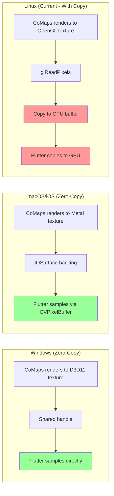
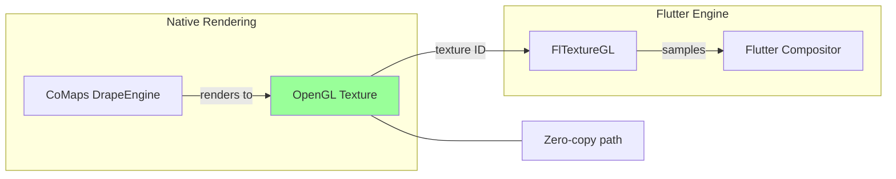
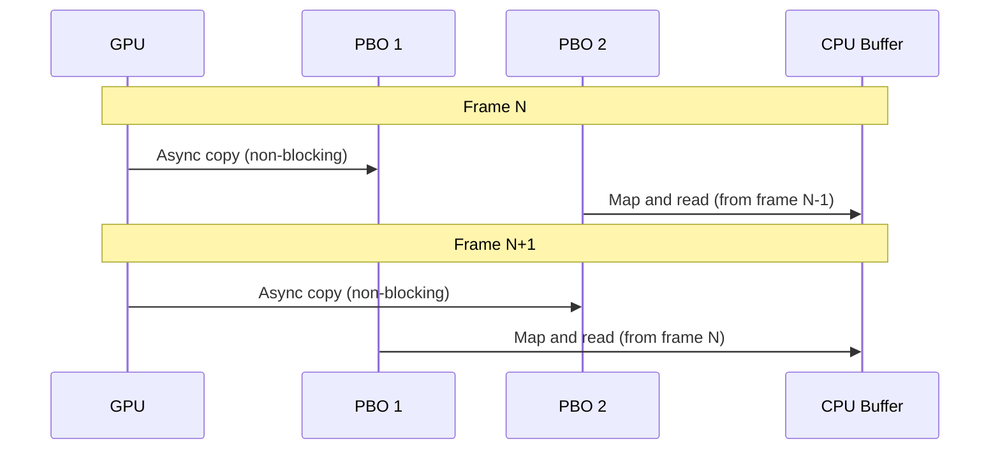
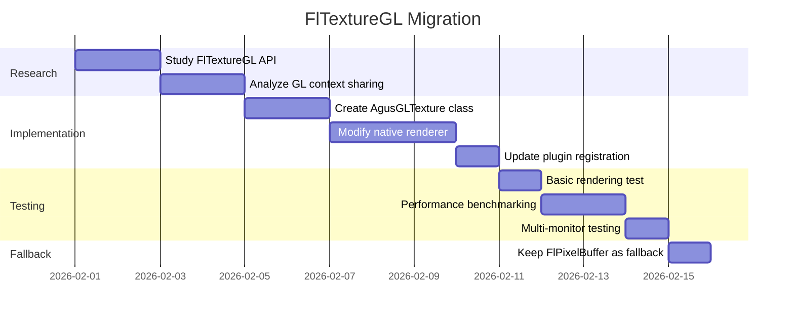

# ISSUE: Linux Pixel Buffer Copy Overhead

## Severity: Medium

## Status: Open

---

## Non-Technical Summary

### The Problem (Analogy)

Imagine you're watching a live sports game through a window. The **ideal setup** would be:
- You look through a clear glass window directly at the game (zero delay, perfect quality)

The **current Linux setup** is like:
1. A camera films the game
2. The video is transmitted to a TV inside your room
3. You watch the TV

This works, but there's a delay and quality loss compared to looking through the window. More importantly, someone has to operate the camera and transmission equipment, using extra energy.

On **Windows and macOS**, the plugin uses "the window" approach—Flutter looks directly at the GPU texture where the map is rendered. On **Linux**, we use "the camera" approach—every frame is copied from GPU memory to regular memory, then Flutter reads that copy.

### Why It Matters

- **Higher CPU usage**: Copying millions of pixels 60 times per second is expensive
- **Memory bandwidth**: Large data transfers between GPU and CPU
- **Latency**: Extra step adds 1-3ms delay per frame
- **Power consumption**: More work = more battery drain (on laptops)

### The Solution (Simple)

Use a shared texture approach on Linux similar to Windows and macOS, where Flutter can read directly from the GPU texture without copying.

---

## Technical Deep Dive

### Problem Statement

The Linux implementation uses `FlPixelBufferTexture` which requires copying the entire frame buffer from GPU memory to CPU memory on every frame. This is significantly less efficient than the zero-copy GPU texture sharing used on Windows (D3D11 shared handles) and macOS/iOS (CVPixelBuffer with IOSurface).

### Current Architecture Comparison



### Current Linux Implementation

**Texture class** ([linux/agus_maps_flutter_plugin.cc#L47-L115](../../linux/agus_maps_flutter_plugin.cc)):

```cpp
// Linux uses FlPixelBufferTexture - requires CPU buffer copy
struct _AgusMapTexture {
  FlPixelBufferTexture parent_instance;
  int32_t width;
  int32_t height;
  uint8_t* pixel_buffer;  // CPU-side buffer
  size_t buffer_size;
  std::mutex* mutex;
  std::atomic<bool>* dirty;
};

// Called by Flutter on every frame
static gboolean agus_map_texture_copy_pixels(FlPixelBufferTexture* texture,
                                              const uint8_t** out_buffer,
                                              uint32_t* width,
                                              uint32_t* height,
                                              GError** error) {
  AgusMapTexture* self = AGUS_MAP_TEXTURE(texture);
  
  // EXPENSIVE: Copy pixels from GPU to CPU buffer
  if (self->mutex) {
    std::lock_guard<std::mutex> lock(*self->mutex);
    int result = agus_copy_pixels(self->pixel_buffer, 
                                   static_cast<int32_t>(self->buffer_size));
  }
  
  *out_buffer = self->pixel_buffer;  // Flutter will copy this again
  *width = static_cast<uint32_t>(self->width);
  *height = static_cast<uint32_t>(self->height);
  
  return TRUE;
}
```

**Native pixel copy** ([src/agus_maps_flutter_linux.cpp](../../src/agus_maps_flutter_linux.cpp)):

```cpp
// This is where the expensive GPU→CPU copy happens
int agus_copy_pixels(uint8_t* buffer, int32_t bufferSize) {
    if (!g_textureId || !buffer) return 0;
    
    glBindTexture(GL_TEXTURE_2D, g_textureId);
    
    // EXPENSIVE: glGetTexImage reads from GPU to CPU memory
    // For 1920x1080 @ 4 bytes/pixel = 8.3MB per frame
    // At 60fps = 498MB/second of memory bandwidth
    glGetTexImage(GL_TEXTURE_2D, 0, GL_RGBA, GL_UNSIGNED_BYTE, buffer);
    
    return 1;
}
```

### Performance Impact Analysis

For a typical 1920x1080 display at 60fps:

| Metric | Value | Impact |
|--------|-------|--------|
| Pixels per frame | 2,073,600 | |
| Bytes per frame | 8,294,400 (8.3MB) | |
| Bandwidth (60fps) | 497MB/s | Saturates many memory buses |
| Copy latency | 1-3ms | Adds to frame time |
| CPU usage | 5-15% | On modern CPUs |

```mermaid
gantt
    title Frame Timeline Comparison (16.67ms budget @ 60fps)
    dateFormat X
    axisFormat %L
    
    section Windows
    Render to texture    :w1, 0, 8
    Flutter samples      :w2, after w1, 1
    Composite           :w3, after w2, 3
    Idle                :w4, after w3, 5
    
    section Linux (Current)
    Render to texture    :l1, 0, 8
    glReadPixels copy    :crit, l2, after l1, 3
    Flutter copy         :crit, l3, after l2, 1
    Composite           :l4, after l3, 3
    Idle                :l5, after l4, 2
```



### Why FlPixelBufferTexture?

Flutter Linux initially only supported `FlPixelBufferTexture` for external textures. `FlTextureGL` was added later but has different requirements:

- `FlPixelBufferTexture`: Provides CPU buffer, Flutter uploads to GPU
- `FlTextureGL`: Provides OpenGL texture ID, Flutter samples directly

---

## Proposed Solutions

### Solution A: Migrate to FlTextureGL (Recommended)

**Approach**: Use Flutter's `FlTextureGL` interface to share the OpenGL texture directly.

```cpp
// New texture class using FlTextureGL
#define AGUS_GL_TEXTURE(obj) \
  (G_TYPE_CHECK_INSTANCE_CAST((obj), agus_gl_texture_get_type(), AgusGLTexture))

struct _AgusGLTexture {
  FlTextureGL parent_instance;
  GLuint texture_id;
  int32_t width;
  int32_t height;
};

G_DEFINE_TYPE(AgusGLTexture, agus_gl_texture, fl_texture_gl_get_type())

// Return the OpenGL texture ID directly - NO COPY!
static gboolean agus_gl_texture_populate(FlTextureGL* texture,
                                          uint32_t* target,
                                          uint32_t* name,
                                          uint32_t* width,
                                          uint32_t* height,
                                          GError** error) {
  AgusGLTexture* self = AGUS_GL_TEXTURE(texture);
  
  *target = GL_TEXTURE_2D;
  *name = self->texture_id;  // Direct texture ID - zero copy!
  *width = static_cast<uint32_t>(self->width);
  *height = static_cast<uint32_t>(self->height);
  
  return TRUE;
}

static void agus_gl_texture_class_init(AgusGLTextureClass* klass) {
  FL_TEXTURE_GL_CLASS(klass)->populate = agus_gl_texture_populate;
}
```

**Architecture with FlTextureGL:**



**Key changes required:**

1. **Texture creation**: Create OpenGL texture that CoMaps can render to
2. **Context sharing**: Ensure Flutter and CoMaps share the same GL context
3. **Synchronization**: Handle frame timing between render and sample

```cpp
// Plugin initialization with GL texture
static void create_gl_texture_surface(AgusMapsFlutterPlugin* self,
                                       int32_t width, int32_t height) {
  // Create OpenGL texture
  GLuint texture_id;
  glGenTextures(1, &texture_id);
  glBindTexture(GL_TEXTURE_2D, texture_id);
  glTexImage2D(GL_TEXTURE_2D, 0, GL_RGBA, width, height, 0, 
               GL_RGBA, GL_UNSIGNED_BYTE, nullptr);
  
  // Configure texture parameters
  glTexParameteri(GL_TEXTURE_2D, GL_TEXTURE_MIN_FILTER, GL_LINEAR);
  glTexParameteri(GL_TEXTURE_2D, GL_TEXTURE_MAG_FILTER, GL_LINEAR);
  
  // Create Flutter texture wrapper
  self->gl_texture = agus_gl_texture_new(texture_id, width, height);
  
  // Register with Flutter
  self->texture_id = fl_texture_registrar_register_texture(
      self->texture_registrar, FL_TEXTURE(self->gl_texture));
  
  // Initialize CoMaps to render to this texture
  agus_native_create_surface_with_texture(texture_id, width, height, density);
}
```

#### Pros
- ✅ **Zero-copy**: Eliminates all pixel buffer copies
- ✅ **~10x less CPU usage**: No more glReadPixels or memcpy
- ✅ **Lower latency**: 1-3ms saved per frame
- ✅ **Parity with Windows/macOS**: Same architectural approach

#### Cons
- ❌ **GL context complexity**: Must share context correctly
- ❌ **Synchronization challenges**: Need proper fence/sync
- ❌ **Debugging difficulty**: GL texture issues harder to diagnose
- ❌ **Flutter version dependency**: FlTextureGL availability

---

### Solution B: EGL Image Sharing (Advanced)

**Approach**: Use EGL images for cross-process texture sharing.

```cpp
// Create EGL image from OpenGL texture
EGLImage egl_image = eglCreateImage(
    egl_display, egl_context,
    EGL_GL_TEXTURE_2D,
    (EGLClientBuffer)(uintptr_t)texture_id,
    nullptr);

// Export as DMA-BUF for Flutter
int dma_buf_fd;
eglExportDMABUFImageMESA(egl_display, egl_image, &dma_buf_fd, ...);
```

#### Pros
- ✅ **Cross-process capable**: Could enable separate render process
- ✅ **Hardware-accelerated**: Leverages GPU's native sharing

#### Cons
- ❌ **Complex implementation**: EGL extensions vary by driver
- ❌ **Driver dependencies**: Not universally supported
- ❌ **Overkill for single-process**: More complexity than needed

---

### Solution C: Optimized Pixel Buffer (Incremental)

**Approach**: Keep FlPixelBufferTexture but optimize the copy path.

```cpp
// Use PBO (Pixel Buffer Object) for async transfer
GLuint pbo[2];  // Double buffer
int current_pbo = 0;

void async_copy_pixels() {
    // Start async copy from texture to PBO
    glBindBuffer(GL_PIXEL_PACK_BUFFER, pbo[current_pbo]);
    glBindTexture(GL_TEXTURE_2D, texture_id);
    glGetTexImage(GL_TEXTURE_2D, 0, GL_RGBA, GL_UNSIGNED_BYTE, 0);
    
    // Map the OTHER PBO (completed from previous frame)
    glBindBuffer(GL_PIXEL_PACK_BUFFER, pbo[1 - current_pbo]);
    void* data = glMapBuffer(GL_PIXEL_PACK_BUFFER, GL_READ_ONLY);
    
    // Copy to Flutter's buffer
    memcpy(flutter_buffer, data, buffer_size);
    
    glUnmapBuffer(GL_PIXEL_PACK_BUFFER);
    
    current_pbo = 1 - current_pbo;  // Swap
}
```



#### Pros
- ✅ **Minimal code changes**: Same API, optimized internals
- ✅ **Reduces blocking**: Async copy overlaps with render
- ✅ **Widely supported**: PBOs are standard OpenGL

#### Cons
- ❌ **Still copies data**: Just hides latency, doesn't eliminate work
- ❌ **One frame latency**: Double buffering adds delay
- ❌ **Complexity**: PBO management is error-prone

---

## Recommended Approach

**Solution A (FlTextureGL)** is recommended for achieving parity with other platforms:

### Decision Matrix

| Criteria | FlTextureGL | EGL Image | Optimized PBO |
|----------|-------------|-----------|---------------|
| Performance | ⭐⭐⭐⭐⭐ | ⭐⭐⭐⭐⭐ | ⭐⭐⭐ |
| Implementation effort | ⭐⭐⭐ | ⭐ | ⭐⭐⭐⭐ |
| Maintainability | ⭐⭐⭐⭐ | ⭐⭐ | ⭐⭐⭐ |
| Compatibility | ⭐⭐⭐⭐ | ⭐⭐ | ⭐⭐⭐⭐⭐ |
| **Total** | **16** | **10** | **15** |

### Implementation Plan



---

## Verification

### Performance Benchmark

```cpp
// Benchmark frame time
void benchmark_texture_approaches() {
    const int iterations = 1000;
    
    // Pixel buffer approach
    auto pbo_start = std::chrono::high_resolution_clock::now();
    for (int i = 0; i < iterations; i++) {
        agus_copy_pixels(buffer, buffer_size);
    }
    auto pbo_duration = std::chrono::high_resolution_clock::now() - pbo_start;
    
    // GL texture approach (just populate call)
    auto gl_start = std::chrono::high_resolution_clock::now();
    for (int i = 0; i < iterations; i++) {
        agus_gl_texture_populate(texture, &target, &name, &width, &height, nullptr);
    }
    auto gl_duration = std::chrono::high_resolution_clock::now() - gl_start;
    
    printf("Pixel buffer: %.2f ms/frame\n", 
           pbo_duration.count() / 1000000.0 / iterations);
    printf("GL texture: %.2f ms/frame\n", 
           gl_duration.count() / 1000000.0 / iterations);
    
    // Expected:
    // Pixel buffer: 2.5ms/frame (for 1080p)
    // GL texture: 0.01ms/frame
}
```

### System Monitoring

```bash
# Monitor CPU usage during map panning
htop -p $(pidof flutter_app)

# Monitor GPU memory bandwidth
sudo intel_gpu_top  # Intel
nvidia-smi dmon     # NVIDIA
radeontop          # AMD

# Expected improvement:
# CPU: 15% → 5%
# Memory bandwidth: 500MB/s → ~0
```

---

## References

- [Flutter Linux Texture API](https://api.flutter.dev/flutter/rendering/TextureBox-class.html)
- [FlTextureGL Source](https://github.com/flutter/engine/blob/main/shell/platform/linux/fl_texture_gl.h)
- [OpenGL Pixel Buffer Objects](https://www.khronos.org/opengl/wiki/Pixel_Buffer_Object)
- [EGL Image Extensions](https://www.khronos.org/registry/EGL/extensions/KHR/EGL_KHR_image.txt)
