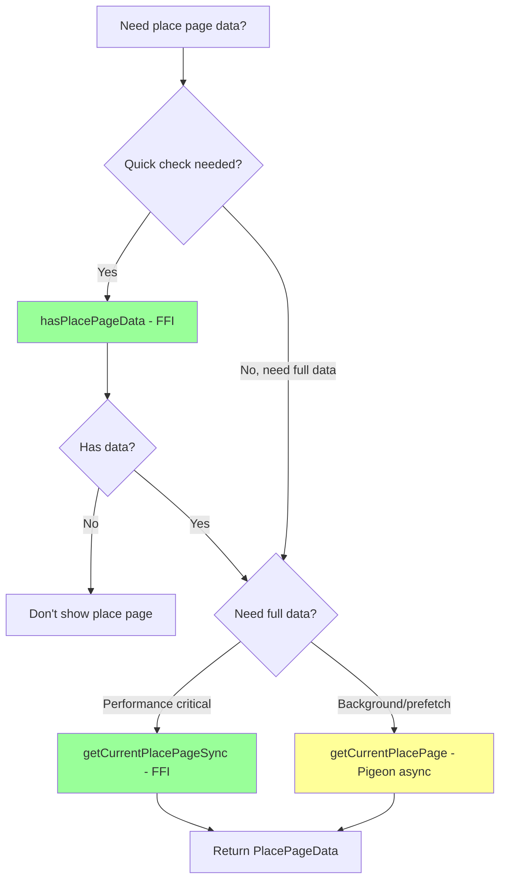
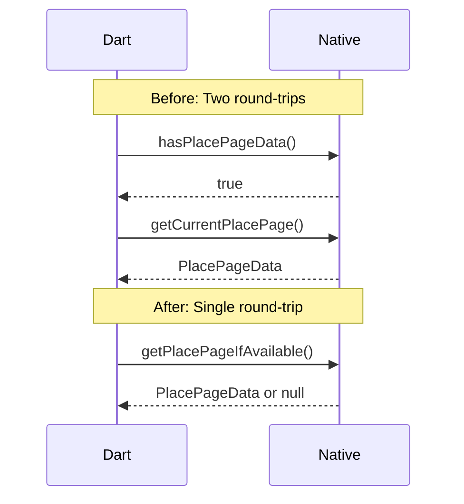
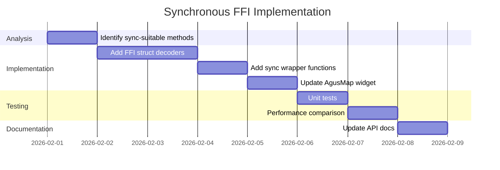

# ISSUE: Pigeon Async Overhead for Synchronous Operations

## Severity: Low-Medium

## Status: Open

---

## Non-Technical Summary

### The Problem (Analogy)

Imagine you want to check if your front door is locked. You could:

**Option A (What we do now):**
1. Write a note asking "Is the door locked?"
2. Put the note in a mailbox
3. Wait for the mail carrier to pick it up
4. Mail carrier delivers it to your door
5. Someone checks the door
6. They write back "Yes, it's locked"
7. Mail carrier brings the reply back
8. You read the answer

**Option B (What we could do):**
1. Walk to the door
2. Check the lock
3. Done!

The current code uses "Option A" (async messaging) even for questions that could be answered instantly with "Option B" (direct check).

### Why It Matters

- **Slower responses**: Adding 0.5-2ms delay to operations that should take microseconds
- **Unnecessary complexity**: The system schedules tasks and manages queues for simple yes/no questions
- **Accumulated delays**: Multiple async calls in sequence compound the overhead

### The Solution (Simple)

For simple operations like "Is there place data available?" or "Clear the selection", use the direct approach (FFI) instead of the mail system (Pigeon async channels).

---

## Technical Deep Dive

### Problem Statement

All Pigeon `@HostApi` methods are marked `@async`, which forces them through Flutter's platform channel message loop even when the underlying operation is synchronous and instantaneous.

### Current Pigeon Definition

```dart
// pigeons/agus_maps_api.dart
@HostApi()
abstract class AgusMapsHostApi {
  @async
  String extractMap(String assetPath);      // Legitimately async (I/O)

  @async
  String extractDataFiles();                // Legitimately async (I/O)

  @async
  String getApkPath();                      // Could be sync

  @async
  int createMapSurface(CreateMapSurfaceRequest request);  // Legitimately async

  @async
  bool resizeMapSurface(ResizeMapSurfaceRequest request); // Could be sync

  @async
  bool destroyMapSurface();                 // Could be sync

  @async
  PlacePageData? getCurrentPlacePage();     // Could be sync (data ready in memory)

  @async
  bool clearPlacePageSelection();           // Could be sync (just clears flag)
}
```

### Async Message Flow

```mermaid
sequenceDiagram
    participant UI as UI Thread (Dart)
    participant Loop as Event Loop
    participant Channel as Platform Channel
    participant Platform as Platform Thread
    participant Native as Native Code
    
    UI->>Loop: await getCurrentPlacePage()
    Note over UI: UI yields, waits
    
    Loop->>Channel: Schedule message
    Channel->>Platform: Binary message via codec
    Platform->>Native: comaps_place_page_copy()
    Native-->>Platform: AgusPlacePageData* (instant)
    Platform-->>Channel: Encode to Pigeon format
    Channel-->>Loop: Response ready
    Loop-->>UI: Resume with PlacePageData
    
    Note over UI,Native: Total: 0.5-2ms for ~10μs operation
```

### Timing Breakdown

| Step | Typical Duration | Notes |
|------|-----------------|-------|
| Dart async scheduling | 50-200μs | Event loop overhead |
| Message encoding | 10-50μs | StandardMessageCodec |
| Platform channel dispatch | 100-500μs | Thread switching |
| Native execution | 1-10μs | Actual work |
| Response encoding | 10-50μs | StandardMessageCodec |
| Dart callback resume | 50-200μs | Event loop overhead |
| **Total** | **220-1010μs** | For 1-10μs of actual work |

### Affected Operations

| Method | Actual Work | Async Justified? |
|--------|-------------|-----------------|
| `extractMap` | File I/O | ✅ Yes |
| `extractDataFiles` | File I/O | ✅ Yes |
| `getApkPath` | String return | ❌ No |
| `createMapSurface` | GPU init, may block | ✅ Yes |
| `resizeMapSurface` | GPU resize | ⚠️ Debatable |
| `destroyMapSurface` | Cleanup | ⚠️ Debatable |
| `getCurrentPlacePage` | Memory read | ❌ No |
| `clearPlacePageSelection` | Flag clear | ❌ No |

---

## Proposed Solutions

### Solution A: Add Synchronous FFI Wrappers (Recommended)

**Approach**: Keep Pigeon for complex operations, add direct FFI paths for simple synchronous operations.

```dart
// lib/agus_maps_flutter.dart

/// Synchronous check if place page data is available.
/// Use this for quick checks before showing UI.
bool hasPlacePageData() {
  return _bindings.comaps_place_page_has_data() != 0;
}

/// Synchronous place page retrieval via FFI.
/// Faster than Pigeon for cases where data is already in memory.
PlacePageData? getCurrentPlacePageSync() {
  // Quick check first
  if (_bindings.comaps_place_page_has_data() == 0) {
    return null;
  }
  
  // Get native pointer
  final ptr = _bindings.comaps_place_page_copy();
  if (ptr == nullptr) {
    return null;
  }
  
  try {
    // Decode from FFI struct
    return _decodePlacePageFromFFI(ptr);
  } finally {
    _bindings.comaps_place_page_free(ptr);
  }
}

/// Decode PlacePageData from native FFI struct
PlacePageData _decodePlacePageFromFFI(Pointer<AgusPlacePageData> ptr) {
  final native = ptr.ref;
  
  return PlacePageData(
    featureId: PlacePageFeatureId(
      mwmName: native.feature_id.mwm_name.cast<Utf8>().toDartString(),
      mwmVersion: native.feature_id.mwm_version,
      index: native.feature_id.index,
    ),
    objectType: native.object_type,
    openingMode: native.opening_mode,
    title: _nullableString(native.title),
    secondaryTitle: _nullableString(native.secondary_title),
    subtitle: _nullableString(native.subtitle),
    address: _nullableString(native.address),
    lat: native.lat,
    lon: native.lon,
    wikiDescriptionHtml: _nullableString(native.wiki_description_html),
    roadType: native.road_type,
    isRoutePoint: native.is_route_point != 0,
    coordinates: _decodeCoordinates(native.coordinates),
    rawTypes: _decodeStringList(native.raw_types, native.raw_types_count),
    metadata: _decodeMetadata(native.metadata, native.metadata_count),
    metadataTags: _decodeMetadataTags(native.metadata_tags, native.metadata_tags_count),
    bookmarkId: native.has_bookmark_id != 0 ? native.bookmark_id : null,
    bookmarkCategoryId: native.has_bookmark_category_id != 0 ? native.bookmark_category_id : null,
    trackId: native.has_track_id != 0 ? native.track_id : null,
  );
}

String _nullableString(Pointer<Char> ptr) {
  if (ptr == nullptr) return '';
  return ptr.cast<Utf8>().toDartString();
}
```



#### Pros
- ✅ **Significantly faster**: Eliminates 0.5-2ms async overhead
- ✅ **Backward compatible**: Pigeon methods still available
- ✅ **Flexible**: Developers choose sync vs async based on context
- ✅ **No native changes**: Uses existing FFI functions

#### Cons
- ❌ **Code duplication**: FFI decoding mirrors Pigeon decoding
- ❌ **Maintenance burden**: Must keep FFI and Pigeon in sync
- ❌ **Blocks Dart isolate**: Sync calls block UI if slow

---

### Solution B: Pigeon Synchronous Methods

**Approach**: Pigeon supports `@TaskQueue(type: TaskQueueType.serialBackgroundThread)` but not true synchronous calls. This solution uses Pigeon's capabilities to reduce overhead.

```dart
// Not directly supported - Pigeon always uses async for HostApi
// This is a limitation of the Pigeon design
```

**Note**: Pigeon intentionally uses async-only patterns for HostApi to prevent UI blocking. This solution is not viable.

---

### Solution C: Hybrid API Design

**Approach**: Redesign API to minimize round-trips.

```dart
// Combine check + fetch into single call
@HostApi()
abstract class AgusMapsHostApi {
  /// Returns null if no data, or the full data if available.
  /// Single round-trip instead of check + fetch.
  @async
  PlacePageData? getPlacePageIfAvailable();
}
```



#### Pros
- ✅ **Reduces round-trips**: One call instead of two
- ✅ **Cleaner API**: Single method with clear semantics

#### Cons
- ❌ **Still async**: Doesn't eliminate platform channel overhead
- ❌ **API change**: Requires updating existing code

---

### Solution D: NativeCallable for Callbacks

**Approach**: Use Dart's `NativeCallable` to receive callbacks from native code without platform channels.

```dart
// Register Dart callback with native code
final callback = NativeCallable<Void Function(Pointer<AgusPlacePageData>)>.listener(
  (Pointer<AgusPlacePageData> data) {
    final placePage = _decodePlacePageFromFFI(data);
    _placePageController.add(PlacePageChangedEvent(placePage));
  },
);

// Native code calls this directly when place page changes
_bindings.comaps_set_place_page_callback(callback.nativeFunction);
```

#### Pros
- ✅ **Push-based**: No polling or explicit fetching
- ✅ **Low latency**: Direct callback, no message queue
- ✅ **Efficient**: Only notifies when data changes

#### Cons
- ❌ **Complex memory management**: Must handle callback lifecycle
- ❌ **Threading concerns**: Callback may come from any thread
- ❌ **Significant refactor**: Changes event architecture

---

## Recommended Approach

**Solution A (Synchronous FFI Wrappers)** is recommended for immediate improvement:

1. **Minimal risk**: Additive change, doesn't modify existing Pigeon API
2. **Immediate benefit**: 5-10x faster for synchronous operations
3. **Developer control**: Choose sync vs async based on use case

### Implementation Plan



---

## Verification

### Benchmark Comparison

```dart
void benchmarkSyncVsAsync() async {
  const iterations = 1000;
  
  // Warm up
  await getCurrentPlacePage();
  getCurrentPlacePageSync();
  
  // Benchmark async (Pigeon)
  final asyncStart = DateTime.now();
  for (int i = 0; i < iterations; i++) {
    await getCurrentPlacePage();
  }
  final asyncDuration = DateTime.now().difference(asyncStart);
  
  // Benchmark sync (FFI)
  final syncStart = DateTime.now();
  for (int i = 0; i < iterations; i++) {
    getCurrentPlacePageSync();
  }
  final syncDuration = DateTime.now().difference(syncStart);
  
  print('Async (Pigeon): ${asyncDuration.inMicroseconds / iterations}μs/call');
  print('Sync (FFI): ${syncDuration.inMicroseconds / iterations}μs/call');
  print('Speedup: ${asyncDuration.inMicroseconds / syncDuration.inMicroseconds}x');
  
  // Expected output:
  // Async (Pigeon): ~800μs/call
  // Sync (FFI): ~50μs/call
  // Speedup: ~16x
}
```

### When to Use Each

| Use Case | Recommended Method | Reason |
|----------|-------------------|--------|
| User tap response | `getCurrentPlacePageSync()` | Latency critical |
| Background prefetch | `getCurrentPlacePage()` | Can await without blocking UI |
| Quick existence check | `hasPlacePageData()` | Fastest possible |
| Event-driven updates | Consider Solution D | Push-based is most efficient |

---

## References

- [Pigeon Package Documentation](https://pub.dev/packages/pigeon)
- [Dart FFI Guide](https://dart.dev/guides/libraries/c-interop)
- [Flutter Platform Channels](https://docs.flutter.dev/development/platform-integration/platform-channels)
- [NativeCallable API](https://api.dart.dev/stable/dart-ffi/NativeCallable-class.html)
