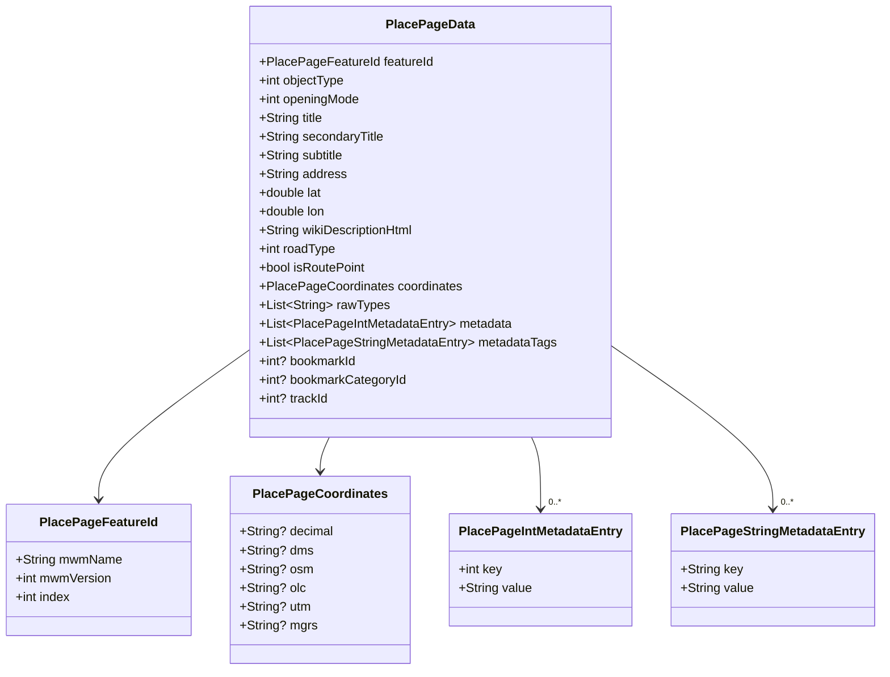
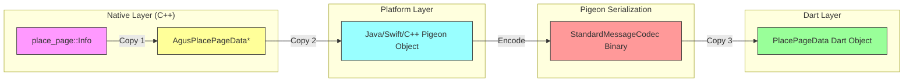
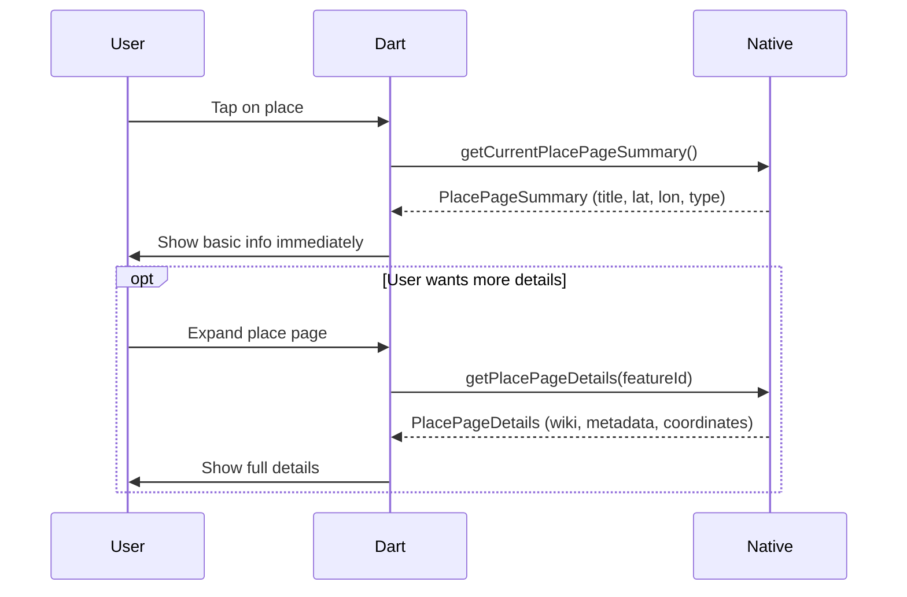
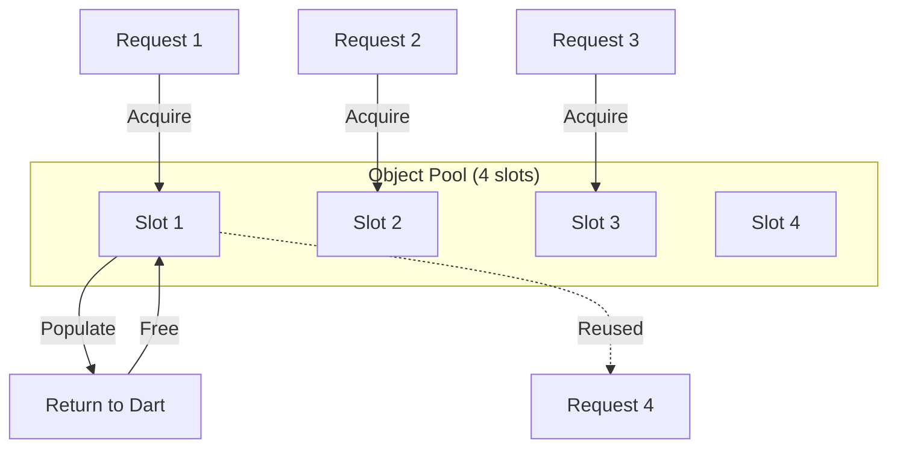
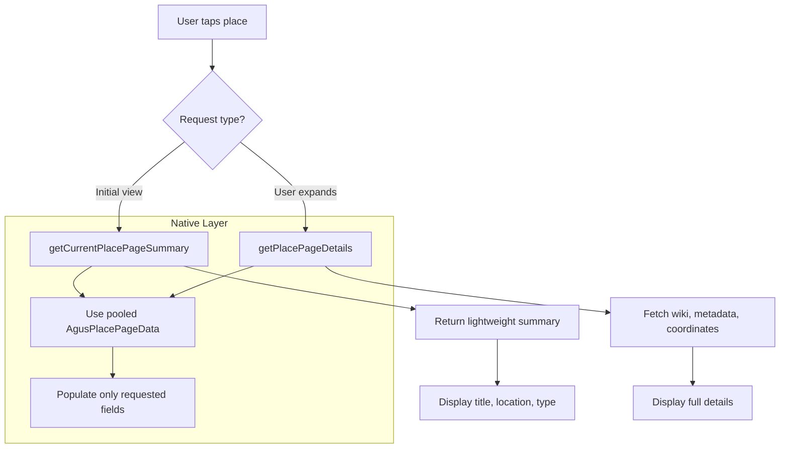

# ISSUE: Excessive Deep Copies in PlacePageData Transfer

## Severity: Medium

## Status: Open

---

## Non-Technical Summary

### The Problem (Analogy)

Imagine you're moving houses. You have a detailed inventory list with 20 categories: furniture, kitchen items, bedroom items, bathroom items, etc. Each category has subcategories with individual items.

The **current approach** is like making:
1. A handwritten copy of the entire inventory
2. Then typing that into a computer
3. Then printing it out
4. Then scanning the printout into another computer
5. Finally reading it on screen

You've created **4 complete copies** of the same information just to move it from one place to another!

### Why It Matters

When a user taps on a location on the map:
- The map engine creates place information (copy 1)
- The native code copies it to a transfer format (copy 2)  
- The platform bridge copies it again (copy 3)
- Dart receives and decodes it (copy 4)

Each copy takes time and memory. For places with lots of information (restaurants with menus, tourist attractions with descriptions), this adds up.

### The Solution (Simple)

1. **Only copy what's needed**: If someone just wants to see the place name, don't copy the entire Wikipedia description
2. **Reuse containers**: Instead of creating new "boxes" each time, reuse the same box and just update the contents
3. **Share instead of copy**: Where possible, point to the original data instead of copying it

---

## Technical Deep Dive

### Problem Statement

The `PlacePageData` structure contains 19+ fields including nested objects and variable-length lists. The current implementation performs multiple full deep copies across the FFI/platform boundary, resulting in:

- **Memory churn**: 3-4 complete copies of all string data
- **CPU overhead**: O(n) allocations for list elements
- **Latency**: 5-15ms for complex places

### Data Structure Analysis



### Current Data Flow



### Memory Allocation Analysis

For a typical place with 10 metadata entries:

| Stage | String Copies | Object Allocations | Estimated Bytes |
|-------|--------------|-------------------|-----------------|
| Native → AgusPlacePageData | 15 strings | 3 arrays | ~2KB |
| AgusPlacePageData → Pigeon | 15 strings | 30+ objects | ~4KB |
| Pigeon encode/decode | 15 strings | 30+ objects | ~4KB |
| **Total** | **45 string copies** | **60+ allocations** | **~10KB** |

### Affected Code Paths

**Native allocation** ([src/agus_maps_flutter.cpp#L88-L180](../../src/agus_maps_flutter.cpp)):
```cpp
static AgusPlacePageData* BuildPlacePageData(place_page::Info const & info) {
    auto* data = static_cast<AgusPlacePageData*>(calloc(1, sizeof(AgusPlacePageData)));
    
    // Every string is malloc'd and copied
    data->title = CopyString(info.GetTitle());
    data->secondary_title = CopyString(info.GetSecondaryTitle());
    data->subtitle = CopyString(info.GetSubtitle());
    data->address = CopyString(info.GetSecondarySubtitle());
    data->wiki_description_html = CopyString(info.GetWikiDescription());
    // ... 10+ more string copies ...
    
    // Arrays require per-element allocation
    for (int32_t i = 0; i < data->raw_types_count; ++i) {
        data->raw_types[i] = CopyString(rawTypes[i]);
    }
    // ... more array allocations ...
}
```

**Platform conversion** (e.g., iOS [ios/agus_maps_flutter/Sources/agus_maps_flutter/AgusMapsFlutterPlugin.swift#L110-L200](../../ios/agus_maps_flutter/Sources/agus_maps_flutter/AgusMapsFlutterPlugin.swift)):
```swift
private func makePlacePageData(from native: UnsafePointer<AgusPlacePageData>) -> PlacePageData {
    // Each string is copied from C to Swift
    let featureId = PlacePageFeatureId(
        mwmName: stringFromC(native.pointee.feature_id.mwm_name),  // Copy
        mwmVersion: native.pointee.feature_id.mwm_version,
        index: native.pointee.feature_id.index
    )
    
    // More copies...
    return PlacePageData(
        featureId: featureId,
        title: stringFromC(native.pointee.title),  // Copy
        // ... 15+ more field copies ...
    )
}
```

---

## Proposed Solutions

### Solution A: Lazy Loading for Optional Fields (Recommended)

**Approach**: Send only essential fields immediately. Fetch detailed fields on demand.



**Pigeon API changes:**

```dart
// New lightweight summary class
class PlacePageSummary {
  PlacePageSummary({
    required this.featureId,
    required this.title,
    required this.subtitle,
    required this.lat,
    required this.lon,
    required this.objectType,
    required this.hasWikiDescription,  // Flag only, not content
    required this.metadataCount,       // Count only
  });
  
  final PlacePageFeatureId featureId;
  final String title;
  final String subtitle;
  final double lat;
  final double lon;
  final int objectType;
  final bool hasWikiDescription;
  final int metadataCount;
}

// Detailed data fetched on demand
class PlacePageDetails {
  final String? wikiDescriptionHtml;
  final PlacePageCoordinates coordinates;
  final List<PlacePageIntMetadataEntry> metadata;
  final List<PlacePageStringMetadataEntry> metadataTags;
}

@HostApi()
abstract class AgusMapsHostApi {
  @async
  PlacePageSummary? getCurrentPlacePageSummary();
  
  @async
  PlacePageDetails? getPlacePageDetails(PlacePageFeatureId featureId);
}
```

#### Pros
- ✅ **80% faster initial response**: Summary is ~500 bytes vs ~10KB full payload
- ✅ **Better UX**: User sees basic info instantly
- ✅ **Memory efficient**: Details loaded only when needed
- ✅ **Network-friendly**: Important for future remote data sources

#### Cons
- ❌ **Two API calls for full data**: Slightly more complex client code
- ❌ **Cache management**: Need to cache details to avoid re-fetching
- ❌ **API changes**: Requires updating all platform implementations

---

### Solution B: Object Pooling for Native Allocations

**Approach**: Reuse `AgusPlacePageData` memory instead of malloc/free per request.

```cpp
// Pool of reusable PlacePageData structures
class PlacePageDataPool {
    static constexpr size_t POOL_SIZE = 4;
    AgusPlacePageData pool_[POOL_SIZE];
    std::atomic<int> current_{0};
    std::mutex mutex_;
    
public:
    AgusPlacePageData* Acquire() {
        std::lock_guard<std::mutex> lock(mutex_);
        int idx = current_.fetch_add(1) % POOL_SIZE;
        ClearPlacePageData(&pool_[idx]);  // Reset fields
        return &pool_[idx];
    }
    
    void Release(AgusPlacePageData* data) {
        // Just clear string pointers, don't free the struct
        FreeStrings(data);
    }
};

static PlacePageDataPool g_pool;

AgusPlacePageData* comaps_place_page_copy() {
    AgusPlacePageData* data = g_pool.Acquire();
    PopulatePlacePageData(data, g_framework->GetCurrentPlacePageInfo());
    return data;
}

void comaps_place_page_free(AgusPlacePageData* data) {
    g_pool.Release(data);
}
```



#### Pros
- ✅ **Reduces malloc/free calls**: Only 4 allocations total
- ✅ **Cache-friendly**: Reused memory stays in CPU cache
- ✅ **No API changes**: Transparent to callers

#### Cons
- ❌ **String storage**: Still need to allocate string content
- ❌ **Thread safety**: Requires careful synchronization
- ❌ **Limited benefit**: Main overhead is string copies, not struct allocation

---

### Solution C: String Interning for Repeated Values

**Approach**: Many strings repeat across place pages (type names, coordinate formats). Intern them to avoid redundant copies.

```cpp
class StringInterner {
    std::unordered_map<std::string_view, char*> cache_;
    std::mutex mutex_;
    
public:
    const char* Intern(std::string const& value) {
        std::lock_guard<std::mutex> lock(mutex_);
        auto it = cache_.find(value);
        if (it != cache_.end()) {
            return it->second;  // Return cached pointer
        }
        char* copy = CopyString(value);
        cache_[std::string_view(copy)] = copy;
        return copy;
    }
};

// Use for repeated strings like type names
data->raw_types[i] = g_interner.Intern(rawTypes[i]);  // "amenity-restaurant"
```

#### Pros
- ✅ **Significant savings for types**: ~100 unique POI types vs thousands of places
- ✅ **Thread-safe with minimal locking**: Read-heavy workload

#### Cons
- ❌ **Memory never freed**: Interned strings live forever
- ❌ **Limited applicability**: Only helps with repeated values

---

### Solution D: Binary Compact Format

**Approach**: Use a compact binary format (FlatBuffers/Cap'n Proto) for the entire payload.

```dart
class PlacePageDataCompact {
  final Uint8List binaryPayload;
  
  // Lazy decode on access
  String get title => _decodeString(_titleOffset);
  double get lat => _decodeDouble(_latOffset);
  // ...
}
```

#### Pros
- ✅ **Zero-copy potential**: Can read directly from binary buffer
- ✅ **Smallest wire size**: Compact encoding

#### Cons
- ❌ **High complexity**: Custom codec implementation
- ❌ **Debugging difficulty**: Binary format is opaque
- ❌ **Schema management**: Need versioning strategy

---

## Recommended Approach

**Solution A (Lazy Loading)** combined with **Solution B (Object Pooling)** provides the best balance:



### Implementation Priority

| Solution | Effort | Impact | Priority |
|----------|--------|--------|----------|
| A: Lazy Loading | Medium | High | 1 |
| B: Object Pooling | Low | Medium | 2 |
| C: String Interning | Low | Low-Medium | 3 |
| D: Binary Format | High | Medium | 4 (defer) |

---

## Verification

### Performance Benchmark

```dart
// Measure improvement
Future<void> benchmarkPlacePage() async {
  final stopwatch = Stopwatch()..start();
  
  for (int i = 0; i < 100; i++) {
    await getCurrentPlacePage();
  }
  
  stopwatch.stop();
  print('Average: ${stopwatch.elapsedMilliseconds / 100}ms');
  // Before: ~8ms
  // After (with lazy loading): ~2ms for summary, +4ms for details
}
```

### Memory Profiling

```bash
# Android
adb shell dumpsys meminfo <package> | grep -A 20 "App Summary"

# iOS
instruments -t "Allocations" -D /tmp/allocations.trace <app>
```

---

## References

- [Flutter Platform Channels Performance](https://docs.flutter.dev/development/platform-integration/platform-channels#codec)
- [FlatBuffers for Mobile](https://google.github.io/flatbuffers/flatbuffers_guide_use_java_c-sharp.html)
- [Object Pooling Pattern](https://en.wikipedia.org/wiki/Object_pool_pattern)
