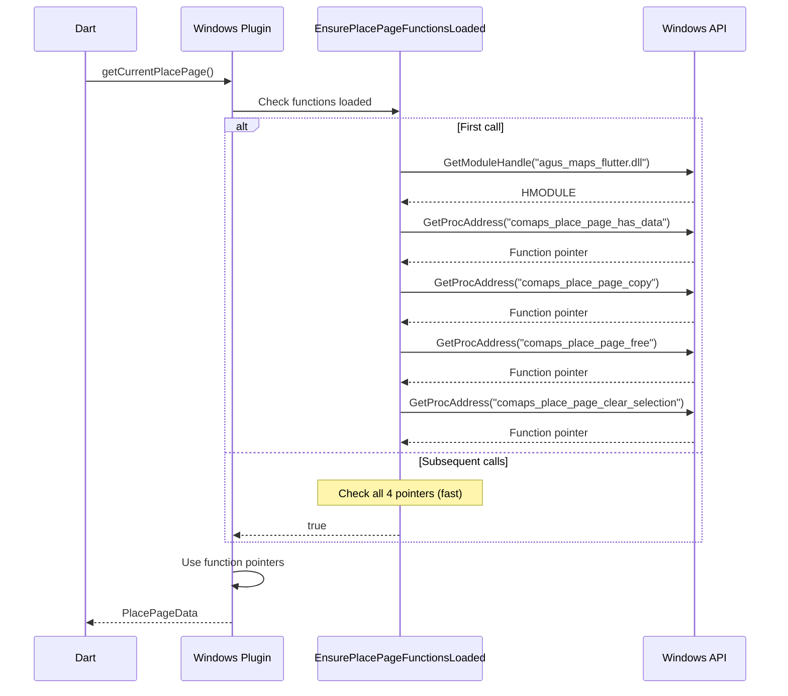
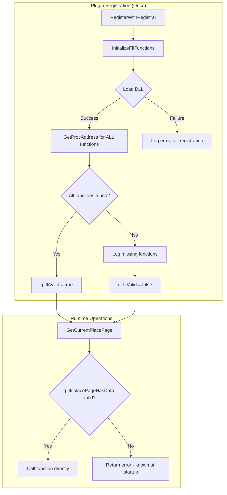
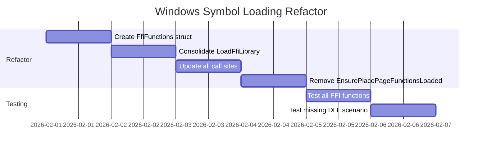

# ISSUE: Windows Dynamic Symbol Loading Overhead

## Severity: Low

## Status: Open

---

## Non-Technical Summary

### The Problem (Analogy)

Imagine you work in an office building, and every time you need to use the printer, you have to:
1. Go to the reception desk
2. Ask "Where is the printer?"
3. Walk to the printer
4. Print your document
5. Repeat steps 1-3 the next time you need to print

Even though the printer never moves, you keep asking for directions every single time!

The Windows version of the map plugin does something similar. When it needs to call certain map functions, it asks Windows "Where is this function?" repeatedly, even though the answer never changes while the app is running.

### Why It Matters

- **Wasted effort**: Looking up the same information repeatedly
- **Slower operations**: Extra steps before doing actual work
- **Inconsistent timing**: Sometimes the lookup is cached by the system, sometimes not

### The Solution (Simple)

Ask for directions once when you arrive at the office (app startup), write them down, and use your notes from then on.

---

## Technical Deep Dive

### Problem Statement

The Windows plugin uses `GetProcAddress()` to look up FFI function pointers. While the main rendering functions are loaded once at startup via `LoadFfiLibrary()`, the place page functions are loaded lazily with repeated checks on every call.

### Current Implementation

**Location**: [windows/agus_maps_flutter_plugin.cpp#L160-L195](../../windows/agus_maps_flutter_plugin.cpp)

```cpp
// Function pointer globals - loaded lazily
static PlacePageHasDataFn g_fnPlacePageHasData = nullptr;
static PlacePageCopyFn g_fnPlacePageCopy = nullptr;
static PlacePageFreeFn g_fnPlacePageFree = nullptr;
static PlacePageClearSelectionFn g_fnPlacePageClearSelection = nullptr;

// Called on EVERY place page operation
static bool EnsurePlacePageFunctionsLoaded() {
    // Check all 4 pointers every time
    if (g_fnPlacePageHasData && g_fnPlacePageCopy && g_fnPlacePageFree &&
        g_fnPlacePageClearSelection) {
        return true;
    }

    // Load the FFI library if not loaded
    if (!LoadFfiLibrary()) {
        return false;
    }

    HMODULE module = GetNativeLibraryHandle();
    if (!module) {
        return false;
    }

    // Look up symbols - done repeatedly if any are null
    g_fnPlacePageHasData = reinterpret_cast<PlacePageHasDataFn>(
        GetProcAddress(module, "comaps_place_page_has_data"));
    g_fnPlacePageCopy = reinterpret_cast<PlacePageCopyFn>(
        GetProcAddress(module, "comaps_place_page_copy"));
    g_fnPlacePageFree = reinterpret_cast<PlacePageFreeFn>(
        GetProcAddress(module, "comaps_place_page_free"));
    g_fnPlacePageClearSelection = reinterpret_cast<PlacePageClearSelectionFn>(
        GetProcAddress(module, "comaps_place_page_clear_selection"));

    return g_fnPlacePageHasData && g_fnPlacePageCopy && g_fnPlacePageFree &&
           g_fnPlacePageClearSelection;
}

// Usage - checks on every call
void AgusMapsFlutterPlugin::GetCurrentPlacePage(
    std::function<void(ErrorOr<std::optional<PlacePageData>> reply)> result) {
    
    // This function performs checks every call
    if (!EnsurePlacePageFunctionsLoaded()) {
        OutputDebugStringA("[AgusMapsFlutter] getCurrentPlacePage unavailable (FFI missing)\n");
        result(ErrorOr<std::optional<PlacePageData>>(std::nullopt));
        return;
    }

    // Now use the functions...
}
```

### Call Flow Analysis



### Performance Analysis

| Operation | First Call | Subsequent Calls |
|-----------|-----------|------------------|
| `EnsurePlacePageFunctionsLoaded()` | ~50μs (4x GetProcAddress) | ~0.1μs (4 pointer checks) |
| Function null checks | ~0.05μs | ~0.05μs |
| Actual FFI call | ~1-10μs | ~1-10μs |

**Issues identified:**

1. **Branching overhead**: 4 null checks on every call
2. **No fail-fast**: If loading fails once, it will try again on next call
3. **Inconsistent with other functions**: Rendering functions loaded at startup, place page functions loaded lazily
4. **Debug string overhead**: `OutputDebugStringA` called on failure path

### Code Smell: Scattered Loading

```cpp
// In LoadFfiLibrary() - rendering functions
g_fnCreateSurface = reinterpret_cast<CreateSurfaceFn>(
    GetProcAddress(g_ffiModule, "agus_native_create_surface"));
g_fnOnSizeChanged = reinterpret_cast<OnSizeChangedFn>(
    GetProcAddress(g_ffiModule, "agus_native_on_size_changed"));
// ... 7 more functions ...

// In EnsurePlacePageFunctionsLoaded() - place page functions (SEPARATE!)
g_fnPlacePageHasData = reinterpret_cast<PlacePageHasDataFn>(
    GetProcAddress(module, "comaps_place_page_has_data"));
// ... 3 more functions ...
```

The loading logic is split across two functions, making it harder to maintain and reason about.

---

## Proposed Solutions

### Solution A: Consolidate Loading at Startup (Recommended)

**Approach**: Load all function pointers once during plugin registration, fail fast if any are missing.

```cpp
// All function pointers in one place
struct FfiFunctions {
    // Rendering
    CreateSurfaceFn createSurface;
    OnSizeChangedFn onSizeChanged;
    SetVisualScaleFn setVisualScale;
    OnSurfaceDestroyedFn onSurfaceDestroyed;
    GetSharedTextureHandleFn getSharedTextureHandle;
    GetD3D11DeviceFn getD3D11Device;
    GetD3D11TextureFn getD3D11Texture;
    RenderFrameFn renderFrame;
    SetFrameReadyCallbackFn setFrameReadyCallback;
    
    // Place page
    PlacePageHasDataFn placePageHasData;
    PlacePageCopyFn placePageCopy;
    PlacePageFreeFn placePageFree;
    PlacePageClearSelectionFn placePageClearSelection;
    
    bool isValid() const {
        return createSurface && onSizeChanged && setVisualScale &&
               onSurfaceDestroyed && getSharedTextureHandle &&
               renderFrame && setFrameReadyCallback &&
               placePageHasData && placePageCopy && 
               placePageFree && placePageClearSelection;
    }
};

static FfiFunctions g_ffi = {};
static bool g_ffiInitialized = false;
static bool g_ffiValid = false;

// Load everything once
static bool InitializeFfiFunctions() {
    if (g_ffiInitialized) {
        return g_ffiValid;
    }
    g_ffiInitialized = true;
    
    HMODULE module = GetModuleHandleW(L"agus_maps_flutter.dll");
    if (!module) {
        module = LoadLibraryW(L"agus_maps_flutter.dll");
    }
    if (!module) {
        OutputDebugStringA("[AgusMapsFlutter] ERROR: Failed to load DLL\n");
        return false;
    }
    
    // Load all functions in one block
    #define LOAD_FN(name, symbol) \
        g_ffi.name = reinterpret_cast<decltype(g_ffi.name)>( \
            GetProcAddress(module, symbol)); \
        if (!g_ffi.name) { \
            OutputDebugStringA("[AgusMapsFlutter] Missing: " symbol "\n"); \
        }
    
    LOAD_FN(createSurface, "agus_native_create_surface")
    LOAD_FN(onSizeChanged, "agus_native_on_size_changed")
    LOAD_FN(setVisualScale, "agus_native_set_visual_scale")
    LOAD_FN(onSurfaceDestroyed, "agus_native_on_surface_destroyed")
    LOAD_FN(getSharedTextureHandle, "agus_get_shared_texture_handle")
    LOAD_FN(getD3D11Device, "agus_get_d3d11_device")
    LOAD_FN(getD3D11Texture, "agus_get_d3d11_texture")
    LOAD_FN(renderFrame, "agus_render_frame")
    LOAD_FN(setFrameReadyCallback, "agus_set_frame_ready_callback")
    LOAD_FN(placePageHasData, "comaps_place_page_has_data")
    LOAD_FN(placePageCopy, "comaps_place_page_copy")
    LOAD_FN(placePageFree, "comaps_place_page_free")
    LOAD_FN(placePageClearSelection, "comaps_place_page_clear_selection")
    
    #undef LOAD_FN
    
    g_ffiValid = g_ffi.isValid();
    
    if (!g_ffiValid) {
        OutputDebugStringA("[AgusMapsFlutter] ERROR: Some FFI functions missing\n");
    }
    
    return g_ffiValid;
}

// Called during plugin registration
void AgusMapsFlutterPlugin::RegisterWithRegistrar(
    flutter::PluginRegistrarWindows* registrar) {
    
    // Fail fast if FFI not available
    if (!InitializeFfiFunctions()) {
        OutputDebugStringA("[AgusMapsFlutter] FATAL: FFI initialization failed\n");
        // Could throw here, or register with limited functionality
    }
    
    // ... rest of registration
}

// Usage - no more checks needed!
void AgusMapsFlutterPlugin::GetCurrentPlacePage(
    std::function<void(ErrorOr<std::optional<PlacePageData>> reply)> result) {
    
    // Direct use - already validated at startup
    if (!g_ffi.placePageHasData || g_ffi.placePageHasData() == 0) {
        result(ErrorOr<std::optional<PlacePageData>>(std::nullopt));
        return;
    }

    AgusPlacePageData* native_data = g_ffi.placePageCopy();
    // ...
}
```



#### Pros
- ✅ **Single initialization point**: All loading in one place
- ✅ **Fail fast**: Problems detected at startup, not during use
- ✅ **Zero runtime overhead**: No checks during normal operation
- ✅ **Easier debugging**: Clear logging of what's missing
- ✅ **Maintainable**: One place to add new functions

#### Cons
- ❌ **Startup delay**: All functions loaded upfront (negligible ~1ms)
- ❌ **All-or-nothing**: Can't gracefully degrade if some functions missing

---

### Solution B: Optional Functions with Capability Flags

**Approach**: Track which optional features are available.

```cpp
struct FfiCapabilities {
    bool hasRendering = false;
    bool hasPlacePage = false;
    bool hasDebug = false;
};

static FfiCapabilities g_capabilities;

// Check capabilities before using features
void AgusMapsFlutterPlugin::GetCurrentPlacePage(...) {
    if (!g_capabilities.hasPlacePage) {
        result(ErrorOr<std::optional<PlacePageData>>(
            FlutterError("UNSUPPORTED", "Place page not available")));
        return;
    }
    // Use place page functions...
}
```

#### Pros
- ✅ **Graceful degradation**: App works with reduced features
- ✅ **Clear capability model**: Easy to query what's available

#### Cons
- ❌ **More complex**: Must check capabilities everywhere
- ❌ **Partial functionality**: Users may be confused by missing features

---

### Solution C: Static Linking (Build-time)

**Approach**: Link directly to the DLL at build time instead of dynamic loading.

```cpp
// In CMakeLists.txt
target_link_libraries(agus_maps_flutter_plugin PRIVATE agus_maps_flutter)

// In code - direct calls, no GetProcAddress
extern "C" {
    int comaps_place_page_has_data(void);
    AgusPlacePageData* comaps_place_page_copy(void);
    void comaps_place_page_free(AgusPlacePageData* data);
    void comaps_place_page_clear_selection(void);
}

void AgusMapsFlutterPlugin::GetCurrentPlacePage(...) {
    // Direct call - linker resolved
    if (comaps_place_page_has_data() == 0) {
        result(std::nullopt);
        return;
    }
    // ...
}
```

#### Pros
- ✅ **Zero overhead**: No runtime symbol lookup
- ✅ **Compile-time safety**: Missing symbols caught at build time
- ✅ **Simpler code**: No function pointers needed

#### Cons
- ❌ **Less flexible**: Can't load different DLL versions
- ❌ **Build complexity**: Must link correctly across configurations
- ❌ **Current architecture assumes dynamic**: Would require refactoring

---

## Recommended Approach

**Solution A (Consolidate Loading at Startup)** is recommended:

1. **Low risk**: Minimal changes to existing logic
2. **Clear benefits**: Eliminates repeated checks
3. **Better debugging**: All failures reported at startup
4. **Consistent**: Matches how Linux/iOS/macOS handle symbols

### Implementation Checklist



---

## Verification

### Before/After Comparison

```cpp
// Benchmark helper
void BenchmarkPlacePageCheck() {
    const int iterations = 10000;
    
    LARGE_INTEGER freq, start, end;
    QueryPerformanceFrequency(&freq);
    
    // Warm up
    EnsurePlacePageFunctionsLoaded();
    
    QueryPerformanceCounter(&start);
    for (int i = 0; i < iterations; i++) {
        EnsurePlacePageFunctionsLoaded();
    }
    QueryPerformanceCounter(&end);
    
    double elapsed_us = (end.QuadPart - start.QuadPart) * 1000000.0 / freq.QuadPart;
    char msg[256];
    snprintf(msg, sizeof(msg), 
             "[Benchmark] EnsurePlacePageFunctionsLoaded: %.2f ns/call\n",
             elapsed_us * 1000 / iterations);
    OutputDebugStringA(msg);
    
    // Before: ~100-500 ns/call (4 pointer checks + branch prediction misses)
    // After: 0 ns/call (no function needed)
}
```

### Unit Test

```cpp
TEST(FfiFunctions, AllFunctionsLoadedAtStartup) {
    // Simulate plugin registration
    ASSERT_TRUE(InitializeFfiFunctions());
    
    // All functions should be valid
    EXPECT_NE(g_ffi.createSurface, nullptr);
    EXPECT_NE(g_ffi.onSizeChanged, nullptr);
    EXPECT_NE(g_ffi.placePageHasData, nullptr);
    EXPECT_NE(g_ffi.placePageCopy, nullptr);
    EXPECT_NE(g_ffi.placePageFree, nullptr);
    EXPECT_NE(g_ffi.placePageClearSelection, nullptr);
    
    EXPECT_TRUE(g_ffi.isValid());
}

TEST(FfiFunctions, GracefulFailureOnMissingDll) {
    // Temporarily rename DLL
    // ...
    
    EXPECT_FALSE(InitializeFfiFunctions());
    EXPECT_FALSE(g_ffiValid);
}
```

---

## References

- [GetProcAddress Documentation](https://docs.microsoft.com/en-us/windows/win32/api/libloaderapi/nf-libloaderapi-getprocaddress)
- [Dynamic-Link Library Best Practices](https://docs.microsoft.com/en-us/windows/win32/dlls/dynamic-link-library-best-practices)
- [Flutter Windows Plugin Development](https://docs.flutter.dev/development/platform-integration/windows/plugin-development)
