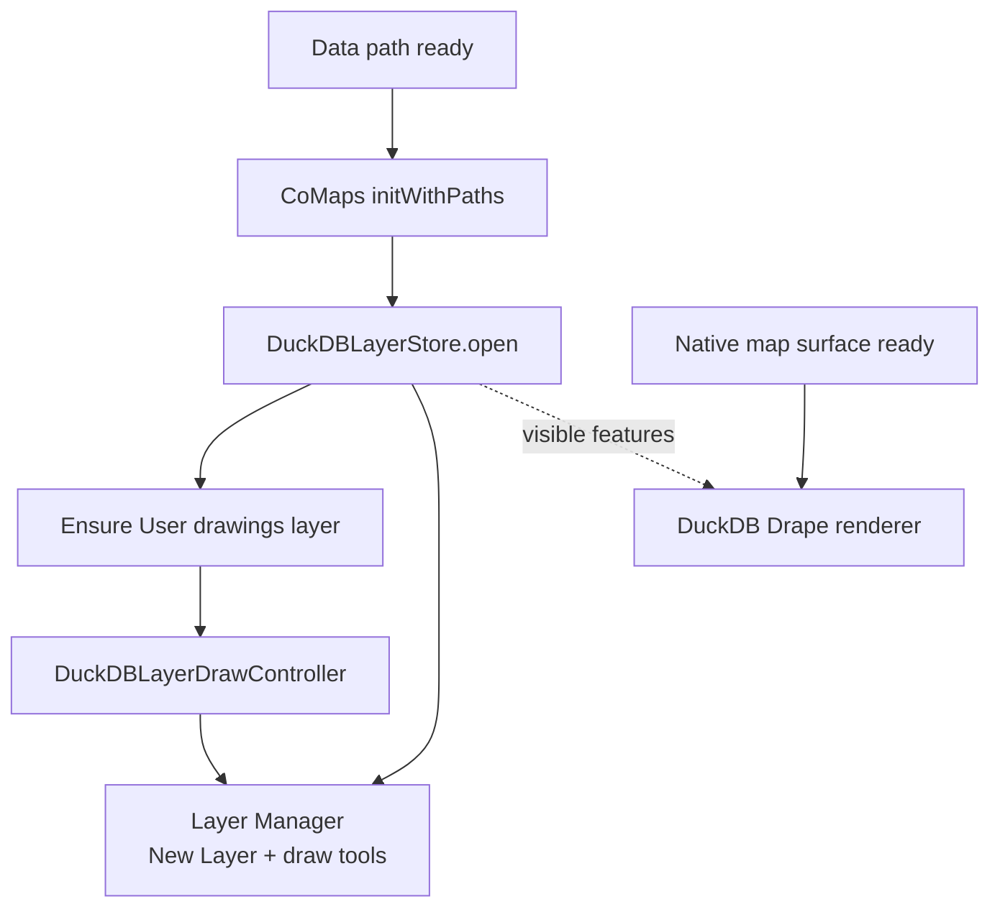
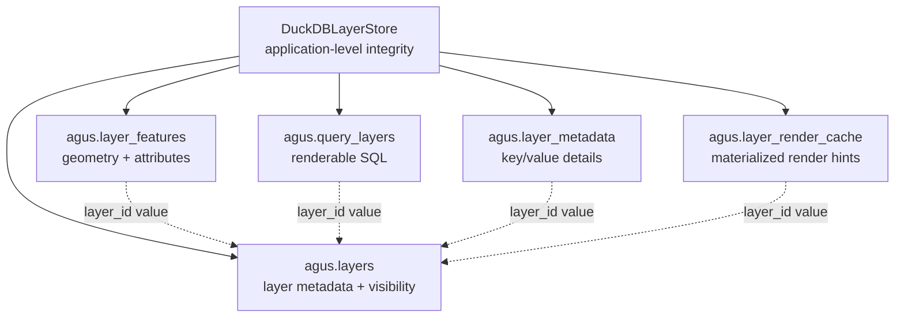

# DuckDB Layer Runtime

This document explains how editable project layers start up and connect to the
native map renderer.

## Runtime ownership

DuckDB project layer persistence is a Dart-owned application service. It should
start as soon as the example app has a writable data path and CoMaps has been
initialized with `initWithPaths()`. It must not wait for the native map surface
or renderer.

Native Drape rendering is a later attachment step. If the native renderer is not
ready or fails on a platform, the layer store, **New Layer**, and drawing tools
should remain available. Rendering failures should be logged to the debug
console without disabling project editing.



## Startup contract

1. The app extracts CoMaps data and sets `_dataPath`.
2. The app calls `initWithPaths(dataPath, dataPath)`.
3. The app opens `DuckDBLayerStore(writablePath: dataPath)`.
4. The app ensures the default `User drawings` layer exists.
5. The app creates a `DuckDBLayerDrawController` for the active layer.
6. The Layer Manager receives a non-null store and enables **New Layer**.
7. When the native map surface becomes ready, the app enables native DuckDB
   layer rendering and refreshes visible features.

## UI behavior

The Layer Manager uses these states:

| State | Store | Native renderer | UI behavior |
| --- | --- | --- | --- |
| Starting | `null` | Not relevant | Show startup status; disable project editing. |
| Store ready | Open | Not ready or failed | Enable **New Layer** and draw tools; log render status. |
| Renderer ready | Open | Enabled | Enable editing and draw persisted features on the map. |
| Store failed | `null` | Not relevant | Show failure status and point to the debug console. |

Project layer count comes from `DuckDBLayerStore.listLayers()`, not from the
native renderer. A renderer failure must not make project layers appear as zero
if the store has opened successfully.

## New Layer command lifecycle

The New Layer command is UI-driven but writes through `DuckDBLayerStore`. The
dialog should collect a layer name without using a method-local
`TextEditingController` that is disposed immediately after `showDialog`
completes. Flutter can still rebuild the dialog route while it is being removed;
disposing that controller too early can produce a red screen:

```text
A TextEditingController was used after being disposed.
```

Use a controller-free `TextFormField(initialValue: ...)` for simple prompts, or
a dedicated stateful dialog widget when a controller is required. After the name
is submitted, `DuckDBLayerStore.upsertLayer()` creates the layer, the active edit
layer is updated, and native rendering is refreshed when available. Any creation
error should be shown in the Layer Manager status area.

## Timestamp expressions in runtime DML

DuckDB migrations may use `DEFAULT current_timestamp` for timestamp columns, but
Dart-generated runtime DML should use `current_localtimestamp()` in `UPDATE` and
`ON CONFLICT DO UPDATE` assignments. Without parentheses, DuckDB can bind
`current_timestamp` as an identifier in those contexts and fail with an error
such as:

```text
Binder Error: Table "layers" does not have a column named "current_timestamp"
```

That failure blocks the default `User drawings` layer upsert and leaves the
Layer Manager in the store-unavailable state.

Do not use `current_timestamp()` in runtime DML for the embedded DuckDB build:
it is not exposed as a scalar function there. The runtime-safe expression is
`current_localtimestamp()`.

## Layer parent rows and child-table references

DuckDB-backed editable layers keep `agus.layers` as the parent table and store
features, query definitions, metadata, and render-cache rows in child tables.
Those child tables intentionally do not use database-level foreign keys to
`agus.layers`.

The embedded DuckDB build can reject parent-row updates while referenced child
rows exist, even when the update only changes columns such as `visible` or
`z_index`. In the Layer Manager this presented as a successful feature commit
followed by an exception when the user toggled visibility:

```text
Constraint Error: Violates foreign key constraint because key "layer_id: ..."
is still referenced by a foreign key in a different table
```

The layer store therefore treats parent/child integrity as an application-level
contract:

1. The migration sequence rebuilds child tables without
   `REFERENCES agus.layers(...)` while preserving the original initial migration
   checksum for existing databases.
2. `DuckDBLayerStore.open()` also repairs existing databases by rebuilding the
   child tables without foreign keys while preserving rows.
3. Layer delete/soft-delete operations are responsible for cleaning related child
   rows.
4. UI operations that update layer visibility, order, or drawing state must
   surface operation failures in-pane rather than red-screening.


