# DuckDB Layers Plan and Progress

Last updated: 2026-05-04

This document is the technical handoff for the DuckDB persistence, analytics, and native layer-rendering work in `agus_maps_flutter`. It is intended to be sufficient context for continuing the implementation later or with another AI coding agent.

## Objective

Add DuckDB as the embedded persistence and analytics layer for user drawings, layer metadata, preset data layers, custom query layers, and geospatial data sources such as GeoParquet. DuckDB-backed layers must render through the native CoMaps/Drape map widget, not through a Flutter overlay, so map interaction, panning, zooming, and visual composition stay consistent with the existing rendering engine.

The rollout order is macOS first, then iOS, Android, Windows, and Linux. macOS was the proving ground because it shares the Apple static framework packaging model with iOS and gives the fastest native iteration loop. iOS packaging now builds successfully; the next major platform target is Android.

## Architecture Principles

- Keep DuckDB private to the plugin/app bundle. Never rely on a user's machine-wide DuckDB installation.
- Mirror the existing CoMaps dependency discipline: pinned refs, deterministic checkout, local patch directories, and explicit CI/release metadata.
- Keep first-party app data in strict plugin-owned tables. Custom user SQL is unrestricted, but renderable query layers must satisfy a strict result contract.
- Use DuckDB Spatial `GEOMETRY` in WGS84/EPSG:4326 as the database geometry representation. Convert to CoMaps Mercator coordinates in native code before Drape rendering.
- Keep native rendering in Drape from the first renderable implementation. Points and lines should use existing user-mark/user-line paths first; filled polygons should use an area primitive/Drape patch only when needed.
- Keep CoMaps behavior unchanged unless a small, isolated rendering patch is required for filled polygon support.
- Keep build outputs reproducible and platform-local: Apple uses static `DuckDB.xcframework`, Android should fold DuckDB into one `libagus_maps_flutter.so`, Windows should use a private DuckDB DLL, and Linux should use a private shared library.

## Key Decisions

- DuckDB core is a root submodule at `thirdparty/duckdb`.
- duckdb-spatial is a separate root submodule at `thirdparty/duckdb-spatial` because `spatial` is out-of-tree.
- DuckDB is pinned to `v1.5.2` (`8a5851971fae891f292c2714d86046ee018e9737`).
- duckdb-spatial is pinned to `dc1996bfd16bd8614fb4ccb5895b3ee0dbd4298e`, the ref used by DuckDB `v1.5.2` release configuration.
- duckdb-spatial nested submodules are initialized at:
  - `thirdparty/duckdb-spatial/duckdb`: `ebf0f8fde4249b6489dd33bec03b041dc4d2fff2`
  - `thirdparty/duckdb-spatial/extension-ci-tools`: `795096d04b009c0d087468439ebb526a5460dfac`
- Required extensions are `core_functions`, `parquet`, `json`, `icu`, `httpfs`, and `spatial`.
- `httpfs` is out-of-tree for DuckDB `v1.5.2`; it is pinned through DuckDB's release config to `duckdb-httpfs` commit `13e18b3c9f3810334f5972b76a3acc247b28e537`.
- The app database path currently used by the first bridge is `writablePath/agus_layers.duckdb`.
- The native bridge now covers lifecycle, health, SQL execution, embedded migrations, materialized JSON query results, render-query validation, and Android render-feature copying. Layer CRUD/backups live in the Dart store and Android native rendering is wired through Drape.

## Responsive Example UI Workstream

The example app is now also being treated as the reference adaptive UI surface
for plugin demos. The earlier shell was mobile-first across every platform,
which made macOS and other desktop runs feel like stretched phone layouts. The
new work introduces a shared responsive UI layer under `example/lib/shared/`
and `example/lib/features/` so mobile, tablet, and desktop behavior can evolve
through a single design system.

Current responsive decisions:

- Three UI levels are now the source of truth:
  - mobile: simplified overlays and modal panels
  - tablet: docked, touch-optimized panels with larger targets
  - desktop: docked compact panels with denser controls for mouse/keyboard
- Width and shortest-side are the primary form-factor signals so Android and
  iPad tablets can adopt the larger-shell experience without custom native
  platform branching.
- The layer manager is the first adaptive GIS-style component:
  - mobile uses a modal layer-tree sheet
  - tablet uses a larger docked tree with generous touch spacing
  - desktop uses a compact docked tree inspired by QGIS/ArcGIS layer docks,
    including grouped nodes, visibility toggles, z-order actions, and feature
    previews
- The example shell now uses a side navigation rail on larger screens instead
  of forcing bottom navigation everywhere.

### May 4 Desktop Workbench Direction

The macOS desktop run is now moving from a stretched mobile/tablet shell to a
VS Code-style workbench for GIS workflows. The workbench keeps VS Code
terminology in the example code and UI:

- **Activity Bar**: left-most icon strip for switching workbench activities.
- **Primary Side Bar**: left resizable pane whose content is controlled by the
  selected Activity Bar item.
- **Editor Area**: main viewport with editor tabs. The initial tabs are `Map`
  and `Blank`, with `Map` selected by default.
- **Panel**: bottom resizable pane with `POINT OF INTEREST` selected by default
  and `DEBUG CONSOLE` available for runtime logs.
- **Secondary Side Bar**: right resizable pane for stacked inspection tabs,
  starting with `PROPERTIES` and `INSPECTOR`.
- **Layout Controls**: upper-right editor controls for toggling the Primary Side
  Bar, Panel, and Secondary Side Bar.

Tabs and panes are treated as viewports over shared app/workbench state. The
tab widget itself does not own the map, selected feature, layer tree, or logs;
it only chooses which viewport reads those shared data models.

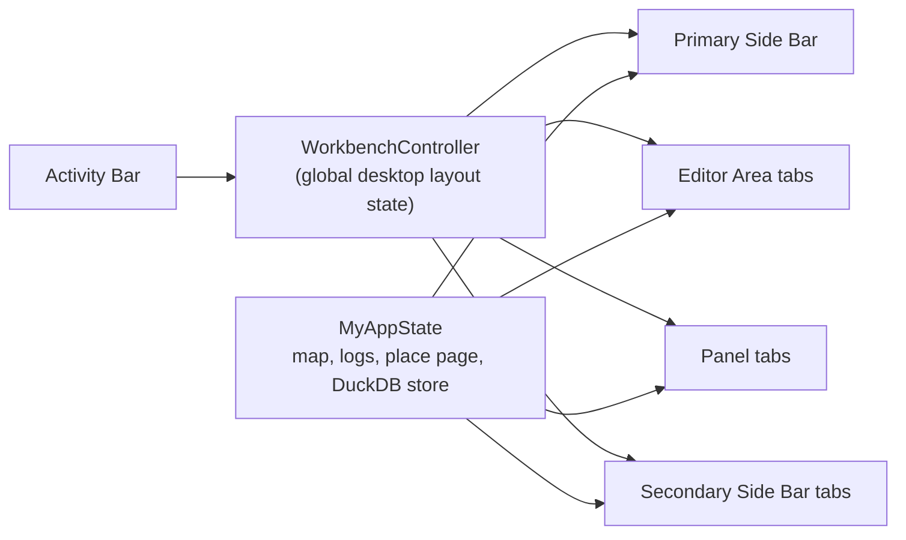

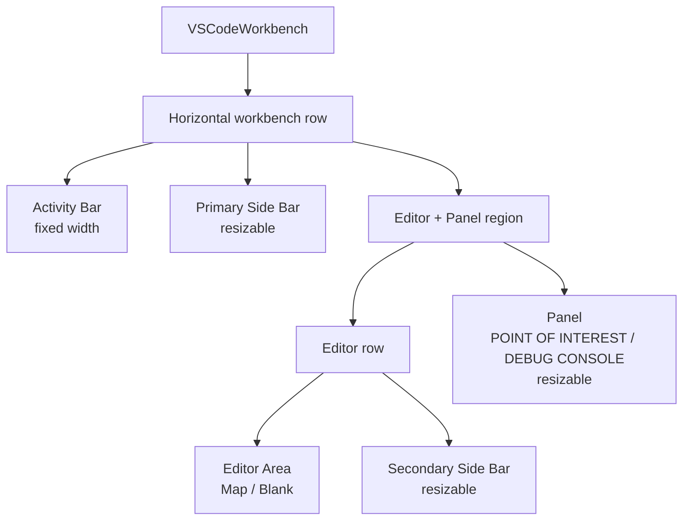

The same DuckDB-backed drawing-layer workflow is also being enabled for macOS
and iOS. Apple platforms already had the DuckDB persistence bridge and static
extension loading; the current platform gap was the native Drape user-mark
renderer and screen-to-coordinate projection that Android had first.

Validation after the desktop workbench and Apple renderer update:

```bash
dart format example/lib/main.dart \
  example/lib/features/workbench/workbench_controller.dart \
  example/lib/features/workbench/vscode_workbench.dart \
  example/lib/features/workbench/workbench_panels.dart \
  example/lib/features/map/widgets/adaptive_layer_manager.dart \
  lib/agus_maps_flutter.dart 2>&1 | tee ./output.log

cd example && \
  flutter analyze lib/main.dart \
    lib/features/workbench/workbench_controller.dart \
    lib/features/workbench/vscode_workbench.dart \
    lib/features/workbench/workbench_panels.dart \
    lib/features/map/widgets/adaptive_layer_manager.dart \
    ../lib/agus_maps_flutter.dart 2>&1 | tee ../output.log

cd example && flutter build macos --debug 2>&1 | tee ../output.log

cd example && flutter build ios --simulator 2>&1 | tee ../output.log
```

Results:

- Dart analysis reported no issues for the touched Flutter files.
- macOS debug example build produced
  `build/macos/Build/Products/Debug/agus_maps_flutter_example.app`.
- iOS simulator example build produced `build/ios/iphonesimulator/Runner.app`.

### May 4 Desktop Density Refinement

The second desktop pass focuses on making macOS, Linux, and Windows feel like a
professional GIS workstation rather than a tablet shell. The workbench keeps the
same VS Code structure, but its surfaces are now moving toward Visual
Studio/Blender-style density:

- Splitter visuals collapse to one-pixel separators with larger transparent drag
  hit targets, avoiding stacked pane borders.
- Feature properties and point-of-interest details share a compact, full-width
  property-grid widget.
- The desktop Layer Manager becomes a compact table/property-grid dock with a
  direct **New Layer** command, active edit-layer selection, z-order controls,
  and drawing-session tools for point, segment, line, and polygon capture.
- Desktop Downloads use a compact explorer-style tree with one-line rows,
  status columns, and right-aligned actions.
- `doc/UI-LAYOUT.md` is the canonical layout guide for desktop, tablet, and
  mobile density decisions.

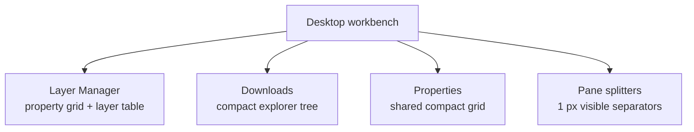

Validation after the density refinement:

```bash
dart format example/lib/main.dart \
  example/lib/features/workbench/vscode_workbench.dart \
  example/lib/features/workbench/workbench_panels.dart \
  example/lib/features/map/widgets/adaptive_layer_manager.dart \
  example/lib/shared/widgets/compact_property_grid.dart \
  example/lib/downloads_tab.dart 2>&1 | tee ./output.log

cd example && \
  flutter analyze lib/main.dart \
    lib/features/workbench/vscode_workbench.dart \
    lib/features/workbench/workbench_panels.dart \
    lib/features/map/widgets/adaptive_layer_manager.dart \
    lib/shared/widgets/compact_property_grid.dart \
    lib/downloads_tab.dart 2>&1 | tee ../output.log

cd example && flutter build macos --debug 2>&1 | tee ../output.log
```

Results:

- Dart analysis reported no issues for the touched Flutter files.
- macOS debug example build produced
  `build/macos/Build/Products/Debug/agus_maps_flutter_example.app`.

### May 4 macOS Release TransformLayer Fix

The macOS release app logged repeated Flutter engine errors:

```text
[ERROR:flutter/flow/layers/transform_layer.cc(15)] TransformLayer is constructed with an invalid matrix.
```

The issue reproduced only when the desktop Layer Manager was visible in the
Primary Side Bar at startup. The fix keeps the compact desktop UI but avoids
startup transform-producing controls in that pane:

- Workbench tabs now build the active viewport directly instead of keeping
  inactive viewports alive in `IndexedStack`.
- Desktop Layer Manager map toggles now use compact property-grid checkboxes
  instead of adaptive switches.
- Drawing-session tools now use custom compact buttons instead of Material
  `FilterChip`.
- The map texture widget now rejects unbounded/non-finite layout constraints
  before creating or painting a texture.
- The compass bearing path ignores non-finite native bearings before they can
  reach `Transform.rotate`.

Validation after the runtime fix:

```bash
dart format example/lib/features/workbench/workbench_controller.dart \
  example/lib/features/workbench/vscode_workbench.dart \
  example/lib/features/map/widgets/adaptive_layer_manager.dart \
  example/lib/main.dart \
  lib/agus_maps_flutter.dart 2>&1 | tee ./output.log

cd example && \
  flutter analyze lib/main.dart \
    lib/features/workbench/workbench_controller.dart \
    lib/features/workbench/vscode_workbench.dart \
    lib/features/map/widgets/adaptive_layer_manager.dart \
    ../lib/agus_maps_flutter.dart 2>&1 | tee ../output.log

cd example && flutter build macos --release 2>&1 | tee ../output.log

cd example && \
  perl -e 'alarm 8; exec @ARGV' \
    ./build/macos/Build/Products/Release/agus_maps_flutter_example.app/Contents/MacOS/agus_maps_flutter_example \
    2>&1 | tee ../output.release-macos-check.log
```

Results:

- Dart analysis reported no issues for the touched Flutter files.
- macOS release build produced
  `build/macos/Build/Products/Release/agus_maps_flutter_example.app`.
- The bounded release runtime smoke log no longer contains the TransformLayer
  invalid-matrix error.

### May 4 macOS Release Crash Follow-up

The next macOS release run crashed after startup with a native stack showing
`comaps_set_3d_buildings_enabled` entering `Framework::Save3dMode`, which writes
CoMaps native string settings, while Drape rendering was active. In this Flutter
plugin example, the user-facing preference is already stored in Dart
`SharedPreferences`, so the native bridge should apply the runtime renderer
state only and avoid duplicating persistence in CoMaps settings storage.

The bridge now treats the Flutter 3D buildings toggle as a process-local runtime
setting on macOS, iOS, Linux, Windows, and the shared C++ fallback:

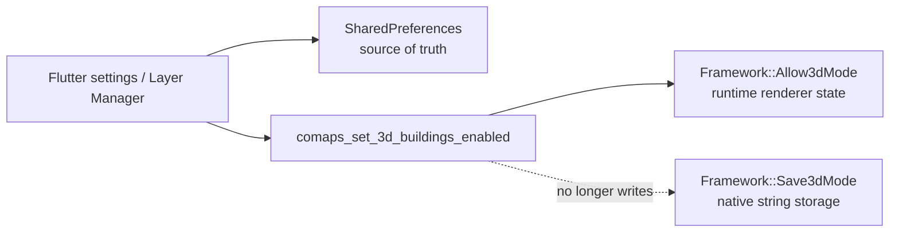

Two desktop-specific stability changes accompany the native fix:

- `comaps_set_3d_buildings_enabled` no longer calls `Framework::Save3dMode`.
  The call now uses `Allow3dMode(false, buildingsEnabled)` so the buildings
  toggle does not implicitly change the separate perspective/navigation mode.
- Desktop Downloads replaces the remaining animated progress indicators with
  static icons and compact deterministic progress bars. Mobile and tablet keep
  their larger touch-oriented progress controls.
- The reset-north compass icon now avoids constructing a transform layer for
  the zero-bearing startup state and only rotates when the bearing is finite and
  non-zero.

Validation after the crash follow-up:

```bash
dart format example/lib/main.dart example/lib/downloads_tab.dart \
  2>&1 | tee ./output.log

cd example && \
  flutter analyze lib/main.dart lib/downloads_tab.dart \
    ../lib/agus_maps_flutter.dart 2>&1 | tee ../output.log

cd example && flutter build macos --release 2>&1 | tee ../output.log

cd example && \
  perl -e 'alarm 120; exec @ARGV' \
    ./build/macos/Build/Products/Release/agus_maps_flutter_example.app/Contents/MacOS/agus_maps_flutter_example \
    2>&1 | tee ../output.release-macos-check.log
```

Results:

- Dart analysis reported no issues for the touched Dart files.
- macOS release build produced
  `build/macos/Build/Products/Release/agus_maps_flutter_example.app`.
- The 120-second release smoke completed cleanly with no `TransformLayer`,
  `SIGSEGV`, `EXC_BAD_ACCESS`, `Save3dMode`, `ERROR`, or `FATAL` entries in
  `output.release-macos-check.log`.

### May 4 macOS Resize/Layout Transition Crash Follow-up

The next desktop macOS report crashed while resizing from the tablet/adaptive
shell into the desktop workbench. The main thread was inside Flutter's
`ResizeSynchronizer` and the plugin `comaps_invalidate` bridge, while Drape
render threads were processing `FrontendRenderer::InvalidateRect` and Metal
buffer cleanup. That made viewport-rect invalidation during native surface
resize the risky operation.

The resize path now keeps the map viewport and renderer lifecycle stable:

- The `AgusMap` used by the example has a stable `GlobalKey`, so Flutter can
  reparent the same map viewport when the shell crosses the adaptive/desktop
  breakpoint instead of creating a second native map surface during the resize.
- The map viewport remains stable across responsive shell changes, so macOS,
  Linux, and Windows can still move between mobile, tablet, and desktop layouts
  by width without creating a second native map surface during resize.
- `_applyNativeMapSettings()` no longer calls an extra `invalidateMap()` after
  every setting write. The native runtime setting functions already wake the
  renderer.
- macOS and iOS `WakeRenderer`, `comaps_invalidate`, and `comaps_force_redraw`
  now request `InvalidateRendering()` plus `MakeFrameActive()` without forcing
  `InvalidateRect(GetCurrentViewport())` during resize-sensitive refreshes.
- Previously misleading duplicate map registration warnings are no longer
  emitted for already-registered maps; `VersionAlreadyExists` is treated as a
  benign success path.

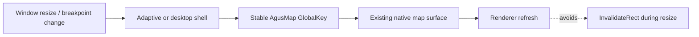

### May 4 Property Grid Layout Follow-up

The desktop inspector/property grids were reported as visually garbled, with
labels and values painting over each other in compact panes. The shared
`CompactPropertyGrid` now owns text layout instead of embedding independent
`SelectableText` controls in every row.

The grid pattern is now:

- One shared row primitive with a dense intrinsic minimum height.
- A fixed-width label cell with ellipsis.
- A flexible value cell with compact clipped text or a centered control.
- Boolean values use a small `On`/`Off` pill control instead of a checkbox in
  dense grids.
- Optional trailing actions aligned to the row center.
- One-pixel row and column separators.

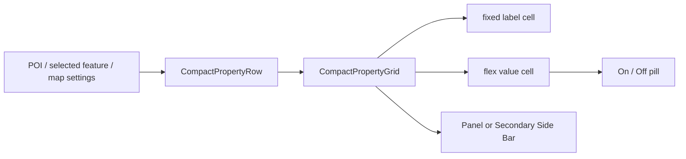

### May 4 Responsive Breakpoint Correction

Desktop platforms were temporarily locked to the desktop workbench at every
window width to avoid the resize crash while the native map surface was being
stabilized. With the stable map key and non-destructive renderer refresh path in
place, form-factor resolution is again width-based:

- Mobile: shortest side below 600 logical pixels or width below 700.
- Desktop OS workbench: macOS, Linux, or Windows at width 1100 and above.
- Any platform desktop workbench: width 1400 and above.
- Tablet: the remaining medium-sized layouts.

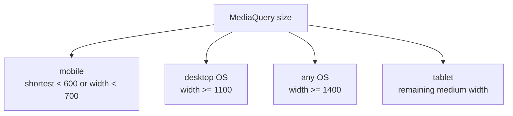

### May 4 macOS Search Crash / Surface Reattachment Follow-up

The macOS debug search report did not include an Apple crash report, but
`output.debug-macos.log` ended with `Lost connection to device` immediately
after Flutter logged a second `AgusMap` surface creation and native macOS logged
a new `agus_native_set_surface` while the previous Metal render context was
still presenting frames. The user action was search, but the failure signature
is a responsive-shell map-surface lifecycle issue: search changed pane/content
layout enough for Flutter to rebuild the map host, which then tried to create a
second native CoMaps/Drape surface.

The Dart map widget now treats the native texture as a singleton attachment:

- The first `AgusMap` creates the native surface and records the texture id,
  logical size, physical size, device pixel ratio, user scale, and visual scale.
- Later `AgusMap` states created by responsive shell changes attach to the
  existing texture id instead of calling `createMapSurface`.
- Attached states schedule `resizeMapSurface` for the new layout size.
- `onMapReady` remains tied to first native creation so app initialization is
  not replayed during shell reparenting.

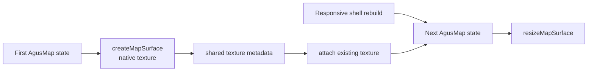

### May 4 Cross-platform Build and CI Assessment

The current platform readiness pass reviewed Android, iOS, Linux, Windows, and
GitHub Actions dependency flow without running local emulators or desktop apps.

Findings and changes:

- Android example `ndkVersion` is aligned with CI's installed
  `NDK_VERSION=29.0.14206865`, avoiding a packaging build that asks Gradle for a
  different NDK than the workflow installs.
- Linux CI now copies every file from `build/agus-binaries-linux/x64/` into
  `linux/prebuilt/x64/`, not only `libagus_maps_flutter.so`. This preserves
  private runtime dependencies such as `libduckdb.so` when present.
- Responsive layout is shared across Android, iOS, macOS, Linux, and Windows
  through `resolveExampleFormFactor()`.
- Windows and Linux remain theoretical/local-code assessments on this macOS
  machine; GitHub Actions is the authoritative host validation path for those
  targets.
- iOS and Android can be build-validated locally without launching simulators or
  emulators.

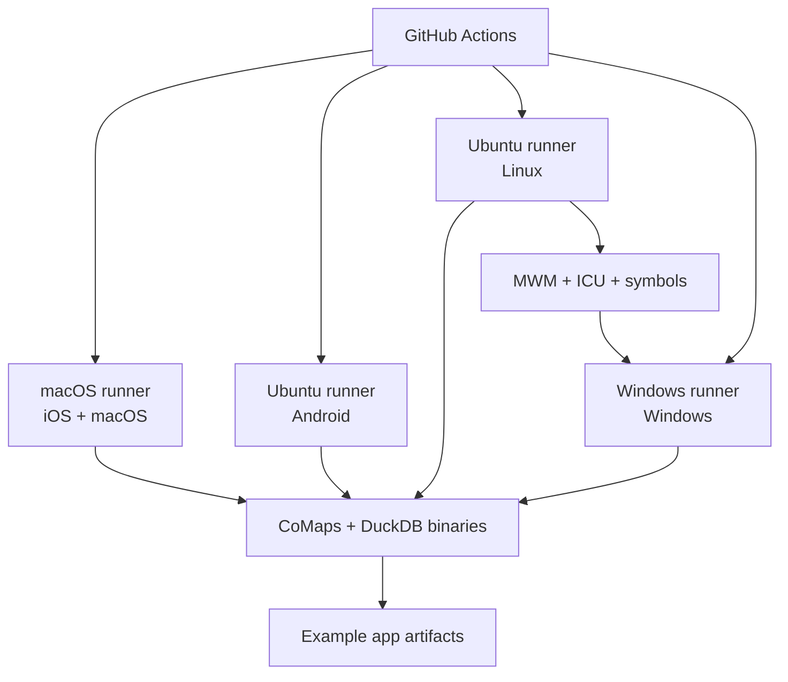

### May 4 Desktop and Tablet UI Polish Follow-up

The current polish pass addresses visual mismatches reported from macOS
tablet-width and desktop-width runs:

- Tablet adaptive navigation rail is now square-edged and flush with the window
  side instead of a rounded floating card.
- Desktop workbench splitter handles now consume exactly one logical pixel in
  layout. The previous wider transparent hit target left visual gaps on the
  right edge of the Primary Side Bar and the left edge of the Secondary Side Bar.
- Desktop Search and Favorites activities no longer reuse mobile/tablet
  `ListTile`-density content in the Primary Side Bar. Search uses a 34 px input
  and compact result rows; Favorites uses compact one-line rows.
- DuckDB drawing layer persistence is initialized independently from native
  layer rendering. If native rendering setup fails, **New Layer** remains
  available and the rendering failure is logged separately.

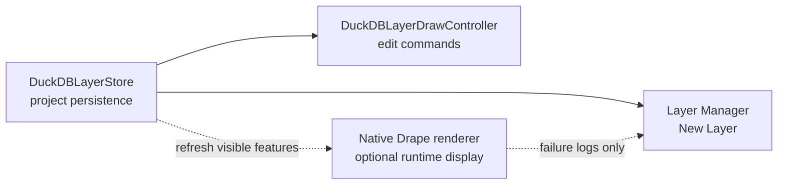

### May 5 Layer Manager Store Startup Fix

The Layer Manager could stay stuck at `DuckDB layer store is starting`, leaving
**New Layer** disabled, draw tools disabled, and project layer count at zero.
The root cause was lifecycle coupling: the example initialized
`DuckDBLayerStore` from the map-ready/native-renderer path. If map-ready was
delayed or a renderer setup problem occurred, project persistence never reached
the UI.

The example now opens the project layer store immediately after data-path setup
and `initWithPaths()`. Native Drape rendering attaches later, after the map
surface is ready. Renderer failures are logged but no longer disable layer
creation or drawing persistence.

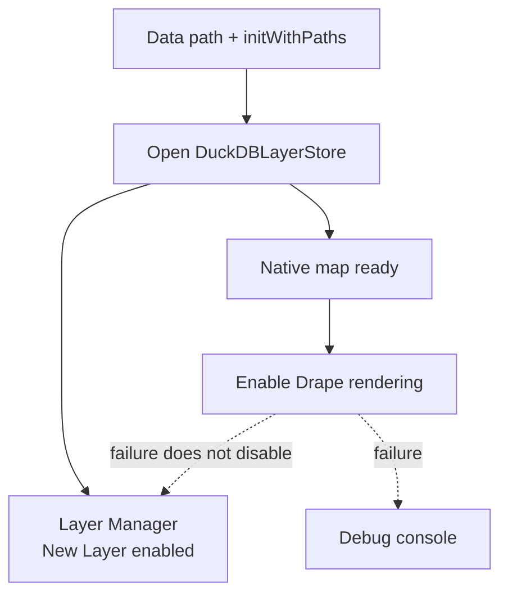

### May 5 Layer Store Timestamp DML Fix

The macOS debug console showed the Layer Manager still reporting
`DuckDB layer store unavailable` even though the About page reported `Database
open, schema migrated, spatial query ok`. The store opened correctly, but the
default `User drawings` layer upsert failed:

```text
Binder Error: Table "layers" does not have a column named "current_timestamp"
```

DuckDB accepted the schema defaults, but Dart-generated runtime DML used
`updated_at = current_timestamp` inside `UPDATE` and `ON CONFLICT DO UPDATE`
assignments. In that context DuckDB bound `current_timestamp` as an identifier.
A follow-up run showed that `current_timestamp()` is also invalid in the
embedded DuckDB build because it is not exposed as a scalar function. The layer
store now emits `current_localtimestamp()` for runtime update/upsert timestamp
assignments across layers, features, query-layer validation, and metadata
writes.

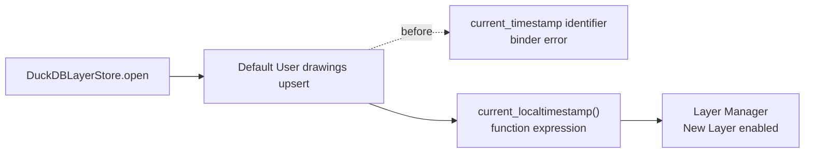

### May 5 New Layer Dialog Controller Fix

Clicking **New Layer** on macOS produced a Flutter red screen after the layer
store was already enabled. The log showed:

```text
A TextEditingController was used after being disposed.
TextField:file:///.../adaptive_layer_manager.dart:183:20
```

The dialog created a method-local `TextEditingController`, awaited
`showDialog`, then disposed the controller immediately. Flutter can still rebuild
the closing dialog route, so the `TextField` attempted to attach to a disposed
controller. The New Layer dialog now uses a controller-free `TextFormField` with
`initialValue` and tracks the edited name through `onChanged`. Layer creation is
wrapped so persistence/render failures are shown in the Layer Manager status text
instead of becoming red-screen exceptions.

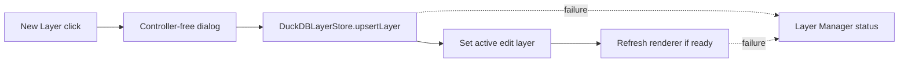

### May 5 Layer Feature Foreign-Key Repair

Adding a point/segment/line/polygon feature succeeded, but the next layer update
could fail when the Layer Manager toggled visibility or z-order. The macOS log
showed a DuckDB foreign-key constraint error from
`DuckDBLayerStore.setLayerVisibility`, not from the feature insert itself:

```text
Constraint Error: Violates foreign key constraint because key "layer_id: ..."
is still referenced by a foreign key in a different table
```

The initial schema used `REFERENCES agus.layers(layer_id)` on child tables such
as `agus.layer_features`. The embedded DuckDB build can reject updates to the
parent layer row while child rows reference it, even when the update only changes
non-key columns like `visible` or `z_index`. A new additive migration now
rebuilds child tables without those foreign keys while preserving the checksum of
the already-applied initial migration. `DuckDBLayerStore.open()` also keeps a
runtime repair path for existing app databases by rebuilding child tables without
foreign keys while preserving rows. Layer integrity is maintained in the
application layer through store operations and soft-delete cleanup.

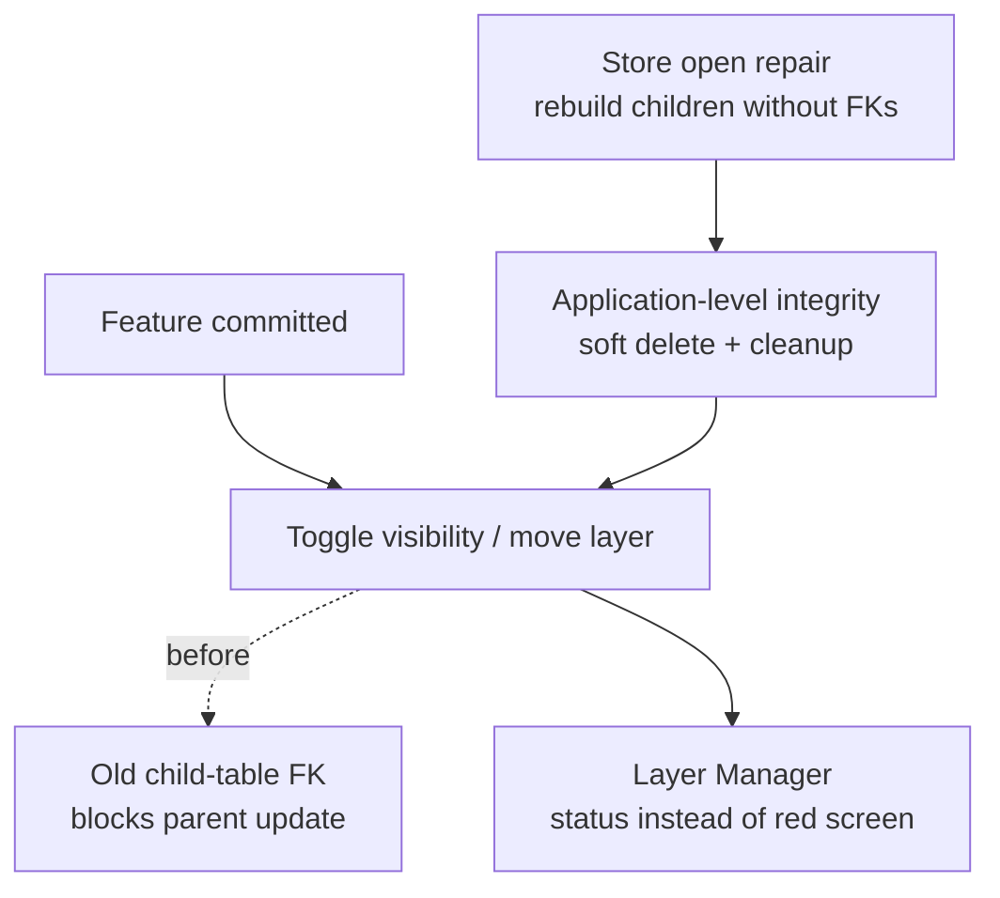

## Current File Map

### Dependency and Build Pins

- `.gitmodules`: root submodule registry for `thirdparty/duckdb` and `thirdparty/duckdb-spatial`.
- `.github/workflows/devops.yml`: exposes `DUCKDB_TAG` and `DUCKDB_SPATIAL_TAG` in CI/release metadata, bootstraps DuckDB dependencies, and packages the current Apple, Android, and Linux artifacts. The latest CI hardening needs a GitHub Actions rerun for external confirmation.
- `tool/src/config.dart`: default DuckDB and duckdb-spatial refs plus `getDuckdbTag()` and `getDuckdbSpatialTag()`.
- `tool/src/platform_detector.dart`: path helpers for DuckDB, duckdb-spatial, and dependency-specific patch directories.

### Dependency Bootstrap and Patches

- `tool/src/git_operations.dart`: generic git/submodule helpers used by CoMaps and DuckDB dependencies.
- `tool/src/patch_applicator.dart`: generic dependency patch application while preserving CoMaps patch behavior.
- `tool/src/build_runner.dart`: bootstraps DuckDB and duckdb-spatial after CoMaps and before native platform builds.
- `patches/duckdb/README.md`: placeholder and policy for DuckDB patches.
- `patches/duckdb-spatial/README.md`: placeholder and policy for duckdb-spatial patches.

### DuckDB Build

- `tool/duckdb/agus_duckdb_extensions.cmake`: project-owned extension config. It explicitly loads `core_functions`, `parquet`, `json`, `icu`, pinned out-of-tree `httpfs`, and `spatial` from `thirdparty/duckdb-spatial`.
- `tool/src/duckdb_build.dart`: DuckDB build helper. Current implemented Apple outputs are macOS universal static `DuckDB.xcframework` and iOS static `DuckDB.xcframework` with device and simulator slices.
- `macos/agus_maps_flutter.podspec`: now vendors both `CoMaps.xcframework` and `DuckDB.xcframework`, compiles the platform-local `Classes/agus_duckdb_bridge.mm` wrapper for the shared DuckDB bridge implementation, and adds DuckDB header search paths.
- `ios/agus_maps_flutter.podspec`: now vendors both `CoMaps.xcframework` and `DuckDB.xcframework`, compiles the platform-local `Classes/agus_duckdb_bridge.mm` wrapper for the shared DuckDB bridge implementation, and adds DuckDB header search paths for device and simulator XCFramework slices.

### Native Bridge and Dart API

- `src/agus_maps_flutter.h`: public C ABI declarations for the initial DuckDB bridge.
- `src/agus_duckdb_bridge.cpp`: initial DuckDB bridge implementation.
- `src/agus_duckdb_migrations.inc`: generated native migration manifest created from `doc/schemas/migrations/*.sql`.
- `lib/agus_maps_flutter_bindings_generated.dart`: regenerated ffigen bindings including DuckDB bridge functions.
- `lib/agus_maps_flutter.dart`: Dart convenience helpers for Apple-platform DuckDB bridge calls.

### Schema Documentation

- `doc/schemas/README.md`: database scope, required extensions, layer kinds, and query render contract.
- `doc/schemas/MIGRATION.md`: migration strategy and backup policy.
- `doc/schemas/migrations/20260502_001_initial_duckdb_layers.sql`: first schema migration.
- `doc/schemas/migrations/20260505_001_remove_layer_child_foreign_keys.sql`: additive migration that rebuilds layer child tables without database-level foreign keys.
- `doc/schemas/PLAN-PROGRESS.md`: this handoff document.

## Implemented So Far

### Dependency Foundation

- Added root submodules for DuckDB and duckdb-spatial.
- Added build config defaults and environment-variable accessors for DuckDB pins.
- Generalized submodule checkout and patch application tooling without changing the CoMaps patch model.
- Added empty patch directories for future DuckDB and duckdb-spatial changes.
- Added CI/release metadata visibility for DuckDB and duckdb-spatial refs.

### Extension Configuration

- Added `tool/duckdb/agus_duckdb_extensions.cmake` with the required extension set.
- `spatial` is loaded from the local `thirdparty/duckdb-spatial` source checkout.
- `httpfs` is pinned from the out-of-tree `duckdb-httpfs` repository because it is not present as an in-tree extension in DuckDB `v1.5.2`.

### macOS DuckDB Packaging

- Added `tool/src/duckdb_build.dart` to build DuckDB separately from CoMaps.
- The helper generates DuckDB's merged vcpkg manifest for out-of-tree extension dependencies.
- The helper fetches the DuckDB-generated vcpkg builtin baseline into `VCPKG_ROOT` if a local vcpkg checkout does not already contain it.
- The helper builds macOS `arm64` and `x86_64` slices, merges DuckDB, extension, and vcpkg static archives, then produces a universal `DuckDB.xcframework`.
- `tool/src/build_runner.dart` now calls `buildDuckDBMacOSXCFramework()` from the macOS platform build and copies `DuckDB.xcframework` into `macos/Frameworks` beside CoMaps.

### iOS DuckDB Packaging

- Added `buildDuckDBiOSXCFramework()` to `tool/src/duckdb_build.dart`.
- The iOS helper builds device `arm64`, simulator `arm64`, and simulator `x86_64` DuckDB static archives, merges DuckDB, extension, and vcpkg static archives per slice, then packages a static `DuckDB.xcframework`.
- The simulator archive is created with `lipo` from the `arm64` and `x86_64` simulator builds before `xcodebuild -create-xcframework` packages it beside the device archive.
- The helper generates project-owned vcpkg overlay triplets under `build/duckdb/ios/vcpkg-triplets`:
  - `arm64-ios-agus`
  - `arm64-ios-simulator-agus`
  - `x64-ios-simulator-agus`
- The overlay triplets force `HAVE_PIPE2=0` for vcpkg CMake packages. This fixes curl `8.17.0` mis-detecting `pipe2` on the Xcode `iPhoneSimulator26.4.sdk`, where `pipe2` is not declared.
- iOS CMake builds pass explicit `CMAKE_SYSTEM_NAME=iOS`, `CMAKE_SYSTEM_PROCESSOR`, a generated `CMAKE_PROJECT_TOP_LEVEL_INCLUDES` file that forces the processor cache value early, and `DUCKDB_EXPLICIT_PLATFORM` so DuckDB does not try to execute a cross-compiled platform detector binary on macOS.
- `tool/src/build_runner.dart` now calls `buildDuckDBiOSXCFramework()` from the iOS platform build and copies `DuckDB.xcframework` into `ios/Frameworks` beside CoMaps.
- `ios/agus_maps_flutter.podspec` now vendors `DuckDB.xcframework`, compiles `ios/Classes/agus_duckdb_bridge.mm`, and includes DuckDB headers.

### Apple Native Bridge

The initial bridge in `src/agus_duckdb_bridge.cpp` exposes:

- `agus_duckdb_library_version()`
- `agus_duckdb_last_error()`
- `agus_duckdb_open_app_database(writablePath)`
- `agus_duckdb_close()`
- `agus_duckdb_is_open()`
- `agus_duckdb_load_required_extensions()`
- `agus_duckdb_execute(sql)`
- `agus_duckdb_apply_migration_file(path)`
- `agus_duckdb_run_migrations()`

The bridge currently opens `writablePath/agus_layers.duckdb`, loads required extensions, executes arbitrary SQL, and can execute a migration SQL file. It is guarded by a mutex and maintains a last-error string for Dart callers.

Current limitations:

- The bridge now uses `duckdb_open_ext`, but advanced config options are still not wired beyond the default configuration.
- Extension verification now queries `duckdb_extensions()` after `LOAD <extension>` succeeds.
- The initial schema migration is embedded in the native bridge, applied in a transaction, and recorded with a non-null `fnv1a64:` checksum. Adding future migrations currently requires updating both the reviewable SQL file under `doc/schemas/migrations/` and the embedded migration manifest in `src/agus_duckdb_bridge.cpp`.
- Query results can now be extracted as a materialized JSON payload for small result sets and diagnostics. Layer CRUD, feature CRUD, checkpoint/backup, and Android render refresh APIs are implemented; large/chunked result delivery remains a future renderer-path improvement.
- Dart wrappers intentionally throw `UnsupportedError` outside macOS, iOS, and Android until additional native platform builds are wired.

### Dart API

`lib/agus_maps_flutter.dart` now exposes Apple-platform helpers:

- `duckDBLibraryVersion()`
- `duckDBLastError()`
- `openDuckDBAppDatabase(String writablePath)`
- `closeDuckDB()`
- `isDuckDBOpen()`
- `executeDuckDBSql(String sql)`
- `queryDuckDBJson(String sql)`
- `queryDuckDB(String sql)`
- `validateRenderableDuckDBQuery(String sql)`
- `applyDuckDBMigrationFile(String path)`
- `runDuckDBMigrations()`

These are intentionally small bridge helpers, not the final layer-management API.

### Schema Baseline

The first migration creates:

- `agus.schema_migrations`
- `agus.app_metadata`
- `agus.layers`
- `agus.layer_features`
- `agus.query_layers`
- `agus.layer_metadata`
- `agus.layer_render_cache`

The schema includes strict layer kinds, `GEOMETRY` feature storage, JSON properties/style/metadata, bbox columns for viewport filtering, visibility/z-order columns, soft-delete timestamps, and render cache metadata.

## Validation Completed

### Submodule Pins

Validated with direct nested git checks:

```bash
git -C thirdparty/duckdb rev-parse HEAD
git -C thirdparty/duckdb describe --tags --always --dirty
git -C thirdparty/duckdb-spatial rev-parse HEAD
git -C thirdparty/duckdb-spatial describe --tags --always --dirty
git -C thirdparty/duckdb-spatial/duckdb rev-parse HEAD
git -C thirdparty/duckdb-spatial/extension-ci-tools rev-parse HEAD
```

Observed refs:

- DuckDB: `8a5851971fae891f292c2714d86046ee018e9737`, `v1.5.2`
- duckdb-spatial: `dc1996bfd16bd8614fb4ccb5895b3ee0dbd4298e`, described as `v0.9.1-962-gdc1996b`
- spatial nested DuckDB: `ebf0f8fde4249b6489dd33bec03b041dc4d2fff2`
- spatial nested extension-ci-tools: `795096d04b009c0d087468439ebb526a5460dfac`

### macOS DuckDB Build

Validated both macOS slices:

- `arm64` CMake configure passed and linked all required extensions.
- `arm64` build completed.
- `x86_64` CMake configure passed and linked all required extensions.
- `x86_64` build completed.
- Static archives were merged with `libtool`.
- Universal `build/agus-binaries-macos/libagus_duckdb.a` was created with `x86_64 arm64` architectures.
- `build/agus-binaries-macos/DuckDB.xcframework` was created successfully.
- The generated framework was copied to `macos/Frameworks/DuckDB.xcframework` for local macOS builds.

### macOS Runtime Extension Smoke Test

Validated against the built macOS `arm64` DuckDB dylib with Python `ctypes`:

```sql
LOAD core_functions;
LOAD parquet;
LOAD json;
LOAD icu;
LOAD httpfs;
LOAD spatial;
SELECT ST_AsText(ST_Point(1, 2));
```

All required `LOAD` statements returned success and DuckDB reported `v1.5.2`.

### iOS DuckDB Build

Validated through the contributor iOS build:

```bash
env -u AGUS_MAPS_HOME AGUS_MAPS_BUILD_MODE=contributor \
  dart run tool/build.dart --build-binaries --platform ios 2>&1 | tee ./output.log
```

Observed results:

- CoMaps iOS `CoMaps.xcframework` was built successfully.
- DuckDB extension configuration completed with the required extension set.
- DuckDB iOS device `arm64` built successfully.
- DuckDB iOS simulator `arm64` built successfully.
- DuckDB iOS simulator `x86_64` built successfully.
- `build/agus-binaries-ios/DuckDB.xcframework` was created successfully.
- `ios/Frameworks/DuckDB.xcframework` was copied for local CocoaPods integration.
- `pod install` completed for `example/ios`.

Artifact checks:

```bash
find build/agus-binaries-ios/DuckDB.xcframework ios/Frameworks/DuckDB.xcframework \
  -maxdepth 3 -type f -name 'libagus_duckdb.a'

lipo -info \
  build/agus-binaries-ios/DuckDB.xcframework/ios-arm64/libagus_duckdb.a \
  build/agus-binaries-ios/DuckDB.xcframework/ios-arm64_x86_64-simulator/libagus_duckdb.a
```

Observed architectures:

- Device slice: `arm64`
- Simulator slice: `x86_64 arm64`

The rebuilt curl simulator configs under the project-owned triplets record `HAVE_PIPE2:UNINITIALIZED=0` and generate `/* #undef HAVE_PIPE2 */`.

### iOS Simulator App Build

An actual example iOS simulator build was started after the successful iOS `DuckDB.xcframework` packaging. CocoaPods integration progressed far enough to compile/link the plugin target, but the first direct `xcodebuild` run failed at link time with duplicate symbols.

The failing log confirmed two duplicate-symbol groups:

- CoMaps `libcomaps.a` and DuckDB `libagus_duckdb.a` both expose ICU symbols such as `_ubidi_getVisualMap`, `_utrace_data`, and `_umutablecptrie_open`.
- DuckDB's merged static archive contains repeated dependency/loader objects such as `sds.cpp.o`, `bitpacking.cpp.o`, JPEG objects, `strerror_override.c.o`, zstd objects, and both `dummy_static_extension_loader.cpp.o` and `generated_extension_loader.cpp.o`.

The immediate root cause for the hard failure was `-all_load` in `ios/agus_maps_flutter.podspec`. `-all_load` forced every object from every static archive into `agus_maps_flutter.framework`, surfacing duplicates that normal archive selection can otherwise leave unselected. The iOS podspec was changed from `-ObjC -all_load` to `-ObjC`, `pod install` was rerun, and direct simulator `xcodebuild` succeeded for the installed iPhone 17 simulator.

Validated command from the repo root:

```bash
cd example/ios && \
  xcodebuild \
    -workspace Runner.xcworkspace \
    -scheme Runner \
    -configuration Debug \
    -sdk iphonesimulator \
    -destination 'id=B22FD4B7-2890-47C3-B132-883948758375' \
    build 2>&1 | tee ../../output.log
```

Result: `** BUILD SUCCEEDED **`.

Flutter tool validation also passed:

```bash
cd example && \
  flutter build ios --simulator 2>&1 | tee ../output.log
```

Result: Flutter built `build/ios/iphonesimulator/Runner.app` successfully.

The example app now includes an About-tab DuckDB smoke status card. It uses the public Dart bridge helpers to read the linked DuckDB version, open the app-support database, let the native bridge load the required extensions, and execute `SELECT ST_AsText(ST_Point(1, 2));`. Because the example app keeps tabs alive through an `IndexedStack`, the card is built during app startup even when the Map tab is selected.

After adding the card, targeted analysis and Apple builds were rerun:

```bash
cd example && \
  flutter analyze lib/about_tab.dart 2>&1 | tee ../output.log

cd example && \
  flutter build ios --simulator 2>&1 | tee ../output.log

cd example && \
  flutter build macos 2>&1 | tee ../output.log
```

Results: analysis reported only pre-existing `withOpacity` deprecation infos in `about_tab.dart`; both iOS simulator and macOS builds succeeded after the smoke card was added.

The same linker-flag cleanup was applied to `macos/agus_maps_flutter.podspec` to keep Apple podspecs aligned. The Flutter macOS release example build passed:

```bash
cd example && \
  flutter build macos 2>&1 | tee ../output.log
```

Result: Flutter built `build/macos/Build/Products/Release/agus_maps_flutter_example.app` successfully. The macOS log only showed duplicate `-lc++` and missing Metal toolchain Swift search-path warnings, not duplicate symbols.

### May 3 Apple Runtime Symbol and Extension Loader Fixes

The first physical iPhone and Mac smoke run failed in the About tab with:

```text
Failed to lookup symbol 'agus_duckdb_library_version': dlsym(...): symbol not found
```

The C ABI declarations and Dart bindings were correct, but the bridge implementation was not being compiled into the Apple plugin frameworks. `nm -gU` on the built iPhoneOS and macOS plugin frameworks showed `_sum` and `_comaps_init`, but no `_agus_duckdb_*` exports. Grepping the generated Pods projects showed no `agus_duckdb_bridge` source entry.

Fix applied:

- Added `ios/Classes/agus_duckdb_bridge.mm`, which includes `../../src/agus_duckdb_bridge.cpp`.
- Added `macos/Classes/agus_duckdb_bridge.mm`, which includes `../../src/agus_duckdb_bridge.cpp`.
- Removed direct `../src/agus_duckdb_bridge.cpp` entries from both Apple podspec `s.source_files` lists, because CocoaPods was not placing that outside-`Classes` C++ source into the generated Pods projects.
- Reran `pod install` for `example/ios` and `example/macos`.

Validation after the wrapper fix:

- Generated `example/ios/Pods/Pods.xcodeproj/project.pbxproj` and `example/macos/Pods/Pods.xcodeproj/project.pbxproj` both include `agus_duckdb_bridge.mm in Sources`.
- Standalone wrapper compile emitted `_agus_duckdb_library_version` and `_agus_duckdb_open_app_database`.
- `flutter build ios --debug --no-codesign` succeeded and built `build/ios/iphoneos/Runner.app`.
- `flutter build ios --simulator` succeeded and built `build/ios/iphonesimulator/Runner.app`.
- The rebuilt iPhoneOS and simulator plugin frameworks export all `agus_duckdb_*` C ABI symbols.

Once the bridge actually linked DuckDB, macOS surfaced the real static-library conflict: DuckDB's bundled ICU 66.1 symbols collided with CoMaps' bundled ICU 75.1 symbols. The build helper now generates an Apple-only force-include header from DuckDB's vendored `extension/icu/third_party/icu/common/unicode/urename.h`. The generated header prefixes DuckDB's ICU C and C++ symbols with `agus_duckdb_icu_` during DuckDB Apple builds.

Validation for ICU isolation:

- A compile probe against DuckDB `ucase.cpp` emitted `_agus_duckdb_icu_u_isUUppercase` instead of `_u_isUUppercase`.
- Rebuilt macOS `DuckDB.xcframework`; `lipo -info` reports `x86_64 arm64`.
- Rebuilt iOS `DuckDB.xcframework`; device slice reports `arm64`, simulator slice reports `x86_64 arm64`.
- `nm -gU` on both rebuilt Apple DuckDB archives shows `_agus_duckdb_icu_u_isUUppercase` and `_duckdb_library_version`.
- `flutter build macos --debug`, `flutter build ios --debug --no-codesign`, and `flutter build ios --simulator` all succeeded with the prefixed DuckDB frameworks installed.

After that, a macOS `ctypes` smoke test reached DuckDB but failed on `LOAD core_functions` because the generated static extension loader was still being left out by normal archive selection. The bridge now makes a tiny Apple-only reference to DuckDB's generated `duckdb::LinkedExtensions()` symbol. That pulls `generated_extension_loader.cpp.o` and the required static extension objects into the final plugin without reintroducing `-all_load`.

Validation for static extension loading:

- `nm -a` on the macOS plugin now shows `duckdb::LinkedExtensions`, `duckdb::ExtensionHelper::LoadExtension`, and `CoreFunctionsExtension` symbols.
- `nm -a` on the iPhoneOS and simulator plugin frameworks shows the same generated loader path and prefixed ICU symbol.
- macOS runtime smoke via `ctypes` against `example/build/macos/Build/Products/Debug/agus_maps_flutter/agus_maps_flutter.framework` now reports:

```text
version=v1.5.2
open=1
spatial_query=1
is_open=1
```

User validation on May 3 confirmed the About-tab DuckDB smoke status reports spatial query success on both macOS and a physical iPhone 15. This confirms the missing-symbol fix, Apple ICU prefixing, generated static extension loader retention, and required extension loading are working in the real Flutter UI on Apple targets.

### May 3 Android Integration Scoping

The next implementation target is Android. The repository already has the right high-level shape for this: Android should continue shipping one plugin shared library per ABI, `libagus_maps_flutter.so`, and DuckDB should be statically folded into that shared library rather than packaged as a second runtime library.

Relevant Android integration points identified on May 3:

- `android/build.gradle` detects in-repo source builds and points Gradle `externalNativeBuild.cmake.path` at `../src/CMakeLists.txt`.
- External/consumer Android mode already consumes `android/prebuilt/<abi>/libagus_maps_flutter.so` through `jniLibs`, so the release distribution shape should not need a second DuckDB artifact.
- `src/CMakeLists.txt` builds the Android plugin target from `agus_maps_flutter.cpp`, `agus_platform.cpp`, `agus_localization.cpp`, `agus_ogl.cpp`, and `agus_gui_thread.cpp`, then links CoMaps static libraries into the same shared target.
- `tool/src/cmake_build.dart` builds Android ABI outputs into `build/android-<abi>/libagus_maps_flutter.so` and copies them to `build/agus-binaries-android/<abi>/libagus_maps_flutter.so`.
- DuckDB upstream Android CI builds with `ANDROID_ABI=<abi>`, the NDK CMake toolchain, `EXTENSION_STATIC_BUILD=1`, `DUCKDB_PLATFORM=android_<abi>`, and `DUCKDB_CUSTOM_PLATFORM=android_<abi>`.
- DuckDB's platform helper appends `_android` for Android, but explicit `DUCKDB_EXPLICIT_PLATFORM=android_<abi>` is still the safer path because this project is cross-compiling and needs predictable static extension metadata.

Android-specific implementation implications:

- `src/CMakeLists.txt` needs to compile `src/agus_duckdb_bridge.cpp` for Android as part of `agus_maps_flutter`.
- `lib/agus_maps_flutter.dart` should allow `Platform.isAndroid` only after Android native linkage is validated.
- The bridge's generated-loader retention should be extended from Apple to Android so `LOAD core_functions`, `LOAD spatial`, and the rest resolve to statically linked extensions instead of looking for `.duckdb_extension` files.
- DuckDB's bundled ICU should also be prefixed for Android, just like Apple, because CoMaps also brings bundled ICU into the same final shared library.
- The Android DuckDB build helper should produce ABI-specific static archives and any needed vcpkg static libraries before the final plugin CMake build links `libagus_maps_flutter.so`.
- ABI mapping should start with the existing Flutter plugin ABI list: `arm64-v8a`, `armeabi-v7a`, and `x86_64`. Candidate DuckDB/vcpkg mapping is `android_arm64-v8a`, `android_armeabi-v7a`, and `android_x86_64` for DuckDB platform names, with vcpkg triplets likely `arm64-android`, `arm-neon-android`, and `x64-android` unless project-owned overlay triplets prove necessary.
- Android linker validation should include exported `agus_duckdb_*` symbols, generated static extension loader symbols, prefixed `agus_duckdb_icu_*` symbols, and absence of raw DuckDB ICU collisions with CoMaps.

### May 3 Android Implementation Progress

Implementation progress after the Android scoping pass:

- `tool/src/duckdb_build.dart` now has `buildDuckDBAndroidArchives()`, which builds ABI-specific DuckDB static archive bundles before the final Android plugin build.
- Android DuckDB builds reuse the project DuckDB extension config, merged vcpkg manifest generation, required extension list, and DuckDB ICU prefixing strategy already proven on Apple.
- Project-owned Android vcpkg overlay triplets are generated for `arm64-v8a`, `armeabi-v7a`, and `x86_64` so the ABI mapping is explicit and the NDK chainload toolchain is under project control.
- `tool/src/cmake_build.dart` now lets CMake builds receive extra environment values; the Android DuckDB build passes `ANDROID_NDK_HOME`, `ANDROID_NDK_ROOT`, and `ANDROID_NDK` so vcpkg/Android package configuration can find the same NDK used by the plugin build.
- `tool/src/build_runner.dart` now builds the DuckDB Android archive root before each Android plugin ABI and passes `AGUS_DUCKDB_ANDROID_DIR` into `buildAndroidAbi()`.
- `src/CMakeLists.txt` now compiles `agus_duckdb_bridge.cpp` for Android, loads the generated per-ABI DuckDB bundle metadata, adds DuckDB headers, and links the DuckDB/vcpkg static archives into `libagus_maps_flutter.so` with an Android linker group.
- `src/agus_duckdb_bridge.cpp` now retains DuckDB's generated static extension loader on Android, matching the Apple fix that kept `LOAD spatial` from falling back to external `.duckdb_extension` files.
- `lib/agus_maps_flutter.dart` now allows the DuckDB bridge on Android in addition to macOS and iOS.

Current validation target:

1. Run the Android build through `dart run tool/build.dart --build-binaries --platform android` and keep the full output in `android-duckdb-build.log`.
2. If the first build fails during DuckDB/vcpkg Android configuration, inspect the log around the first `error:`/`CMake Error` and adjust only the Android triplet/toolchain variables.
3. After the first successful ABI output, inspect `build/agus-binaries-android/<abi>/libagus_maps_flutter.so` for exported `agus_duckdb_*` symbols, generated loader retention, and prefixed `agus_duckdb_icu_*` symbols.
4. After all ABIs build, run the Android example smoke UI on device/emulator and confirm the About tab reports DuckDB version, database open, and spatial query success.

Validation update after resuming on May 3:

- No terminal process from the previous attempt was still active. The saved `android-duckdb-build.log` had 5,170 lines and ended with `android build complete` plus `=== Build Complete ===`.
- `build/agus-binaries-android/arm64-v8a/libagus_maps_flutter.so`, `build/agus-binaries-android/armeabi-v7a/libagus_maps_flutter.so`, and `build/agus-binaries-android/x86_64/libagus_maps_flutter.so` were all produced.
- Android output sizes are currently large because the debug shared libraries are unstripped and statically include CoMaps plus DuckDB: approximately 1.1 GB for `arm64-v8a`, 954 MB for `armeabi-v7a`, and 1.1 GB for `x86_64`.
- `android-duckdb-symbol-summary.log` confirmed each ABI exported the original eight bridge symbols: `agus_duckdb_library_version`, `agus_duckdb_last_error`, `agus_duckdb_open_app_database`, `agus_duckdb_close`, `agus_duckdb_is_open`, `agus_duckdb_load_required_extensions`, `agus_duckdb_execute`, and `agus_duckdb_apply_migration_file`. After the migration-runner update, `agus_duckdb_run_migrations` must be included in the next native symbol check.
- The same symbol check confirms each ABI contains DuckDB's generated static extension loader path, including `duckdb::LinkedExtensions()`, `CoreFunctionsExtension`, and `SpatialExtension` symbols.
- The same symbol check confirms each ABI contains the prefixed ICU sample symbol `agus_duckdb_icu_u_isUUppercase`, so the Android DuckDB ICU-prefixing strategy is present in the final plugin shared library.
- `adb devices -l` and `flutter devices` detected a physical Android device, `SM G973F` (`RF8M20SAQSL`, Android 12/API 31, `android-arm64`). The next validation step is a non-resident Flutter launch/install against this device, followed by About-tab smoke verification.
- The first non-resident `flutter run --debug --no-resident -d RF8M20SAQSL` failed during Gradle CMake configuration because Flutter requested unsupported `ANDROID_ABI=x86`. This is outside the documented plugin ABI contract and there is no DuckDB Android bundle at `build/agus-binaries-android-duckdb/x86`.
- Fix in progress: constrain Android source builds to the supported ABI set in both the plugin Gradle file and the example app Gradle file: `arm64-v8a`, `armeabi-v7a`, and `x86_64`.
- Runtime fix: linking DuckDB spatial pulled vcpkg `json-c`, whose `json_object_get`/`json_object_iter_next` symbols collided with CoMaps' Jansson symbols. Android CMake now force-loads CoMaps Jansson before the DuckDB/json-c archive group so `countries.txt` parsing binds to the correct JSON ABI.
- `flutter build apk --debug --target-platform android-arm64` now completes, and the rebuilt Android shared library resolves `json_object_get` next to Jansson's `json_loads`/`json_integer_value` symbols instead of json-c.
- Android device smoke passed on `SM G973F`: the example launches to the Map tab, `countries.txt` parses successfully, the map surface is created, three bundled MWMs register, and the About-tab DuckDB card reports `DuckDB v1.5.2` with `Database open • required extensions loaded • spatial query ok`.
- Release-mode Android source smoke also passed from the example app directory with `flutter run -d RF8M20SAQSL --release`: Gradle built CoMaps from source, produced `build/app/outputs/flutter-apk/app-release.apk` at 435.0 MB, installed it on the same device, and the About-tab DuckDB card reported spatial query success.
- Android release package-size handling now uses split-per-ABI direct-install APKs plus an App Bundle. `flutter build apk --release --split-per-abi` produces 203.4 MB (`armeabi-v7a`), 231.0 MB (`arm64-v8a`), and 237.7 MB (`x86_64`) APKs instead of the 435.0 MB universal APK; `flutter build appbundle --release` produces a 367.3 MB AAB for store-style ABI delivery.

### May 3 GitHub Actions Follow-up

The attached GitHub Actions logs in `/Users/gilmichael/Downloads/logs_67196491754` showed the same failure in `Build iOS and macOS`, `Build Android (using Linux)`, and `Build Linux`: after CoMaps restored from the Azure cache and patches applied, `dart run tool/build.dart --no-cache` entered DuckDB bootstrap and failed with `error: pathspec 'thirdparty/duckdb' did not match any file(s) known to git` while running `git submodule update --init --recursive -- thirdparty/duckdb`.

CI hardening/fix status:

- Current root repository state tracks `.gitmodules`, `thirdparty/duckdb`, and `thirdparty/duckdb-spatial`, so fresh checkouts of the current branch know the DuckDB submodule paths.
- `tool/src/build_runner.dart` now falls back to cloning DuckDB or duckdb-spatial from their canonical GitHub repositories if submodule update fails because metadata is missing in a CI checkout.
- The three requested workflow jobs now initialize root submodules during checkout so DuckDB metadata is available before the contributor build runner starts.
- Apple CI binary archives now include both `CoMaps.xcframework` and `DuckDB.xcframework`, and the iOS/macOS example setup copies both frameworks before CocoaPods builds.
- Android CI now builds split-per-ABI release APKs plus the AAB rather than a universal APK, reducing release artifact size and avoiding unnecessary all-ABI APK install artifacts.
- Android, Apple, and Linux workflow paths now remove large source/build directories after native artifacts are copied, especially CoMaps `.git`, DuckDB source checkouts, DuckDB/vcpkg build trees, and Linux/Android native intermediates before Flutter app packaging.

Manual runtime validation guidance has been added at `doc/schemas/MANUAL-TESTING.md` for About-tab DuckDB smoke, drawing, native renderer refresh, layer controls, backups, and release artifact checks.

### May 3 Migration Manifest Generation

The production migration runner no longer requires hand-editing SQL raw strings in the native bridge. `tool/src/duckdb_migration_generator.dart` reads `doc/schemas/migrations/*.sql`, strips an optional `-- agus_migration_description:` metadata comment, and generates `src/agus_duckdb_migrations.inc` with the C++ migration array consumed by `src/agus_duckdb_bridge.cpp`.

Validation status:

- `dart run tool/build.dart --generate-duckdb-migrations` generated `src/agus_duckdb_migrations.inc` from the current single migration.
- `dart run tool/build.dart --check-duckdb-migrations` and `dart run tool/generate_duckdb_migrations.dart --check` both report the generated manifest is current.
- `clang++ -std=c++17 -I src -I thirdparty/duckdb/src/include -c src/agus_duckdb_bridge.cpp -o /tmp/agus_duckdb_bridge_generated_migrations.o` succeeds, confirming the generated include is valid from the bridge translation unit.
- Targeted Dart analysis of the new generator files reports no diagnostics for the generator itself. The only analyzer output in that run is the pre-existing build-tool `_copyDataFiles` unused warning plus existing script-style `print` info lints in `tool/build.dart` and `tool/src/build_runner.dart`.

Future migrations should be added only as SQL files under `doc/schemas/migrations/`, then regenerated with `dart run tool/build.dart --generate-duckdb-migrations`. CI or local validation can use `dart run tool/build.dart --check-duckdb-migrations` to detect drift.

### May 3 Paged Native Render Fetch

The Android renderer no longer depends on a single fixed `LIMIT 5000` native query for every refresh. `src/agus_duckdb_bridge.cpp` now exposes `agus_duckdb_copy_render_features_page(...)`, and the existing `agus_duckdb_copy_render_features(...)` remains as a compatibility wrapper using the previous first-page behavior.

Android Drape refresh in `src/agus_maps_flutter.cpp` now pages visible DuckDB rows in batches of 1,000, up to 10,000 query rows per refresh, then parses and submits valid point/line/polygon-outline geometries to the `DuckDBMarksProvider`. This keeps the render path native and bounded without routing large feature sets through `agus_duckdb_query_json()`.

Validation status:

- `dart run ffigen --config ffigen.yaml` regenerated bindings for the new paged C ABI symbol.
- `clang++ -std=c++17 -I src -I thirdparty/duckdb/src/include -c src/agus_duckdb_bridge.cpp -o /tmp/agus_duckdb_bridge_render_page.o` succeeds.
- `dart analyze lib/agus_maps_flutter.dart lib/agus_maps_flutter_bindings_generated.dart` reports no issues.
- `cd example && flutter build apk --debug --target-platform android-arm64` succeeds after the source edits.
- Android arm64 packaged-library symbol validation confirms `agus_duckdb_copy_render_features`, `agus_duckdb_copy_render_features_page`, and `agus_duckdb_refresh_render_layers` are exported from `libagus_maps_flutter.so`.

If the simulator destination changes, list destinations with:

```bash
cd example/ios && \
  xcodebuild \
    -workspace Runner.xcworkspace \
    -scheme Runner \
    -showdestinations 2>&1 | tee ../../output.log
```

### Code and Tooling Checks

Completed checks:

- `clang++ -std=c++17 -I src -I thirdparty/duckdb/src/include -c src/agus_duckdb_bridge.cpp -o /tmp/agus_duckdb_bridge.o`
- `ruby -c macos/agus_maps_flutter.podspec`
- `ruby -c ios/agus_maps_flutter.podspec`
- `dart run ffigen --config ffigen.yaml`
- `dart format` on edited Dart files
- `dart analyze lib/agus_maps_flutter.dart lib/agus_maps_flutter_bindings_generated.dart tool/src/duckdb_build.dart`
- `git diff --check`
- `dart run tool/build.dart --help`
- `dart run tool/build.dart --generate-duckdb-migrations`
- `dart run tool/build.dart --check-duckdb-migrations`
- `dart run tool/generate_duckdb_migrations.dart --check`
- `clang++ -std=c++17 -I src -I thirdparty/duckdb/src/include -c src/agus_duckdb_bridge.cpp -o /tmp/agus_duckdb_bridge_render_page.o`
- `dart analyze lib/agus_maps_flutter.dart lib/agus_maps_flutter_bindings_generated.dart`
- `cd example && flutter build apk --debug --target-platform android-arm64`
- VS Code diagnostics on edited bridge, header, Dart, podspec, build helper, CMake config, and docs
- Migration runner validation after the interrupted May 3 session resumed:
  - `dart run ffigen --config ffigen.yaml`
  - `dart format lib/agus_maps_flutter.dart lib/agus_maps_flutter_bindings_generated.dart example/lib/about_tab.dart`
  - `clang++ -std=c++17 -I src -I thirdparty/duckdb/src/include -c src/agus_duckdb_bridge.cpp -o /tmp/agus_duckdb_bridge_migration.o`
  - `dart analyze lib/agus_maps_flutter.dart lib/agus_maps_flutter_bindings_generated.dart`
  - `cd example && flutter analyze lib/about_tab.dart`
  - `cd example && flutter build macos --debug`
  - `cd example && flutter build ios --simulator`
  - `cd example && flutter build apk --debug --target-platform android-arm64`
  - macOS `ctypes` smoke against the debug plugin framework opened a fresh temp DuckDB database, reran embedded migrations idempotently, verified the `agus.schema_migrations` row has an `fnv1a64:` checksum, and confirmed `SELECT ST_AsText(ST_Point(1, 2));` still succeeds.
  - Android arm64 debug dynamic-symbol validation on the stripped packaged library confirmed `agus_duckdb_run_migrations`, `agus_duckdb_open_app_database`, `agus_duckdb_apply_migration_file`, and `agus_duckdb_library_version` are exported.
- Query result API validation after the migration-runner checkpoint:
  - `dart run ffigen --config ffigen.yaml`
  - `dart format lib/agus_maps_flutter.dart lib/agus_maps_flutter_bindings_generated.dart`
  - `clang++ -std=c++17 -I src -I thirdparty/duckdb/src/include -c src/agus_duckdb_bridge.cpp -o /tmp/agus_duckdb_bridge_query.o`
  - `dart analyze lib/agus_maps_flutter.dart lib/agus_maps_flutter_bindings_generated.dart`
  - `cd example && flutter build macos --debug`
  - macOS `ctypes` smoke verified `agus_duckdb_query_json()` returns typed column metadata, primitive row values, and JSON values as JSON objects; the same smoke verified `agus_duckdb_validate_render_query()` accepts a valid `feature_id`/`geometry`/`properties` result contract and rejects a query missing `geometry`.
  - `cd example && flutter build ios --simulator`
  - `cd example && flutter build apk --debug --target-platform android-arm64`
  - Android arm64 debug dynamic-symbol validation on the stripped packaged library confirmed `agus_duckdb_query_json`, `agus_duckdb_validate_render_query`, and `agus_duckdb_run_migrations` are exported.
- Layer store API validation after the query API checkpoint:
  - `dart format lib/agus_maps_flutter.dart lib/src/layers/duckdb_layer_store.dart`
  - `dart analyze lib/agus_maps_flutter.dart lib/src/layers/duckdb_layer_store.dart`
  - `cd example && flutter build macos --debug`
  - `cd example && flutter build apk --debug --target-platform android-arm64`

Known analyzer output:

- `tool/src/duckdb_build.dart` currently reports `avoid_print` info lints, consistent with the existing build-tool style.
- Broader targeted analysis of build tooling still reports existing script-style `print` info lints and a pre-existing unused helper warning in `tool/src/build_runner.dart`.

## Current Worktree Notes

The DuckDB and duckdb-spatial submodule gitlinks are committed. `git submodule status thirdparty/duckdb thirdparty/duckdb-spatial` should report the pinned refs directly from the root repository.

Generated build outputs under `build/` and framework outputs under `macos/Frameworks/` and `ios/Frameworks/` are ignored. The source changes that matter are the root submodule metadata, tooling, bridge, Dart bindings/API, podspecs, docs, schema files, and the `example/ios/Podfile.lock` plus `example/macos/Podfile.lock` checksum updates caused by the Apple podspec changes.

## Important Build Lessons

- DuckDB's merged vcpkg manifest target assumes `thirdparty/duckdb/build/extension_configuration` exists. The build helper creates it before running `duckdb_merge_vcpkg_manifests`.
- DuckDB's generated vcpkg manifest pins builtin baseline `84bab45d415d22042bd0b9081aea57f362da3f35`. Newer or shallow local vcpkg checkouts may not contain that commit. The build helper fetches it when missing.
- Do not set `CMAKE_SYSTEM_NAME=Darwin` for native macOS DuckDB builds. It causes vcpkg package config version checks, notably PROJ, to think the build is cross-compiled and reject otherwise valid packages.
- `duckdb_static` alone is not enough for packaging the required static extensions. Build the default DuckDB target set so extension archives and the generated static extension loader are produced, then merge all relevant static archives.
- `libtool` emits many harmless `has no symbols` warnings when merging vcpkg archives. The successful `lipo -info` and `xcodebuild -create-xcframework` outputs are the important artifact checks.
- For iOS DuckDB/vcpkg builds, pass `CMAKE_SYSTEM_NAME=iOS`, force `CMAKE_SYSTEM_PROCESSOR` early through `CMAKE_PROJECT_TOP_LEVEL_INCLUDES`, and pass `DUCKDB_EXPLICIT_PLATFORM` for each slice. Without this, PROJ package config can reject the target or DuckDB can try to execute a cross-compiled platform detector binary.
- vcpkg curl `8.17.0` can mis-detect `pipe2` for `arm64-ios-simulator` with the Xcode `iPhoneSimulator26.4.sdk`. The project-owned iOS vcpkg triplets pass `-DHAVE_PIPE2=0`, which makes curl generate `/* #undef HAVE_PIPE2 */` and avoids the simulator compile failure in `socketpair.c`.
- The iOS build currently emits many deployment target warnings from GEOS objects built by vcpkg with Xcode SDK version `26.4` while DuckDB links with deployment target `15.6`. These are warnings, not current blockers; revisit if Xcode treats them as fatal in CI.

## Remaining Plan

### 1. Finish Apple Migration Smoke Validation

Status: completed for the shared native bridge on macOS; iOS simulator build validation also passes. Rerun on physical iOS after the next device smoke cycle if desired.

- Completed: `doc/schemas/migrations/20260502_001_initial_duckdb_layers.sql` is embedded in `src/agus_duckdb_bridge.cpp` as the first migration manifest entry.
- Completed: opening the app database now loads extensions and runs embedded migrations before returning success.
- Completed: explicit `runDuckDBMigrations()` reruns are idempotent and verify the stored checksum.
- Completed: the macOS `ctypes` smoke test remains the fast local regression check for lookup, open, migration, static extension loading, and spatial SQL.

### 2. Android Single `.so` Integration

Implementation status and next steps:

1. Extend `tool/src/duckdb_build.dart` with `buildDuckDBAndroidArchives()`.
  - Status: implemented and build-validated.
  - Reuse the existing extension config and vcpkg manifest generation.
  - Build one DuckDB static archive bundle per `BuildConfig.androidAbis` ABI.
  - Use the Android NDK CMake toolchain, `ANDROID_PLATFORM=android-24`, `EXTENSION_STATIC_BUILD=TRUE`, `BUILD_SHELL=OFF`, `BUILD_UNITTESTS=OFF`, `BUILD_BENCHMARKS=OFF`, and `DUCKDB_EXPLICIT_PLATFORM=android_<abi>`.
  - Apply the same DuckDB ICU symbol prefixing used for Apple builds.
  - Project-owned Android vcpkg overlay triplets are now generated up front so ABI mapping and NDK chainloading are explicit.

2. Wire Android DuckDB archives into the final plugin CMake target.
  - Status: implemented and link-validated.
  - Add `agus_duckdb_bridge.cpp` to Android `PLATFORM_SOURCES` in `src/CMakeLists.txt`.
  - Add DuckDB headers to Android include paths.
  - Link the ABI-specific DuckDB archive bundle and vcpkg/extension static libraries into `agus_maps_flutter`.
  - Retain the generated static extension loader without `--whole-archive` on unrelated CoMaps archives.
  - Preserve the existing Android link options for 16 KB page size and CoMaps platform-stub overrides.

3. Update Android build orchestration and distribution shape.
  - Status: implemented and artifact-validated.
  - Call the Android DuckDB archive build before `buildAndroidAbi()` in `tool/src/build_runner.dart`.
  - Pass the per-ABI DuckDB archive/header locations into `buildAndroidAbi()` and then into CMake.
  - Keep final outputs as `build/agus-binaries-android/<abi>/libagus_maps_flutter.so` and `android/prebuilt/<abi>/libagus_maps_flutter.so`; do not add a separate DuckDB `.so`.

4. Enable Dart and example smoke on Android.
  - Status: Dart platform gate implemented; native runtime smoke passed.
  - Allow `Platform.isAndroid` in `_ensureDuckDBBridgeSupported()` after the native symbols are present.
  - Reuse the existing About-tab smoke status; it should report DuckDB version, database open, static extension load, and `ST_Point` success on Android.

5. Validate Android in layers.
  - Status: all-ABI native build, symbol validation, debug/source APK build, release/source APK build, and device runtime smoke completed.
  - Completed: built all configured ABIs: `arm64-v8a`, `armeabi-v7a`, and `x86_64`.
  - Completed: inspected the built `.so` outputs with Android NDK `llvm-nm`; all ABIs export the bridge symbols, retain the generated DuckDB static extension loader, and include prefixed DuckDB ICU symbols.
  - Completed: Android source APK build was constrained to the supported arm64 target for smoke validation, then installed and launched on the detected Android device (`SM G973F`, Android 12/API 31).
  - Completed: unrestricted release-mode example launch from `example/` with `flutter run -d RF8M20SAQSL --release` built and installed `app-release.apk` without requesting unsupported `x86`, and the About-tab DuckDB smoke still reported spatial query success.
  - Completed: About-tab DuckDB smoke status reports `DuckDB v1.5.2`, database open, required extensions loaded, and spatial query success.
  - Completed: Android link-order validation confirms CoMaps Jansson is force-loaded before DuckDB/json-c, preventing the `countries.txt` parser from binding to json-c's incompatible `json_object_get` ABI.
  - Completed: Android release packaging now builds split-per-ABI APKs and an AAB. AGP already strips debug symbols from release native libraries; the main size reduction is avoiding universal APK delivery of all ABIs.

Do not run a full Android all-ABI build casually if it looks like vcpkg/DuckDB will take a long time. First implement the build graph and ask the user before kicking off long all-ABI rebuilds.

### 3. Production Migration Runner

Status: completed for the embedded first migration, with generated native manifest support.

- Completed: `agus_duckdb_run_migrations()` runs the embedded migration manifest under the native bridge mutex.
- Completed: `openDuckDBAppDatabase()` loads required extensions and runs migrations before reporting an open database to Dart.
- Completed: SQL remains reviewable under `doc/schemas/migrations/`; future migrations must add both a SQL file and a manifest entry in `src/agus_duckdb_bridge.cpp`.
- Completed: unapplied migrations run in a transaction and roll back on failure.
- Completed: recorded migration checksums are non-null and deterministic as `fnv1a64:<16 hex digits>`.
- Completed: already-applied migrations verify their stored checksum and fail startup if the runtime SQL body has drifted.
- Completed: `src/agus_duckdb_migrations.inc` is generated from `doc/schemas/migrations/*.sql`, so future migrations do not require manual native raw-string edits.

### 4. Query Result API

Status: implemented for materialized JSON results and render-contract validation; map rendering now uses paged native feature copies instead of the JSON helper.

- Completed: native `agus_duckdb_query_json(sql)` returns a JSON payload with `columns`, `rows`, and `row_count` for materialized result sets.
- Completed: Dart exposes `queryDuckDBJson(sql)` and parsed `queryDuckDB(sql)` helpers with `DuckDBQueryResult`/`DuckDBColumn` models.
- Completed: unrestricted `executeDuckDBSql(sql)` remains available for setup/mutation.
- Completed: native `agus_duckdb_validate_render_query(sql)` wraps SQL in `SELECT * FROM (...) LIMIT 0` and validates required `feature_id VARCHAR`, `geometry GEOMETRY`, and `properties JSON` columns, plus optional `style JSON`, `min_zoom`, `max_zoom`, and `z_index` integer columns when present.
- Completed: large map-render fetches use a paged native render-feature API and Android Drape batching rather than the materialized JSON helper.

### 5. Layer CRUD and Backup APIs

Status: initial Dart persistence API completed on top of the native DuckDB bridge.

- Completed: `DuckDBLayerStore` opens the app database and exposes layer CRUD through `AgusLayerDraft`/`AgusLayer`.
- Completed: feature CRUD supports WKT geometry input/output, geometry kind, JSON properties/style, optional bbox, z-order, and min/max zoom.
- Completed: query-layer CRUD stores SQL, preset status, required extensions, result contract version, validation timestamp, and validation errors.
- Completed: query-layer upsert can validate the render contract through the native `validateRenderableDuckDBQuery()` API before saving.
- Completed: layer metadata CRUD supports string key/value metadata with caller-defined value type.
- Completed: `setLayerVisibility()` and `setLayerZIndex()` cover the immediate UI ordering/visibility controls.
- Completed: `DuckDBLayerStore.backup()` executes `CHECKPOINT`, copies the `.duckdb` file to a timestamped backup path, and returns the generated path.
- Completed: `DuckDBLayerPanel` exposes a user-facing backup action and status message backed by `DuckDBLayerStore.backup()`.

### 6. Native Drape Rendering

Status: Android initial renderer implementation completed and compile-validated; About-tab Android runtime smoke passed. Manual draw/native-rendering interaction checks remain covered by `doc/schemas/MANUAL-TESTING.md` until they are run on a device.

- Completed: native DuckDB bridge exposes a typed viewport/zoom render-feature copy API so platform renderers can consume rows without parsing JSON.
- Completed: native render-feature copying supports paged `limit`/`offset` access, and Android refreshes visible rows in bounded batches.
- Completed: Android plugin owns a DuckDB `df::UserMarksProvider` and submits visible points plus line/polygon outlines to Drape through `DrapeEngine::UpdateUserMarks()` and `InvalidateUserMarks()`.
- Completed: Dart exposes Android-only `setDuckDBMapLayerRenderingEnabled()` and `refreshDuckDBMapLayers()` helpers; the example app opens/migrates DuckDB and enables native layer rendering after the map surface is ready.
- Completed: viewport listener preserves existing bearing tracking and triggers throttled DuckDB render refreshes while native layer rendering is enabled.
- Validated: regenerated FFI bindings, `dart analyze lib/agus_maps_flutter.dart lib/src/layers/duckdb_layer_store.dart example/lib/main.dart`, and `flutter build apk --debug --target-platform android-arm64` from `example/`.

- Add a DuckDB-backed layer renderer/provider in native code.
- Initial render path should support points and lines through `df::UserMarksProvider`, `df::UserPointMark`, and `df::UserLineMark`.
- Add viewport listener fan-out so DuckDB rendering can react to viewport changes without replacing existing bearing tracking.
- Query visible features by bbox and zoom, convert WGS84 to Mercator in native code, and throttle refreshes.
- Polygon outlines can use line rendering first. Filled polygons should use a Drape area primitive with an isolated CoMaps patch if necessary.

### 7. Dart Layer API and Reusable UI

Status: initial reusable draw/layer UI completed and compile-validated on Android.

- Completed: added `DuckDBLayerDrawController` for pins, segments, lines, and polygon sketches with vertex editing, metadata capture, WKT generation, bbox calculation, and commit-to-`DuckDBLayerStore`.
- Completed: added reusable `DuckDBLayerDrawOverlay`, `DuckDBLayerDrawToolbar`, `DuckDBLayerMetadataForm`, and `DuckDBLayerPanel` widgets.
- Completed: added Android `screenPointToLatLon()` projection so draw overlays can convert captured pointer positions to WGS84 before committing features.
- Completed: example app creates a default `user_draw` layer, enables the draw toolbar on the map, captures pointer events while drawing, refreshes native Drape rendering after commits, and exposes layer visibility/order plus database backup through the layer panel.
- Validated: regenerated FFI bindings, `dart analyze lib/agus_maps_flutter.dart lib/src/layers/duckdb_layer_store.dart lib/src/layers/duckdb_draw_controller.dart lib/src/layers/duckdb_layer_widgets.dart example/lib/main.dart`, `flutter build apk --debug --target-platform android-arm64` from `example/`, and `flutter build macos --debug` from `example/`.

- Add public layer models/services under `lib/`.
- Add reusable layer/draw widgets under `lib/src/layers/`.
- Integrate the example app with the reusable widgets.
- Make draw mode visually obvious and ensure it captures pointer events rather than forwarding them to map pan/zoom.
- Support pins, lines, segments, polygons/shapes, vertex editing, cancel/commit, and metadata key/value capture.

### 8. Windows and Linux

Status: initial private runtime bundling hooks completed; platform build validation must run on Windows/Linux hosts.

- Completed: Windows CMake now bundles `duckdb.dll` from `windows/prebuilt/x64` or the SDK `windows/prebuilt/x64` directory when present and explicitly avoids searching system paths for DuckDB.
- Completed: Linux CMake now bundles `libduckdb.so` from `linux/prebuilt/x64` or the SDK `linux/prebuilt/x64` directory when present and explicitly avoids system DuckDB fallback.
- Remaining validation: run `flutter build windows` on Windows and `flutter build linux` on Linux once private DuckDB desktop runtime artifacts are produced for those platforms.

- Windows: bundle a private DuckDB runtime artifact with required extensions statically linked where possible.
- Linux: bundle private DuckDB runtime artifacts later, following the same no-system-DuckDB rule.

## Suggested Next Commands

Use these as reference, not as commands to run blindly. Let long builds finish before inspecting output.

```bash
env -u AGUS_MAPS_HOME AGUS_MAPS_BUILD_MODE=contributor \
  dart run tool/build.dart --build-binaries --platform macos 2>&1 | tee ./output.log

env -u AGUS_MAPS_HOME AGUS_MAPS_BUILD_MODE=contributor \
  dart run tool/build.dart --build-binaries --platform ios 2>&1 | tee ./output.log

dart run ffigen --config ffigen.yaml 2>&1 | tee ./output.log

dart format lib tool src 2>&1 | tee ./output.log

git diff --check 2>&1 | tee ./output.log
```

## May 3 Resume Point

Current focus: continue to Android packaging. The source/build/doc work already present in the working tree should not be reverted. The missing-symbol runtime failure was fixed by compiling a platform-local bridge wrapper through CocoaPods. DuckDB's bundled ICU is now prefixed for Apple builds, and the bridge retains DuckDB's generated static extension loader without using `-all_load`.

Validated after the latest fixes: macOS debug build passes, macOS `ctypes` smoke reports `version=v1.5.2`, `open=1`, `spatial_query=1`, and `is_open=1`; iPhoneOS debug no-codesign and iOS simulator builds pass; iPhoneOS and simulator plugin frameworks export all `agus_duckdb_*` C ABI symbols and contain the generated loader and prefixed ICU symbols. User UI validation reports spatial query success on macOS and a physical iPhone 15.

Next action: continue the remaining platform validation work. Android single-`.so` integration is implemented and smoke-tested; the outstanding platform item is Windows/Linux private DuckDB runtime validation on native hosts once artifacts are available.

## Open Questions

No product-level questions are blocking the next step. The active external validation question is whether Windows and Linux hosts have the private DuckDB runtime artifacts needed to run their Flutter desktop builds without falling back to system DuckDB.
